# Alex - Agentic Learning Equities Explainer

## Executive Summary

**Alex** is an enterprise-grade, multi-agent AI financial planning SaaS platform built on AWS serverless architecture. It combines cutting-edge AI/ML services (AWS Bedrock, SageMaker) with cost-optimized infrastructure to deliver comprehensive portfolio analysis, retirement projections, and personalized investment recommendations.

**Key Highlights:**
- 💰 **Cost-Optimized**: ~$110-123/month (90% cheaper than traditional vector databases)
- 🤖 **Multi-Agent AI**: 6 specialized agents (5 coordinated + 1 autonomous)
- ⚡ **Serverless**: Auto-scaling Lambda, Aurora, SageMaker
- 🔐 **Enterprise Security**: Multi-layer auth, encryption, IAM
- 📊 **Full-Stack SaaS**: Next.js frontend, CloudFront CDN, Clerk authentication

---

## 🏗️ High-Level System Architecture

```mermaid
graph TB
    subgraph "Frontend Layer"
        User[👤 User Browser]
        CF[☁️ CloudFront CDN]
        S3UI[📦 S3 Static Site<br/>Next.js React]
        Clerk[🔐 Clerk Auth]
    end
    
    subgraph "API Layer"
        APIGW[🚪 API Gateway]
        APILambda[⚡ API Lambda<br/>FastAPI]
    end
    
    subgraph "Agent Orchestration"
        SQS[📨 SQS Queue]
        Planner[🎯 Planner<br/>Orchestrator]
        Tagger[🏷️ Tagger<br/>Classification]
        Reporter[📝 Reporter<br/>Analysis]
        Charter[📊 Charter<br/>Visualizations]
        Retirement[🎯 Retirement<br/>Projections]
    end
    
    subgraph "Background Services"
        EventBridge[⏰ EventBridge<br/>2-Hour Schedule]
        Researcher[🔬 Researcher<br/>App Runner]
    end
    
    subgraph "AI/ML"
        SageMaker[🧠 SageMaker<br/>Embeddings]
        Bedrock[🤖 Bedrock<br/>Nova Pro]
    end
    
    subgraph "Data Layer"
        Aurora[(💾 Aurora<br/>PostgreSQL)]
        S3V[(📊 S3 Vectors<br/>Knowledge Base)]
    end
    
    User --> CF --> S3UI
    User --> Clerk
    CF --> APIGW --> APILambda
    APILambda --> Aurora
    APILambda --> SQS
    
    SQS --> Planner
    Planner --> Tagger & Reporter & Charter & Retirement
    Tagger & Reporter & Charter & Retirement --> Aurora
    Reporter --> S3V
    
    EventBridge --> Researcher --> S3V
    
    Planner & Tagger & Reporter & Charter & Retirement & Researcher --> Bedrock
    APILambda --> SageMaker
    
    style Planner fill:#FFD700,stroke:#333,stroke-width:3px
    style S3V fill:#90EE90,stroke:#228B22,stroke-width:3px
    style Bedrock fill:#FF6B6B
```



---

## 📊 Agent Collaboration Flow


---

## 🧩 Core Components

### 1. Frontend (Next.js + React)

**Technology Stack:**
- Next.js 14 (React 18)
- TypeScript
- TailwindCSS + shadcn/ui
- Recharts for visualizations
- Clerk SDK for authentication

**Key Features:**
- 🔐 Secure authentication with Clerk
- 📊 Multi-account portfolio management
- 🤖 Real-time agent progress monitoring
- 📈 Interactive charts (asset allocation, sectors, projections)
- 📝 Markdown-rendered analysis reports
- 🌐 CloudFront CDN distribution

**Deployment:**
- Static site hosted on S3
- CloudFront for global CDN
- Environment-based API configuration

---

### 2. API Layer (FastAPI Lambda)

**Endpoints:**
- `GET/POST /api/user` - User profile management
- `GET/POST /api/accounts` - Portfolio accounts
- `GET/POST/PUT/DELETE /api/positions` - Investment positions
- `POST /api/jobs` - Trigger analysis jobs
- `GET /api/jobs/{id}` - Poll job status
- `GET /api/results/{job_id}` - Fetch analysis results

**Security:**
- JWT validation via Clerk JWKS endpoint
- API key authentication for external clients
- CORS configuration
- Input validation with Pydantic models

**Database Integration:**
- RDS Data API for stateless connections
- Secrets Manager for credentials
- Connection pooling optimization

---

### 3. AI Agent Orchestra

#### 🎯 Planner Agent (Orchestrator)
**Role:** Master coordinator

**Responsibilities:**
- Receives jobs from SQS
- Loads portfolio data
- Identifies missing instrument data
- Delegates to specialized agents
- Compiles final results
- Updates job status

**Model:** AWS Bedrock Nova Pro  
**Execution Time:** 2-3 minutes (full workflow)

---

#### 🏷️ Tagger Agent
**Role:** Instrument classification

**Outputs:**
- Asset class (Equity, Fixed Income, Alternative, Cash)
- Region (North America, Europe, Asia, etc.)
- Sector (Technology, Healthcare, Financials, etc.)
- Uses Structured Outputs for consistency

**Execution Time:** 5-10 seconds per instrument

---

#### 📝 Reporter Agent
**Role:** Portfolio narrative generation

**Capabilities:**
- Portfolio composition analysis
- Diversification evaluation
- Risk assessment
- Markdown-formatted reports
- Retrieves context from S3 Vectors knowledge base
- Actionable recommendations
- Quality control via Judge mechanism

**Execution Time:** 20-30 seconds

---

#### 📊 Charter Agent
**Role:** Data visualization

**Outputs:**
- Asset allocation pie charts
- Regional exposure bar charts
- Sector distribution charts
- Recharts-compatible JSON
- Percentage calculations (sum to 100%)

**Execution Time:** 10-15 seconds

---

#### 🎯 Retirement Specialist Agent
**Role:** Financial projections

**Capabilities:**
- Monte Carlo simulations (1000+ scenarios)
- Retirement income projections
- Portfolio sustainability analysis
- Success probability calculations
- Factors: years to retirement, target income, inflation

**Execution Time:** 20-30 seconds

---

#### 🔬 Researcher Agent (Autonomous)
**Role:** Independent market intelligence

**Unique Characteristics:**
- **Autonomous**: Not orchestrated by Planner
- **Scheduled**: Runs every 2 hours via EventBridge
- **Web Research**: Uses MCP Browser server
- **Knowledge Building**: Continuously populates S3 Vectors

**Deployment:**
- App Runner (1 vCPU, 2GB RAM)
- Docker container
- HTTPS endpoint
- Auto-scaling

**Research Topics:**
- Financial news
- Company earnings
- Economic indicators
- Market trends

---

### 4. AI/ML Services

#### AWS Bedrock
**Model:** Amazon Nova Pro (`us.amazon.nova-pro-v1:0`)  
**Region:** us-west-2 (cross-region access)  
**Context Window:** 128K tokens

**Why Nova Pro:**
- Excellent structured output reliability
- Superior reasoning capabilities
- Cost-effective
- Built-in guardrails

**Used By:** All 6 agents

---

#### SageMaker Serverless
**Model:** `sentence-transformers/all-MiniLM-L6-v2`  
**Dimensions:** 384  
**Configuration:**
- Memory: 3GB
- Max Concurrency: 10
- Auto-scales from 0

**Use Cases:**
- Document embedding generation
- Query vectorization
- Semantic similarity

**Cost:** ~$5-10/month

---

### 5. Data Storage

#### Aurora Serverless v2 PostgreSQL
**Configuration:**
- Engine: PostgreSQL 15.4
- Capacity: 0.5-1 ACU (up to 128 ACU)
- Data API enabled
- Scaling: 15-30 seconds

**Core Tables:**
```sql
users (id, email, created_at)
accounts (id, user_id, name, type)
positions (id, account_id, symbol, quantity, cost_basis)
instruments (symbol, asset_class, region, sector)
jobs (id, user_id, status, created_at)
job_results (job_id, report_markdown, charts_json, retirement_json)
conversations (id, user_id, title)
messages (id, conversation_id, role, content)
```

**Cost:** $66-70/month (dev) | $444-450/month (prod)

---

#### S3 Vectors
**Revolutionary Cost Savings:**
- OpenSearch: ~$300/month
- S3 Vectors: ~$30/month
- **90% reduction!**

**Features:**
- Sub-second similarity search
- Auto-optimization
- Strongly consistent
- No minimum charges
- Millions of vectors

**Use Cases:**
- Financial research knowledge base
- Market intelligence storage
- Document retrieval
- Semantic search

---

## 🔄 Key Data Flows

### Portfolio Analysis Flow


### Autonomous Research Flow


---

## 💰 Cost Breakdown

### Development Environment (~$110-123/month)

| Component | Monthly Cost | Notes |
|-----------|-------------|-------|
| S3 Vectors | $30 | 90% cheaper than OpenSearch |
| Aurora Serverless v2 | $66-70 | 0.5-1 ACU, 10GB storage |
| SageMaker Serverless | $5-10 | Pay per invocation |
| Lambda Functions | $1-2 | 6 agents, minimal invocations |
| App Runner | $5 | Researcher agent |
| API Gateway | $1 | REST API |
| CloudFront | $1-2 | CDN distribution |
| Secrets Manager | $1 | Credential storage |
| SQS + EventBridge | <$1 | Queue + scheduler |
| **Total** | **$110-123** | Can optimize to ~$47 with pausing |

### Production Scaling

| Users | Aurora | Lambda | Total/Month |
|-------|--------|--------|-------------|
| 100 | $150 | $10 | ~$200 |
| 1,000 | $450 | $50 | ~$550 |
| 10,000 | $1,100 | $200 | ~$1,400 |

---

## 🚀 Deployment Structure

### Terraform Modules (Progressive Deployment)

```
terraform/
├── 2_sagemaker/      # Embedding endpoint
├── 3_ingestion/      # S3 Vectors + Lambda + API Gateway
├── 4_researcher/     # App Runner + ECR
├── 5_database/       # Aurora Serverless v2
├── 6_agents/         # 5 Lambda agents + SQS
├── 7_frontend/       # API Lambda + CloudFront + S3
└── 8_enterprise/     # Monitoring + Guardrails
```

**Design Principles:**
- Independent deployment per part
- Local Terraform state (no S3 backend)
- Progressive learning path
- Easy cleanup per section

### Deployment Order


---

## 🔐 Security Architecture

### Multi-Layer Security

**Layer 1: Edge Security**
- CloudFront DDoS protection
- SSL/TLS certificates
- WAF rules (optional)

**Layer 2: Authentication**
- Clerk JWT tokens
- JWKS validation
- API key authentication

**Layer 3: Authorization**
- IAM roles with least privilege
- Resource-based policies
- Service-to-service auth

**Layer 4: Data Security**
- Encryption at rest (KMS)
- Secrets Manager for credentials
- VPC security groups
- RDS Data API (no direct connections)

**Layer 5: Application Security**
- Input validation (Pydantic)
- Bedrock guardrails
- Content filtering
- Rate limiting

---

## 📈 Performance Characteristics

### Latency Benchmarks

| Operation | Latency | Notes |
|-----------|---------|-------|
| User Login | 200-500ms | Clerk validation |
| Create Job | 100-200ms | API + SQS |
| Instrument Tagging | 5-10s | Bedrock API call |
| Portfolio Report | 20-30s | Includes vector search |
| Chart Generation | 10-15s | Data aggregation |
| Retirement Projection | 20-30s | Monte Carlo simulation |
| **Full Analysis** | **90-120s** | All agents in parallel |

### Scalability

**Lambda:**
- Default: 1,000 concurrent executions
- Burst: 3,000 concurrent
- Can increase to 10,000+

**Aurora:**
- Auto-scales: 0.5 → 128 ACU
- Scaling time: 15-30 seconds
- Multi-AZ for HA

**SageMaker:**
- Auto-scales: 0 → 10 concurrent
- Cold start: 1-2 seconds

**API Gateway:**
- Default: 10,000 req/sec
- Burst: 5,000 requests

---

## 🎓 Educational Structure

### Week 3: Foundation & AI Services
- **Day 3**: Part 1 (Permissions) + Part 2 (SageMaker)
- **Day 4**: Part 3 (Ingestion Pipeline)
- **Day 5**: Part 4 (Researcher Agent)

### Week 4: Integration & Production
- **Day 1**: Part 5 (Database)
- **Day 2**: Part 6 (Agent Orchestra)
- **Day 3**: Part 7 (Frontend)
- **Day 4**: Part 8 (Enterprise Features)

---

## 🔧 Technology Stack

### Backend
- **Language**: Python 3.12
- **Framework**: FastAPI
- **Validation**: Pydantic
- **Package Manager**: uv
- **AI SDK**: boto3, Anthropic SDK

### Frontend
- **Framework**: Next.js 14
- **Language**: TypeScript
- **Styling**: TailwindCSS
- **Components**: shadcn/ui
- **Charts**: Recharts
- **Auth**: Clerk SDK

### Infrastructure
- **IaC**: Terraform
- **Container**: Docker
- **Deployment**: Manual scripts

### AWS Services
- Compute: Lambda, App Runner
- Database: Aurora Serverless v2
- Storage: S3, S3 Vectors
- AI/ML: Bedrock, SageMaker
- API: API Gateway
- CDN: CloudFront
- Auth: Clerk (external)
- Monitoring: CloudWatch
- Secrets: Secrets Manager
- Queue: SQS
- Scheduler: EventBridge

---

## 🏆 Key Innovations

### 1. S3 Vectors (90% Cost Reduction)
Traditional vector databases cost $300-500/month. S3 Vectors provides native S3 storage at ~$30/month with sub-second search.

### 2. Multi-Agent Collaboration
Specialized agents with focused responsibilities execute in parallel for speed and reliability.

### 3. Autonomous Background Research
Researcher agent operates independently on a schedule, continuously enriching the knowledge base.

### 4. Serverless-First Architecture
Zero server management with automatic scaling and cost optimization.

### 5. Progressive Deployment Model
Educational Terraform structure with independent parts and local state for simplicity.

---

## 🔮 Future Enhancements

### Near-Term (1-2 months)
- Real-time portfolio syncing (Plaid API)
- Tax optimization agent
- Portfolio rebalancing recommendations
- Options strategy analysis
- ESG scoring

### Mid-Term (3-6 months)
- Mobile app (React Native)
- Multi-currency support
- International markets
- Advanced risk metrics
- Social features

### Long-Term (6-12 months)
- Automated trading execution
- Robo-advisor capabilities
- Financial planning chatbot
- Blockchain/crypto support
- B2B enterprise licensing

---

## 🐛 Common Issues & Solutions

### Lambda Timeout
**Symptom:** Jobs stuck in "running"  
**Solution:** Increase timeout in `terraform/6_agents/main.tf` to 900 seconds

### Aurora Cold Start
**Symptom:** First query takes 30+ seconds  
**Solution:** Set `min_capacity = 0.5` to prevent full pause

### S3 Vectors Slow Search
**Symptom:** Queries taking 5+ seconds  
**Solution:** Reduce vectors per index, increase SageMaker concurrency

### Agent Rate Limiting
**Symptom:** ThrottlingException errors  
**Solution:** Use inference profiles: `us.amazon.nova-pro-v1:0`

### CORS Errors
**Symptom:** Frontend can't call API  
**Solution:** Update `FRONTEND_URL` in `.env` and redeploy

---

## 📚 Quick Reference

### Essential Commands

**Deploy Infrastructure:**
```bash
cd terraform/{part_number}
terraform init
terraform apply
```

**Deploy Agents:**
```bash
cd backend
uv run deploy_all_lambdas.py --package
```

**Run Tests:**
```bash
cd backend/planner
uv run test_full.py
```

**Watch Logs:**
```bash
aws logs tail /aws/lambda/alex-planner --follow
```

**Verify Database:**
```bash
cd backend/database
uv run verify_database.py
```

**Reset Database:**
```bash
cd backend/database
uv run reset_db.py --with-test-data
```

---

## 📞 Support & Resources

### Documentation
- Main README: `/README.md`
- Architecture: `/guides/architecture.md`
- Agent Architecture: `/guides/agent_architecture.md`
- Deployment Guides: `/guides/1_permissions.md` through `/guides/8_enterprise.md`

### Getting Help
- **Course Support**: ed@edwarddonner.com
- **Community**: `/community_contributions/` folder
- **Udemy Q&A**: Course discussion forum

---

## 🎉 Conclusion

Alex represents a modern approach to building AI-powered SaaS applications:
- **Cost-Effective**: 90% savings on vector storage
- **Scalable**: Serverless architecture auto-scales
- **Intelligent**: Multi-agent AI collaboration
- **Production-Ready**: Enterprise security and monitoring
- **Educational**: Progressive learning path

The platform demonstrates how to combine AWS serverless services with cutting-edge AI to create a sophisticated financial planning application that's both powerful and affordable.

---

**Built with ❤️ for the AI Agent Developer Course**
