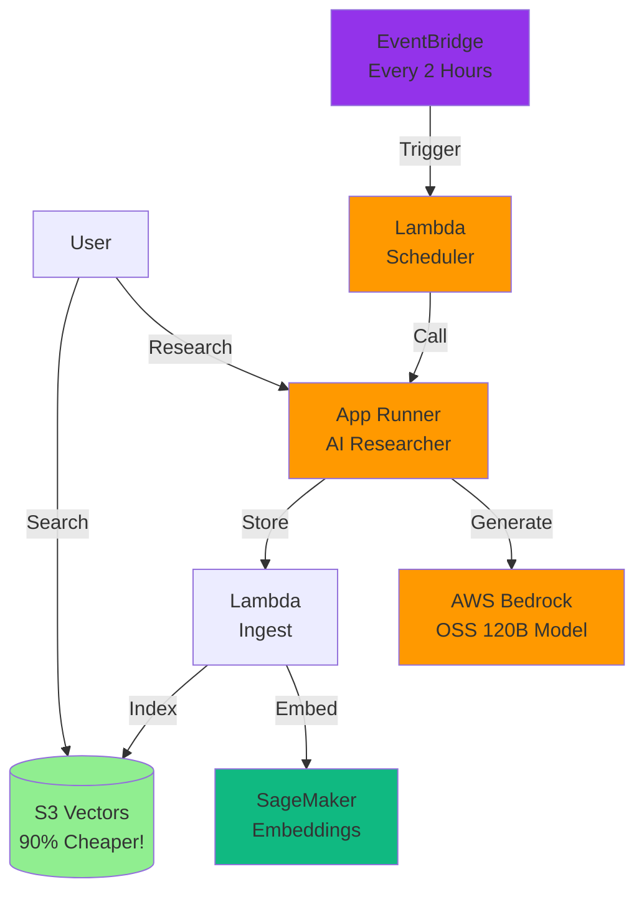

# Building Alex: Part 1 - AWS Permissions Setup

Welcome to Project Alex - the Agentic Lifetime Equities Explainer! 

Alex is an AI-powered personal financial planner that will help users manage their investment portfolios and plan for retirement. Throughout this course, we'll build a complete AI system using AWS services.

## What is Alex?

Alex will help users:
- Understand their investment portfolios
- Plan for retirement
- Get personalized financial advice
- Track market trends and opportunities

## Architecture Overview

Here's what you'll be building across all the guides:



See [architecture.md](architecture.md) for the complete system architecture.

## About This Guide

This first guide focuses on setting up the necessary AWS permissions. We'll create a dedicated IAM group with only the permissions needed for the Alex project.

## Prerequisites

Before starting, ensure you have:
- An AWS account with root access
- AWS CLI installed and configured with your `aiengineer` IAM user
- Python 3.11 or later
- Basic familiarity with AWS services

**Note for VS Code/Cursor users**: To view the architecture diagrams in this guide, install the "Markdown Preview Mermaid Support" extension (ID: `bierner.markdown-mermaid`). This will render the diagrams in your Markdown preview.

## Step 1: Setting Up IAM Permissions

First, we need to create proper IAM permissions for the Alex project. We'll create a dedicated IAM group with only the permissions needed for this project.

### 1.1 Sign in as Root User

1. Navigate to [https://aws.amazon.com/console/](https://aws.amazon.com/console/)
2. Click "Sign In to the Console"
3. Select "Root user" and enter your root email address
4. Click "Next" and enter your root password

⚠️ **Security Note**: We're using the root user only for IAM setup. For all other tasks, we'll use our IAM user.

### 1.2 Create S3 Vectors Policy

Since S3 Vectors is a new service (as of 2025), we need to create a custom policy for it:

1. In the AWS Console, navigate to **IAM** (Identity and Access Management)
2. In the left sidebar, click **Policies**
3. Click **Create policy**
4. Click the **JSON** tab
5. Replace the default content with:

```json
{
    "Version": "2012-10-17",
    "Statement": [
        {
            "Effect": "Allow",
            "Action": [
                "s3vectors:*"
            ],
            "Resource": "*"
        }
    ]
}
```

6. Click **Next: Tags**, then **Next: Review**
7. For **Policy name**, enter: `AlexS3VectorsAccess`
8. For **Description**, enter: `Full access to S3 Vectors for Alex project`
9. Click **Create policy**

### 1.3 Create the AlexAccess Group

1. Still in IAM, click **User groups** in the left sidebar
2. Click the **Create group** button
3. For **Group name**, enter: `AlexAccess`
4. In the **Attach permissions policies** section, search for and select these policies:
   - `AmazonSageMakerFullAccess` (AWS managed policy)
   - `AmazonBedrockFullAccess` (AWS managed policy - for AI model access)
   - `CloudWatchEventsFullAccess` (AWS managed policy - includes EventBridge)
   - `AlexS3VectorsAccess` (the custom policy you just created)
   
   Note: We already have Lambda, S3, CloudWatch, and API Gateway permissions from other groups.

5. Click **Create group**

### 1.4 Add the Group to Your IAM User

1. Still in IAM, click **Users** in the left sidebar
2. Click on your user `aiengineer`
3. Click the **Groups** tab
4. Click **Add user to groups**
5. Select the checkbox next to `AlexAccess`
6. Click **Add to groups**

### 1.5 Sign Out and Sign Back In

1. Click your username in the top right corner
2. Click **Sign out**
3. Sign back in using your IAM user credentials:
   - Account ID or alias
   - IAM user name: `aiengineer`
   - Your IAM password

### 1.6 Verify Permissions

Let's verify you have the necessary permissions by running:

```bash
aws sts get-caller-identity
```

You should see your IAM user ARN. Next, let's check you can access SageMaker:

```bash
aws sagemaker list-endpoints
```

This should return an empty list (no error).

## Next Steps

Excellent! You now have the necessary permissions to build Alex. 

Continue to the next guide: [2_sagemaker.md](2_sagemaker.md) where we'll deploy our first AI component - a SageMaker Serverless endpoint for generating text embeddings.

This will be the foundation of Alex's ability to understand and process financial information! 🚀