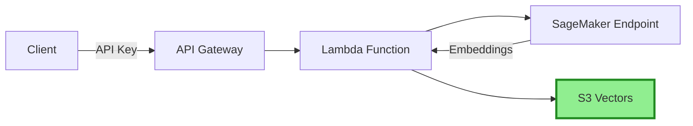

# Building Alex: Part 3 - Ingestion Pipeline with S3 Vectors

Welcome back! In this guide, we'll deploy a cost-effective vector storage solution using AWS S3 Vectors:
- S3 Vectors for vector storage (90% cheaper than OpenSearch!)
- Lambda function for document ingestion  
- API Gateway with API key authentication
- Integration with the SageMaker embedding endpoint

## Prerequisites
- Completed [Guide 1](1_permissions.md) (AWS setup)
- Completed [Guide 2](2_sagemaker.md) (SageMaker deployment)
- AWS CLI configured
- Terraform installed
- Python with `uv` package manager installed

## About S3 Vectors

S3 Vectors is AWS's native vector storage solution, offering 90% cost savings compared to traditional vector databases. It uses a separate namespace (`s3vectors`) from regular S3.

## Step 1: Create S3 Vector Bucket

Since S3 Vectors uses a different namespace than regular S3, we'll create it via the AWS Console:

1. Go to the [S3 Console](https://console.aws.amazon.com/s3/)
2. Look for **"Vector buckets"** in the left navigation (not regular buckets)
3. Click **"Create vector bucket"**
4. Configure:
   - Bucket name: `alex-vectors-{your-account-id}` (replace with your actual account ID)
   - Encryption: Keep default (SSE-S3)
5. After creating the bucket, create an index:
   - Index name: `financial-research`
   - Dimension: `384`
   - Distance metric: `Cosine`
6. Click **"Create vector index"**

## Step 2: Prepare the Lambda Deployment Package

The Lambda function code is already in the repository:

```bash
# Navigate to the ingest directory
cd backend/ingest

# Install dependencies and create deployment package
uv run package.py
```

This creates `lambda_function.zip` containing your function and all dependencies. You should see:
```
✅ Deployment package created: lambda_function.zip
   Size: ~15 MB
```

## Step 3: Configure and Deploy the Infrastructure

First, set up the Terraform variables:

```bash
# Navigate to the ingestion terraform directory
cd ../../terraform/3_ingestion

# Copy the example variables file
cp terraform.tfvars.example terraform.tfvars
```

Edit `terraform.tfvars` and set your values:
```hcl
aws_region = "us-east-1"  # Use your DEFAULT_AWS_REGION from .env
sagemaker_endpoint_name = "alex-embedding-endpoint"  # From Part 2
```

Now deploy the infrastructure:

```bash
# Initialize Terraform (creates local state file)
terraform init

# Deploy the infrastructure
terraform apply
```

Type `yes` when prompted. The deployment takes 2-3 minutes.

Note: The Lambda function expects the deployment package to exist at `../../backend/ingest/lambda_function.zip` (which you created in Step 2).

## Step 4: Save Your Configuration

After deployment, Terraform will display important outputs. You need to save these values to your `.env` file.

### Get Your API Key

First, get your API key using the command shown in Terraform output:
```bash
# Replace the ID with the one from your Terraform output
aws apigateway get-api-key --api-key YOUR_API_KEY_ID --include-value --query 'value' --output text
```

### Update Your .env File

Navigate back to project root and update your `.env`:
```bash
cd ../..

nano .env  # or use your preferred editor
```

Add or update these lines in your `.env` file:
```
# From Part 3 - get these values from Terraform output
VECTOR_BUCKET=alex-vectors-YOUR_ACCOUNT_ID
ALEX_API_ENDPOINT=https://xxxxxxxxxx.execute-api.us-east-1.amazonaws.com/prod/ingest
ALEX_API_KEY=your-api-key-here
```

💡 **Tip**: You can view Terraform outputs anytime:
```bash
cd terraform/3_ingestion
terraform output
```

## Step 5: Test the Setup

Test document ingestion directly via S3 Vectors:

```bash
cd backend/ingest
uv run test_ingest_s3vectors.py
```

You should see:
```
✓ Success! Document ID: [uuid]
Testing complete!
```

## Step 6: Test Search

Now test that you can search the documents:

```bash
uv run test_search_s3vectors.py
```

You should see the three documents (Tesla, Amazon, NVIDIA) that were just ingested, and example semantic searches showing how S3 Vectors finds related content.

### Optional: Test via API Gateway

You can also test the API Gateway endpoint directly:

```bash
# Get your API key from .env or Terraform output
curl -X POST $ALEX_API_ENDPOINT \
  -H "x-api-key: $ALEX_API_KEY" \
  -H "Content-Type: application/json" \
  -d '{"text": "Test document via API", "metadata": {"source": "api_test"}}'
```

You should see:
```json
{"message": "Document indexed successfully", "document_id": "..."}
```

## Architecture Overview



## Cost Comparison

| Service | Monthly Cost (Estimate) |
|---------|------------------------|
| OpenSearch Serverless | ~$200-300 |
| S3 Vectors | ~$20-30 |
| **Savings** | **90%!** |

## Troubleshooting

### "Vector bucket not found"
- Ensure you created the bucket with vector configuration enabled
- Check the bucket name matches exactly

### "AccessDenied" errors
- Make sure your IAM user has S3 and S3 Vectors permissions
- The Lambda role needs `s3vectors:*` permissions

### S3 Vectors Command Not Found
- Ensure you have the latest AWS CLI version
- The `s3vectors` commands use a separate namespace from regular S3

### Lambda Handler Errors (500 Internal Server Error)
- Check CloudWatch logs: `aws logs tail /aws/lambda/alex-ingest`
- Verify environment variables are set correctly (SAGEMAKER_ENDPOINT, VECTOR_BUCKET)
- Ensure Lambda IAM role has `s3vectors:PutVectors` permission
- Lambda handler must be `ingest_s3vectors.lambda_handler`

## What's Next?

Congratulations! You now have a cost-effective vector storage solution. The infrastructure includes:
- ✅ S3 bucket with vector capabilities
- ✅ Lambda function for ingesting documents with embeddings
- ✅ API Gateway with secure API key authentication
- ✅ 90% cost savings compared to OpenSearch!

**Important**: Save the Terraform outputs - you'll need them for the next guide.

In [Guide 4](4_researcher.md), we'll deploy the Alex Researcher Agent that uses this infrastructure to provide intelligent investment insights.

## Clean Up (Optional)

If you want to destroy the infrastructure to avoid costs:

```bash
# From the terraform directory
terraform destroy
```

**Note**: This will destroy ALL resources including your SageMaker endpoint. Only do this if you're completely done with the project.