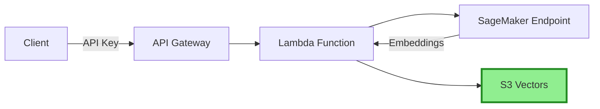

# Building Alex: Part 3 - Ingestion Pipeline with S3 Vectors

Welcome back! In this guide, we'll deploy a cost-effective vector storage solution using AWS S3 Vectors:
- S3 Vectors for vector storage (90% cheaper than OpenSearch!)
- Lambda function for document ingestion  
- API Gateway with API key authentication
- Integration with the SageMaker embedding endpoint

## Prerequisites
- Completed [Guide 1](1_permissions.md) (AWS setup)
- Completed [Guide 2](2_sagemaker.md) (SageMaker deployment)
- AWS CLI configured
- Terraform installed
- Python with `uv` package manager installed

## About S3 Vectors

S3 Vectors is AWS's native vector storage solution, offering 90% cost savings compared to traditional vector databases. It uses a separate namespace (`s3vectors`) from regular S3.

## Step 1: Create S3 Vector Bucket

Since S3 Vectors uses a different namespace than regular S3, we'll create it via the AWS Console:

1. Go to the [S3 Console](https://console.aws.amazon.com/s3/)
2. Look for **"Vector buckets"** in the left navigation (not regular buckets)
3. Click **"Create vector bucket"**
4. Configure:
   - Bucket name: `alex-vectors-{your-account-id}` (replace with your actual account ID)
   - Encryption: Keep default (SSE-S3)
5. After creating the bucket, create an index:
   - Index name: `financial-research`
   - Dimension: `384`
   - Distance metric: `Cosine`
6. Click **"Create vector index"**

## Step 2: Prepare the Lambda Deployment Package

The Lambda function code is already in the repository:

```bash
# Navigate to the ingest directory
cd backend/ingest

# Install dependencies and create deployment package
uv run package.py
```

This creates `lambda_function.zip` containing your function and all dependencies. You should see:
```
✅ Deployment package created: lambda_function.zip
   Size: ~15 MB
```

## Step 3: Deploy the Infrastructure

First, ensure your AWS account ID environment variable is set:

### Mac/Linux:
```bash
export TF_VAR_aws_account_id=$(aws sts get-caller-identity --query Account --output text)
echo $TF_VAR_aws_account_id
```

### Windows PowerShell:
```powershell
$env:TF_VAR_aws_account_id = aws sts get-caller-identity --query Account --output text
echo $env:TF_VAR_aws_account_id
```

Navigate to the Terraform directory:
```bash
cd ../../terraform
```

Deploy the infrastructure:

```bash
# Apply the changes (Terraform was already initialized in Guide 2)
terraform apply
```

Type `yes` when prompted. The deployment takes 2-3 minutes.

## Step 4: Update Environment Variables

After deployment, update your `.env` file with the required values:

```bash
# Navigate back to project root
cd ../..

# Add the S3 Vector bucket name
echo "VECTOR_BUCKET=alex-vectors-${TF_VAR_aws_account_id}" >> .env

# Add the API endpoint (from terraform directory)
cd terraform
echo "ALEX_API_ENDPOINT=$(terraform output -raw api_endpoint)" >> ../.env

# Add the API key
echo "ALEX_API_KEY=$(terraform output -raw api_key_value)" >> ../.env

# Return to project root
cd ..
```

## Step 5: Test the Setup

Test document ingestion:

```bash
cd backend/ingest
uv run test_api.py
```

You should see:
```
✅ Document ingested successfully!
```

## Step 6: Test Search

Now test that you can search the documents:

```bash
uv run test_search_s3vectors.py
```

You should see the three documents (Tesla, Amazon, NVIDIA) that were just ingested, and example semantic searches showing how S3 Vectors finds related content.

## Architecture Overview



## Cost Comparison

| Service | Monthly Cost (Estimate) |
|---------|------------------------|
| OpenSearch Serverless | ~$200-300 |
| S3 Vectors | ~$20-30 |
| **Savings** | **90%!** |

## Troubleshooting

### "Vector bucket not found"
- Ensure you created the bucket with vector configuration enabled
- Check the bucket name matches exactly

### "AccessDenied" errors
- Make sure your IAM user has S3 and S3 Vectors permissions
- The Lambda role needs `s3vectors:*` permissions

### S3 Vectors Command Not Found
- Ensure you have the latest AWS CLI version
- The `s3vectors` commands use a separate namespace from regular S3

## What's Next?

Congratulations! You now have a cost-effective vector storage solution. The infrastructure includes:
- ✅ S3 bucket with vector capabilities
- ✅ Lambda function for ingesting documents with embeddings
- ✅ API Gateway with secure API key authentication
- ✅ 90% cost savings compared to OpenSearch!

**Important**: Save the Terraform outputs - you'll need them for the next guide.

In [Guide 4](4_researcher.md), we'll deploy the Alex Researcher Agent that uses this infrastructure to provide intelligent investment insights.

## Clean Up (Optional)

If you want to destroy the infrastructure to avoid costs:

```bash
# From the terraform directory
terraform destroy
```

**Note**: This will destroy ALL resources including your SageMaker endpoint. Only do this if you're completely done with the project.