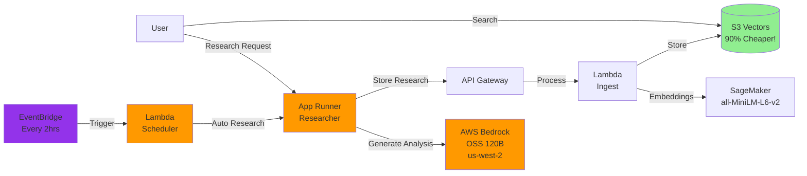

# Guide 4: Deploy the Researcher Agent

In this guide, you'll deploy the Alex Researcher service - an AI agent that generates investment research and automatically stores it in your knowledge base.

## Prerequisites

Before starting, ensure you have:
1. Completed Guides 1-3 (SageMaker, S3 Vectors, and Ingest Pipeline deployed)
2. Docker Desktop installed and running
3. AWS CLI configured with your credentials
4. Access to AWS Bedrock OpenAI OSS models (see Step 0 below)

## What You'll Deploy

The Researcher service is an AWS App Runner application that:
- Uses AWS Bedrock with OpenAI's OSS 120B model for AI capabilities
- Automatically calls your ingest pipeline to store research in S3 Vectors
- Provides a REST API for generating financial analysis on demand

Here's how it fits into the Alex architecture:



## Step 0: Request Access to Bedrock Models

The Researcher uses AWS Bedrock with OpenAI's open-source OSS 120B model. You need to request access to this model first.

### Request Model Access

1. Sign in to the AWS Console
2. Navigate to **Amazon Bedrock** service
3. Switch to the **US West (Oregon) us-west-2** region (top right corner)
4. In the left sidebar, click **Model access**
5. Click **Manage model access** or **Modify model access**
6. Find the **OpenAI** section
7. Check the boxes for:
   - **gpt-oss-120b** (OpenAI GPT OSS 120B)
   - **gpt-oss-20b** (OpenAI GPT OSS 20B) - optional, smaller model
8. Click **Request model access** at the bottom
9. Wait for approval (usually instant for these models)

**Important Notes:**
- These models are ONLY available in **us-west-2** region
- Your App Runner service can be in any region and will connect to us-west-2
- The OSS models are open-weight models from OpenAI, not the commercial GPT models
- No API key is required - AWS IAM handles authentication

## Step 1: Deploy the Infrastructure

First, we need to ensure the App Runner infrastructure is deployed. If you've run the previous guides, this may already exist.

**Mac/Linux:**
```bash
cd terraform
source ../.env
export AWS_ACCOUNT_ID=$(aws sts get-caller-identity --query Account --output text)
terraform apply \
  -var="aws_account_id=$AWS_ACCOUNT_ID" \
  -var="openai_api_key=$OPENAI_API_KEY"
```

**Windows PowerShell:**
```powershell
cd terraform
$env:AWS_ACCOUNT_ID = (aws sts get-caller-identity --query Account --output text)
Get-Content ..\.env | ForEach-Object {
    if ($_ -match '^OPENAI_API_KEY=(.+)$') {
        $env:OPENAI_API_KEY = $matches[1]
    }
}
terraform apply `
  -var="aws_account_id=$env:AWS_ACCOUNT_ID" `
  -var="openai_api_key=$env:OPENAI_API_KEY"
```

Type `yes` when prompted. 

**Note:** If you see an error like "Service with the provided name already exists: alex-researcher", that's fine! It means the service was already created. You can safely continue to Step 2. Terraform will show "Apply complete! Resources: 0 added" in this case.

This step ensures you have:
- ECR repository for your Docker images
- App Runner service configuration
- IAM roles with proper permissions

## Step 2: Build and Deploy the Researcher

Now we'll build the Docker container and deploy it to App Runner.

```bash
cd ../backend/researcher
uv run deploy.py
```

This script will:
1. Build a Docker image (with `--platform linux/amd64` for compatibility)
2. Push it to your ECR repository
3. Trigger an App Runner deployment
4. Wait for the deployment to complete (3-5 minutes)
5. Display your service URL when ready

**Important Note for Apple Silicon Mac Users:**
The deployment script automatically builds for `linux/amd64` architecture to ensure compatibility with AWS App Runner. This is why you'll see "Building Docker image for linux/amd64..." in the output.

When the deployment completes, you'll see:
```
✅ Deployment complete! Service is running.

🚀 Your service is available at:
   https://YOUR_SERVICE_URL.us-east-1.awsapprunner.com

Test it with:
   curl https://YOUR_SERVICE_URL.us-east-1.awsapprunner.com/health
```

## Step 3: Test the Complete System

Now let's test the full pipeline: Research → Ingest → Search.

### 3.1: First, Clean the Database

Clear any existing test data:

```bash
cd ../ingest
uv run cleanup_s3vectors.py
```

You should see: "✅ All documents deleted successfully"

### 3.2: Generate Research

Now let's generate some investment research:

```bash
cd ../researcher
uv run test_research.py
```

This script will:
1. Find your App Runner service URL automatically
2. Check that the service is healthy
3. Generate research on a trending topic (default)
4. Display the results
5. Automatically store it in your knowledge base

You can also research specific topics:
```bash
uv run test_research.py "Tesla competitive advantages"
uv run test_research.py "Microsoft cloud revenue growth"
```

The research takes 20-30 seconds as the agent browses financial websites and generates investment insights.

### 3.3: Verify Data Storage

Check that the research was stored:

```bash
cd ../ingest
uv run test_search_s3vectors.py
```

You should see your research in the database with:
- The research content
- Embeddings generated by SageMaker
- Metadata including timestamp and topic

### 3.4: Test Semantic Search

Now test that semantic search works:

```bash
uv run test_search_s3vectors.py "electric vehicle market"
```

Even if you search for something different than what was stored, semantic search will find related content.

## Step 4: Test the Researcher

Now that your service is deployed and tested, let's explore its capabilities.

### Test Health Check

Verify the service is healthy:

**Mac/Linux:**
```bash
curl https://YOUR_SERVICE_URL/health
```

**Windows PowerShell:**
```powershell
Invoke-WebRequest -Uri "https://YOUR_SERVICE_URL/health" | ConvertFrom-Json
```

You should see:
```json
{
  "service": "Alex Researcher",
  "status": "healthy",
  "alex_api_configured": true,
  "timestamp": "2025-..."
}
```

### Try Different Topics

1. **Generate Multiple Analyses:**
   ```bash
   uv run test_research.py "NVIDIA AI chip market share"
   uv run test_research.py "Apple services revenue growth"
   uv run test_research.py "Gold vs Bitcoin as inflation hedge"
   ```

2. **Search Across Topics:**
   ```bash
   cd ../ingest
   uv run test_search_s3vectors.py "artificial intelligence"
   uv run test_search_s3vectors.py "inflation protection"
   ```

3. **Build Your Knowledge Base:**
   Try different investment topics and build a comprehensive knowledge base for portfolio management.

## Step 5: Enable Automated Research

Now let's enable automated research that runs every 2 hours to continuously gather the latest financial insights and build your knowledge base.

### Enable the Scheduler

The scheduler is disabled by default. Turn it on with:

**Mac/Linux:**
```bash
cd ../../terraform
source ../.env
export AWS_ACCOUNT_ID=$(aws sts get-caller-identity --query Account --output text)
terraform apply \
  -var="aws_account_id=$AWS_ACCOUNT_ID" \
  -var="openai_api_key=$OPENAI_API_KEY" \
  -var="scheduler_enabled=true"
```

**Windows PowerShell:**
```powershell
cd ..\..\terraform
$env:AWS_ACCOUNT_ID = (aws sts get-caller-identity --query Account --output text)
Get-Content ..\.env | ForEach-Object {
    if ($_ -match '^OPENAI_API_KEY=(.+)$') {
        $env:OPENAI_API_KEY = $matches[1]
    }
}
terraform apply `
  -var="aws_account_id=$env:AWS_ACCOUNT_ID" `
  -var="openai_api_key=$env:OPENAI_API_KEY" `
  -var="scheduler_enabled=true"
```

Type `yes` when prompted. You'll see:
- New resources being created (Lambda function and EventBridge schedule)
- Output showing `scheduler_status = "ENABLED - Running every 2 hours"`

**Note:** The scheduler uses a small Lambda function to call your App Runner endpoint. This is necessary because App Runner endpoints can take 30-60 seconds to complete research, but EventBridge API Destinations have a 5-second timeout limit.

### Verify Scheduler Status

Check the current scheduler status:

```bash
terraform output scheduler_status
```

### Monitor Automated Research

The scheduler will call your `/research/auto` endpoint every 2 hours. You can:

1. Check Lambda logs to see when the scheduler runs:
```bash
aws logs tail /aws/lambda/alex-research-scheduler --follow --region us-east-1
```

2. Check App Runner logs to see the actual research being performed:
```bash
aws logs tail /aws/apprunner/alex-researcher/*/application --follow --region us-east-1
```

3. Search your S3 Vectors database to see the accumulated research:
```bash
cd ../backend/ingest
uv run test_search_s3vectors.py
```

### Disable the Scheduler (When Needed)

When you want to stop the automated research (to save on API costs):

**Mac/Linux:**
```bash
cd ../../terraform
terraform apply \
  -var="aws_account_id=$AWS_ACCOUNT_ID" \
  -var="openai_api_key=$OPENAI_API_KEY" \
  -var="scheduler_enabled=false"
```

**Windows PowerShell:**
```powershell
cd ..\..\terraform
terraform apply `
  -var="aws_account_id=$env:AWS_ACCOUNT_ID" `
  -var="openai_api_key=$env:OPENAI_API_KEY" `
  -var="scheduler_enabled=false"
```

This will remove the scheduler but keep all your other services running.

## Troubleshooting

### "Service creation failed"
- Check that your ECR repository exists: `aws ecr describe-repositories`
- Ensure Docker is running
- Verify your AWS credentials are configured

### "Deployment stuck in OPERATION_IN_PROGRESS"
- This is normal for the first deployment (can take 5-10 minutes)
- Check CloudWatch logs in AWS Console > App Runner > Your service > Logs

### "Exit code 255" or service won't start
- This usually means the Docker image wasn't built for the right architecture
- Ensure the deploy script uses `--platform linux/amd64`
- Rebuild and redeploy

### "Connection refused" when calling the service
- Ensure the service status is "RUNNING"
- Check that you're using HTTPS (not HTTP)
- Verify the service URL is correct

### "504 Gateway Timeout" errors
- The agent may be taking too long (>30 seconds)
- This is normal if the agent is browsing multiple web pages
- The research should still complete and be stored

### "Invalid model identifier" or Bedrock errors
- Ensure you've requested access to the OpenAI OSS models in us-west-2 (see Step 0)
- Check that your IAM role has Bedrock permissions (should be added by Terraform)
- The models are ONLY available in us-west-2 but can be accessed from any region
- Verify model access: Go to Bedrock console → Model access → Check status

## Clean Up (Optional)

If you want to stop ALL services to avoid charges:

```bash
cd ../../terraform
terraform destroy
```

This will remove all AWS resources created in this guide.

## Summary

You've successfully deployed an agentic AI system that can research, analyze, and manage investment knowledge. The system uses modern cloud-native architecture with automatic scaling, vector search, and AI agents working together to provide intelligent financial insights.

## What's Next?

Congratulations! You now have a complete AI research pipeline:
1. **Researcher Agent** (App Runner) - Generates investment analysis
2. **Ingest Pipeline** (Lambda) - Processes and stores documents
3. **Vector Database** (S3 Vectors) - Cost-effective semantic search
4. **Embedding Model** (SageMaker) - Creates semantic representations
5. **Automated Scheduler** (EventBridge + Lambda) - Runs research every 2 hours

Your system can now:
- Generate professional investment research on demand
- Automatically store and index all research
- Perform semantic search across your knowledge base
- Scale automatically with demand
- Continuously build knowledge with scheduled research