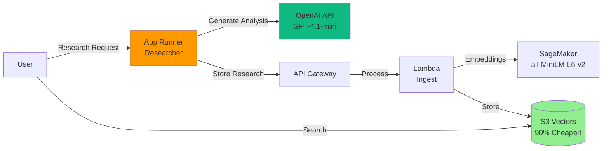

# Guide 4: Deploy the Researcher Agent

In this guide, you'll deploy the Alex Researcher service - an AI agent that generates investment research and automatically stores it in your knowledge base.

## Prerequisites

Before starting, ensure you have:
1. Completed Guides 1-3 (SageMaker, S3 Vectors, and Ingest Pipeline deployed)
2. Docker Desktop installed and running
3. Your `.env` file in the project root with `OPENAI_API_KEY`
4. AWS CLI configured with your credentials

## What You'll Deploy

The Researcher service is an AWS App Runner application that:
- Uses OpenAI's Agents SDK to create an investment research agent
- Automatically calls your ingest pipeline to store research in S3 Vectors
- Provides a REST API for generating financial analysis on demand

Here's how it fits into the Alex architecture:



## Step 1: Deploy the Infrastructure

First, we need to ensure the App Runner infrastructure is deployed. If you've run the previous guides, this may already exist.

**Mac/Linux:**
```bash
cd terraform
source ../.env
export AWS_ACCOUNT_ID=$(aws sts get-caller-identity --query Account --output text)
terraform apply \
  -var="aws_account_id=$AWS_ACCOUNT_ID" \
  -var="openai_api_key=$OPENAI_API_KEY"
```

**Windows PowerShell:**
```powershell
cd terraform
$env:AWS_ACCOUNT_ID = (aws sts get-caller-identity --query Account --output text)
Get-Content ..\.env | ForEach-Object {
    if ($_ -match '^OPENAI_API_KEY=(.+)$') {
        $env:OPENAI_API_KEY = $matches[1]
    }
}
terraform apply `
  -var="aws_account_id=$env:AWS_ACCOUNT_ID" `
  -var="openai_api_key=$env:OPENAI_API_KEY"
```

Type `yes` when prompted. 

**Note:** If you see an error like "Service with the provided name already exists: alex-researcher", that's fine! It means the service was already created. You can safely continue to Step 2. Terraform will show "Apply complete! Resources: 0 added" in this case.

This step ensures you have:
- ECR repository for your Docker images
- App Runner service configuration
- IAM roles with proper permissions

## Step 2: Build and Deploy the Researcher

Now we'll build the Docker container and deploy it to App Runner.

```bash
cd ../backend/researcher
uv run deploy.py
```

This script will:
1. Build a Docker image (with `--platform linux/amd64` for compatibility)
2. Push it to your ECR repository
3. Trigger an App Runner deployment
4. Wait for the deployment to complete (3-5 minutes)
5. Display your service URL when ready

**Important Note for Apple Silicon Mac Users:**
The deployment script automatically builds for `linux/amd64` architecture to ensure compatibility with AWS App Runner. This is why you'll see "Building Docker image for linux/amd64..." in the output.

When the deployment completes, you'll see:
```
✅ Deployment complete! Service is running.

🚀 Your service is available at:
   https://YOUR_SERVICE_URL.us-east-1.awsapprunner.com

Test it with:
   curl https://YOUR_SERVICE_URL.us-east-1.awsapprunner.com/health
```

## Step 3: Test the Complete System

Now let's test the full pipeline: Research → Ingest → Search.

### 3.1: First, Clean the Database

Clear any existing test data:

```bash
cd ../ingest
uv run cleanup_api.py
```

You should see: "✅ All documents deleted successfully"

### 3.2: Generate Research

Now let's generate some investment research:

```bash
cd ../researcher
uv run test_research.py
```

This script will:
1. Find your App Runner service URL automatically
2. Check that the service is healthy
3. Generate research on Apple stock (default topic)
4. Display the results
5. Automatically store it in your knowledge base

You can also research other topics:
```bash
uv run test_research.py "Tesla competitive advantages"
uv run test_research.py "Microsoft cloud revenue growth"
```

The research takes 20-30 seconds as the agent analyzes the topic and generates comprehensive investment insights.

### 3.3: Verify Data Storage

Check that the research was stored:

```bash
cd ../ingest
uv run search_api.py
```

You should see the Apple analysis in your database with:
- The research content
- Embeddings generated by SageMaker
- Metadata including timestamp and topic

### 3.4: Test Semantic Search

Now test that semantic search works:

```bash
uv run search_api.py "iPhone sales growth"
```

Even though you searched for "iPhone sales growth", it should find the Apple stock analysis because of semantic similarity.

## Step 4: Test Health Check

Verify the service is healthy:

**Mac/Linux:**
```bash
curl https://YOUR_SERVICE_URL/health
```

**Windows PowerShell:**
```powershell
Invoke-WebRequest -Uri "https://YOUR_SERVICE_URL/health" | ConvertFrom-Json
```

You should see:
```json
{
  "service": "Alex Researcher",
  "status": "healthy",
  "alex_api_configured": true,
  "timestamp": "2025-..."
}
```

## Troubleshooting

### "Service creation failed"
- Check that your ECR repository exists: `aws ecr describe-repositories`
- Ensure Docker is running
- Verify your AWS credentials are configured

### "Deployment stuck in OPERATION_IN_PROGRESS"
- This is normal for the first deployment (can take 5-10 minutes)
- Check CloudWatch logs in AWS Console > App Runner > Your service > Logs

### "Exit code 255" or service won't start
- This usually means the Docker image wasn't built for the right architecture
- Ensure the deploy script uses `--platform linux/amd64`
- Rebuild and redeploy

### "Connection refused" when calling the service
- Ensure the service status is "RUNNING"
- Check that you're using HTTPS (not HTTP)
- Verify the service URL is correct

## What's Next?

Congratulations! You now have a complete AI research pipeline:
1. **Researcher Agent** (App Runner) - Generates investment analysis
2. **Ingest Pipeline** (Lambda) - Processes and stores documents
3. **Vector Database** (S3 Vectors) - Cost-effective semantic search
4. **Embedding Model** (SageMaker) - Creates semantic representations

Your system can now:
- Generate professional investment research on demand
- Automatically store and index all research
- Perform semantic search across your knowledge base
- Scale automatically with demand

### Try These Experiments

1. **Generate Multiple Analyses:**
   ```bash
   curl -X POST https://YOUR_SERVICE_URL/research \
     -H "Content-Type: application/json" \
     -d '{"topic": "Tesla competitive advantages"}'
   
   curl -X POST https://YOUR_SERVICE_URL/research \
     -H "Content-Type: application/json" \
     -d '{"topic": "Microsoft cloud revenue growth"}'
   ```

2. **Search Across Topics:**
   ```bash
   uv run search_api.py "electric vehicle market"
   uv run search_api.py "cloud computing revenue"
   ```

3. **Build Your Knowledge Base:**
   Try different investment topics and build a comprehensive knowledge base for portfolio management.

## Clean Up (Optional)

If you want to stop the services to avoid charges:

```bash
cd ../../terraform
terraform destroy
```

This will remove all AWS resources created in this guide.

## Summary

You've successfully deployed an agentic AI system that can research, analyze, and manage investment knowledge. The system uses modern cloud-native architecture with automatic scaling, vector search, and AI agents working together to provide intelligent financial insights.