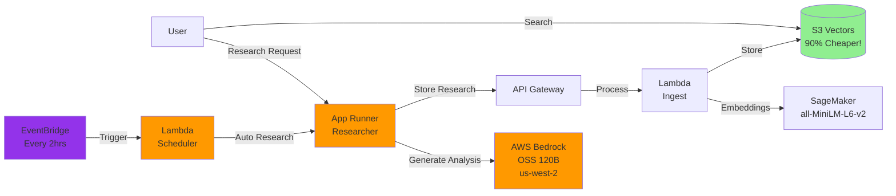

# Guide 4: Deploy the Researcher Agent

In this guide, you'll deploy the Alex Researcher service - an AI agent that generates investment research and automatically stores it in your knowledge base.

## Prerequisites

Before starting, ensure you have:
1. Completed Guides 1-3 (SageMaker, S3 Vectors, and Ingest Pipeline deployed)
2. Docker Desktop installed and running
3. AWS CLI configured with your credentials
4. Access to AWS Bedrock OpenAI OSS models (see Step 0 below)

## What You'll Deploy

The Researcher service is an AWS App Runner application that:
- Uses the OpenAI Agents SDK for agent orchestration and tracing
- Uses AWS Bedrock with OpenAI's OSS 120B model for AI capabilities
- Employs a Playwright MCP (Model Context Protocol) server for web browsing and data retrieval
- Automatically calls your ingest pipeline to store research in S3 Vectors
- Provides a REST API for generating financial analysis on demand

Here's how it fits into the Alex architecture:



## Step 0: Request Access to Bedrock Models

The Researcher uses AWS Bedrock with OpenAI's open-source OSS 120B model. You need to request access to this model first.

### Request Model Access - these instructions are for OSS models, but you can also use Nova in us-east-1 or in your region (cheaper and easier)

1. Sign in to the AWS Console
2. Navigate to **Amazon Bedrock** service
3. Switch to the **US West (Oregon) us-west-2** region (top right corner)
4. In the left sidebar, click **Model access**
5. Click **Manage model access** or **Modify model access**
6. Find the **OpenAI** section
7. Check the boxes for:
   - **gpt-oss-120b** (OpenAI GPT OSS 120B)
   - **gpt-oss-20b** (OpenAI GPT OSS 20B) - optional, smaller model
8. Click **Request model access** at the bottom
9. Wait for approval (usually instant for these models)
10. As an alternative - request access to the Amazon Nova models in your region or in us-east-1

**Important Notes:**
- ⚠️ The OSS models are ONLY available in **us-west-2** region
- ✅ Your App Runner service can be in any region (e.g., us-east-1) and will connect cross-region to us-west-2
- The OSS models are open-weight models from OpenAI, not the commercial GPT models
- No API key is required for Bedrock - AWS IAM handles authentication
- The researcher requires an OpenAI API key for the OpenAI Agents SDK's tracing functionality (to monitor and debug agent execution)

## Extra part of Step 0: IMPORTANT - ADDED SINCE THE VIDEOS!!

### Update server.py with your model

With many thanks to Student Marcin B. for this crucial extra step.

In future labs, we will make this more configurable. But for this step, the Researcher Agent has some variables hard-coded which you will need to change.

Please look at the file `backend/researcher/server.py`

You should see this section:

```python
    # Please override these variables with the region you are using
    # Other choices: us-west-2 (for OpenAI OSS models) and eu-central-1
    REGION = "us-east-1"
    os.environ["AWS_REGION_NAME"] = REGION  # LiteLLM's preferred variable
    os.environ["AWS_REGION"] = REGION  # Boto3 standard
    os.environ["AWS_DEFAULT_REGION"] = REGION  # Fallback

    # Please override this variable with the model you are using
    # Other choices: bedrock/eu.amazon.nova-lite-v1:0 for EU and bedrock/us.amazon.nova-lite-v1:0 for US
    # bedrock/openai.gpt-oss-120b-1:0 for OpenAI OSS models
    # bedrock/converse/us.anthropic.claude-sonnet-4-20250514-v1:0 for Claude Sonnet 4
    MODEL = "bedrock/us.amazon.nova-lite-v1:0"
    model = LitellmModel(model=MODEL)
```

Please update the value of REGION and MODEL to reflect the model you have access to. See the examples given for possible values.

## Step 1: Deploy the Infrastructure

First, ensure you have your OpenAI API key and the values from Part 3 in your `.env` file.

Open the `.env` file in your project root using Cursor's file explorer and verify you have these values:
- `OPENAI_API_KEY` - Your OpenAI API key (required for agent tracing)
- `ALEX_API_ENDPOINT` - From Part 3
- `ALEX_API_KEY` - From Part 3

If you haven't added your OpenAI API key yet, add this line to the `.env` file:
```
OPENAI_API_KEY=sk-...  # Your actual OpenAI API key (required for agent tracing)
```

Now set up the initial infrastructure:

```bash
# Navigate to the terraform/4_researcher directory
# Copy the example variables file
cp terraform.tfvars.example terraform.tfvars
```

Edit `terraform.tfvars` and update with your values from the `.env` file:
```hcl
aws_region = "us-east-1"  # Your AWS region
openai_api_key = "sk-..."  # Your OpenAI API key
alex_api_endpoint = "https://xxxxxxxxxx.execute-api.us-east-1.amazonaws.com/prod/ingest"  # From Part 3
alex_api_key = "your-api-key-here"  # From Part 3
scheduler_enabled = false  # Keep false for now
```

Deploy the ECR repository and IAM roles first:

```bash
# Initialize Terraform (creates local state file)
terraform init

# Deploy only the ECR repository and IAM roles (not App Runner yet)
terraform apply -target=aws_ecr_repository.researcher -target=aws_iam_role.app_runner_role
```

Type `yes` when prompted. This creates:
- ECR repository for your Docker images
- IAM roles with proper permissions for App Runner

Save the ECR repository URL shown in the output - you'll need it in Step 2.

## Step 2: Build and Deploy the Researcher

Now we'll build the Docker container and deploy it to App Runner.

```bash
# Navigate to the backend/researcher directory
uv run deploy.py
```

This script will:
1. Build a Docker image (with `--platform linux/amd64` for compatibility)
2. Push it to your ECR repository
3. Trigger an App Runner deployment
4. Wait for the deployment to complete (3-5 minutes)
5. Display your service URL when ready

**Important Note for Apple Silicon Mac Users:**
The deployment script automatically builds for `linux/amd64` architecture to ensure compatibility with AWS App Runner. This is why you'll see "Building Docker image for linux/amd64..." in the output.

When the Docker image push completes, you'll see:
```
✅ Docker image pushed successfully!
```

## Step 3: Create the App Runner Service

Now that your Docker image is in ECR, create the App Runner service:

```bash
# Navigate back to the terraform/4_researcher directory
# Deploy the complete infrastructure including App Runner
terraform apply
```

Type `yes` when prompted. This will:
- Create the App Runner service using your Docker image
- Configure environment variables for the service
- Set up the optional EventBridge scheduler (if enabled)

The App Runner service creation takes 3-5 minutes. When complete, you'll see the service URL in the output.

## Step 4: Test the Complete System

Now let's test the full pipeline: Research → Ingest → Search.

### 4.1: First, Clean the Database

Clear any existing test data:

```bash
# Navigate to the backend/ingest directory
uv run cleanup_s3vectors.py
```

You should see: "✅ All documents deleted successfully"

### 4.2: Generate Research

Now let's generate some investment research:

```bash
# Navigate to the backend/researcher directory
uv run test_research.py
```

This script will:
1. Find your App Runner service URL automatically
2. Check that the service is healthy
3. Generate research on a trending topic (default)
4. Display the results
5. Automatically store it in your knowledge base

You can also research specific topics:
```bash
uv run test_research.py "Tesla competitive advantages"
uv run test_research.py "Microsoft cloud revenue growth"
```

The research takes 20-30 seconds as the agent browses financial websites and generates investment insights.

### 4.3: Verify Data Storage

Check that the research was stored:

```bash
# Navigate to the backend/ingest directory
uv run test_search_s3vectors.py
```

You should see your research in the database with:
- The research content
- Embeddings generated by SageMaker
- Metadata including timestamp and topic

### 4.4: Test Semantic Search

Now test that semantic search works:

```bash
uv run test_search_s3vectors.py "electric vehicle market"
```

Even if you search for something different than what was stored, semantic search will find related content.

## Step 5: Test the Researcher

Now that your service is deployed and tested, let's explore its capabilities.

### Test Health Check

Verify the service is healthy:

**Mac/Linux:**
```bash
curl https://YOUR_SERVICE_URL/health
```

**Windows PowerShell:**
```powershell
Invoke-WebRequest -Uri "https://YOUR_SERVICE_URL/health" | ConvertFrom-Json
```

You should see:
```json
{
  "service": "Alex Researcher",
  "status": "healthy",
  "alex_api_configured": true,
  "timestamp": "2025-..."
}
```

### Try Different Topics

1. **Generate Multiple Analyses:**
   ```bash
   uv run test_research.py "NVIDIA AI chip market share"
   uv run test_research.py "Apple services revenue growth"
   uv run test_research.py "Gold vs Bitcoin as inflation hedge"
   ```

2. **Search Across Topics:**
   ```bash
   # Navigate to the backend/ingest directory
   uv run test_search_s3vectors.py "artificial intelligence"
   uv run test_search_s3vectors.py "inflation protection"
   ```

3. **Build Your Knowledge Base:**
   Try different investment topics and build a comprehensive knowledge base for portfolio management.

## Step 6: Enable Automated Research (Optional)

Now let's enable automated research that runs every 2 hours to continuously gather the latest financial insights and build your knowledge base.

### Enable the Scheduler

The scheduler is disabled by default. To enable it:

```bash
# Navigate to the terraform/4_researcher directory if not already there
# Edit your terraform.tfvars file
```

Change the `scheduler_enabled` value in `terraform.tfvars`:
```hcl
scheduler_enabled = true  # Changed from false
```

Then apply the change:
```bash
terraform apply
```

**Windows PowerShell:**
```powershell
# Navigate to the terraform/4_researcher directory
# Edit terraform.tfvars to set scheduler_enabled = true
# Then apply the change
terraform apply
```

Type `yes` when prompted. You'll see:
- New resources being created (Lambda function and EventBridge schedule)
- Output showing `scheduler_status = "ENABLED - Running every 2 hours"`

**Note:** The scheduler uses a small Lambda function to call your App Runner endpoint. This is necessary because App Runner endpoints can take 30-60 seconds to complete research, but EventBridge API Destinations have a 5-second timeout limit.

### Verify Scheduler Status

Check the current scheduler status:

```bash
terraform output scheduler_status
```

### Monitor Automated Research

The scheduler will call your `/research/auto` endpoint every 2 hours. You can:

1. Check Lambda logs to see when the scheduler runs:
```bash
aws logs tail /aws/lambda/alex-research-scheduler --follow --region us-east-1
```

2. Check App Runner logs to see the actual research being performed:
```bash
aws logs tail /aws/apprunner/alex-researcher/*/application --follow --region us-east-1
```

3. Search your S3 Vectors database to see the accumulated research:
```bash
# Navigate to the backend/ingest directory
uv run test_search_s3vectors.py
```

### Disable the Scheduler (When Needed)

When you want to stop the automated research (to save on API costs):

**Mac/Linux:**
```bash
# Navigate to the terraform/4_researcher directory
terraform apply -var="scheduler_enabled=false"
```

**Windows PowerShell:**
```powershell
# Navigate to the terraform/4_researcher directory
terraform apply -var="scheduler_enabled=false"
```

This will remove the scheduler but keep all your other services running.

## Troubleshooting

### "Service creation failed"
- Check that your ECR repository exists: `aws ecr describe-repositories`
- Ensure Docker is running
- Verify your AWS credentials are configured

### "Deployment stuck in OPERATION_IN_PROGRESS"
- This is normal for the first deployment (can take 5-10 minutes)
- Check CloudWatch logs in AWS Console > App Runner > Your service > Logs

### "Exit code 255" or service won't start
- This usually means the Docker image wasn't built for the right architecture
- Ensure the deploy script uses `--platform linux/amd64`
- Rebuild and redeploy

### "Connection refused" when calling the service
- Ensure the service status is "RUNNING"
- Check that you're using HTTPS (not HTTP)
- Verify the service URL is correct

### "504 Gateway Timeout" errors
- The agent may be taking too long (>30 seconds)
- This is normal if the agent is browsing multiple web pages
- The research should still complete and be stored

### "Invalid model identifier" or Bedrock errors
- Ensure you've requested access to the OpenAI OSS models in us-west-2 (see Step 0)
- Check that your IAM role has Bedrock permissions (should be added by Terraform)
- The models are ONLY available in us-west-2 but can be accessed from any region
- Verify model access: Go to Bedrock console → Model access → Check status

## Clean Up (Optional)

If you want to stop ALL services to avoid charges:

```bash
# Navigate to the terraform/4_researcher directory
terraform destroy
```

This will remove all AWS resources created in this guide.

## Summary

You've successfully deployed an agentic AI system that can research, analyze, and manage investment knowledge. The system uses modern cloud-native architecture with automatic scaling, vector search, and AI agents working together to provide intelligent financial insights.

## Save Your Configuration

Before moving to the next guide, ensure your `.env` file is up to date:

```bash
# Navigate to the project root and edit .env
# Use your preferred text editor (nano, vim, or open in Cursor)
```

Verify you have all values from Parts 1-4:
```
# Part 1
AWS_ACCOUNT_ID=123456789012
DEFAULT_AWS_REGION=us-east-1

# Part 2
SAGEMAKER_ENDPOINT=alex-embedding-endpoint

# Part 3
VECTOR_BUCKET=alex-vectors-123456789012
ALEX_API_ENDPOINT=https://xxxxxxxxxx.execute-api.us-east-1.amazonaws.com/prod/ingest
ALEX_API_KEY=your-api-key-here

# Part 4
OPENAI_API_KEY=sk-...
```

## What's Next?

Congratulations! You now have a complete AI research pipeline:
1. **Researcher Agent** (App Runner) - Generates investment analysis using Bedrock OSS models in us-west-2
2. **Ingest Pipeline** (Lambda) - Processes and stores documents
3. **Vector Database** (S3 Vectors) - Cost-effective semantic search
4. **Embedding Model** (SageMaker) - Creates semantic representations
5. **Automated Scheduler** (EventBridge + Lambda) - Optional, runs research every 2 hours

Your system can now:
- Generate professional investment research on demand
- Automatically store and index all research
- Perform semantic search across your knowledge base
- Scale automatically with demand
- Continuously build knowledge with scheduled research

Continue to: [5_database.md](5_database.md) where we'll set up Aurora Serverless v2 PostgreSQL to manage user portfolios and financial data!