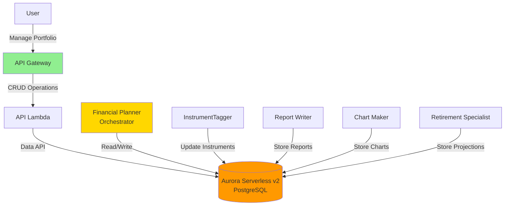

# Building Alex: Part 5 - Database & Shared Infrastructure

Welcome to Part 5! We're now entering the second phase of building Alex - transforming it from a research tool into a complete financial planning SaaS platform. In this guide, we'll set up Aurora Serverless v2 PostgreSQL with the Data API and create a reusable database library that all our AI agents will use.

## What We're Building

In this guide, you'll deploy:
- Aurora Serverless v2 PostgreSQL cluster with Data API enabled (no VPC needed!)
- Complete database schema for portfolios, users, and reports
- Shared database package with Pydantic validation
- Seed data with 22 popular ETFs
- Database reset scripts for easy development

Here's how the database fits into our architecture:



## Prerequisites

Before starting, ensure you have:
- Completed Guides 1-4 (all infrastructure from Parts 1-4)
- AWS CLI configured
- Python with `uv` package manager installed
- Terraform installed
- Docker Desktop installed and running (for local testing)

## Step 0: Additional IAM Permissions

Since Guide 4, we need additional AWS permissions for Aurora and related services.

### Create Custom RDS Policy

1. Sign in to the AWS Console as your root user (just for IAM setup)
2. Navigate to **IAM** → **Policies**
3. Click **Create policy**
4. Click the **JSON** tab
5. Replace the content with:

```json
{
    "Version": "2012-10-17",
    "Statement": [
        {
            "Sid": "RDSPermissions",
            "Effect": "Allow",
            "Action": [
                "rds:CreateDBCluster",
                "rds:CreateDBInstance",
                "rds:CreateDBSubnetGroup",
                "rds:DeleteDBCluster",
                "rds:DeleteDBInstance",
                "rds:DeleteDBSubnetGroup",
                "rds:DescribeDBClusters",
                "rds:DescribeDBInstances",
                "rds:DescribeDBSubnetGroups",
                "rds:ModifyDBCluster",
                "rds:ModifyDBInstance",
                "rds:AddTagsToResource",
                "rds:ListTagsForResource",
                "rds:RemoveTagsFromResource",
                "rds-data:ExecuteStatement",
                "rds-data:BatchExecuteStatement",
                "rds-data:BeginTransaction",
                "rds-data:CommitTransaction",
                "rds-data:RollbackTransaction"
            ],
            "Resource": "*"
        },
        {
            "Sid": "EC2Permissions",
            "Effect": "Allow",
            "Action": [
                "ec2:DescribeVpcs",
                "ec2:DescribeSubnets",
                "ec2:DescribeAvailabilityZones",
                "ec2:DescribeSecurityGroups",
                "ec2:CreateSecurityGroup",
                "ec2:DeleteSecurityGroup",
                "ec2:AuthorizeSecurityGroupIngress",
                "ec2:RevokeSecurityGroupIngress"
            ],
            "Resource": "*"
        },
        {
            "Sid": "SecretsManagerPermissions",
            "Effect": "Allow",
            "Action": [
                "secretsmanager:CreateSecret",
                "secretsmanager:DeleteSecret",
                "secretsmanager:DescribeSecret",
                "secretsmanager:GetSecretValue",
                "secretsmanager:PutSecretValue",
                "secretsmanager:UpdateSecret"
            ],
            "Resource": "*"
        },
        {
            "Sid": "KMSPermissions",
            "Effect": "Allow",
            "Action": [
                "kms:CreateGrant",
                "kms:Decrypt",
                "kms:DescribeKey",
                "kms:Encrypt"
            ],
            "Resource": "*"
        }
    ]
}
```

6. Click **Next: Tags**, then **Next: Review**
7. For **Policy name**, enter: `AlexRDSCustomPolicy`
8. For **Description**, enter: `RDS and Data API permissions for Alex project`
9. Click **Create policy**

### Add Required AWS Managed Policies

1. Still in IAM, click **User groups** in the left sidebar
2. Click on the `AlexAccess` group (created in Guide 1)
3. Click **Permissions** tab, then **Add permissions** → **Attach policies**
4. Search for and select these AWS managed policies:
   - `AmazonRDSDataFullAccess`
   - `AWSLambda_FullAccess`
   - `AmazonSQSFullAccess`
   - `AmazonEventBridgeFullAccess`
   - `SecretsManagerReadWrite`
5. Also select the custom policy you just created:
   - `AlexRDSCustomPolicy`
6. Click **Add permissions**

### Verify Permissions

Sign out and sign back in with your IAM user, then verify:

```bash
# Should return empty list or existing clusters
aws rds describe-db-clusters

# Should return success (even with empty result)
aws rds-data execute-statement --help
```

## Step 1: Deploy Aurora Serverless v2

Now let's deploy the database infrastructure with Terraform.

### Configure and Deploy the Database

```bash
# Navigate to the database terraform directory
cd terraform/5_database

# Copy the example variables file
cp terraform.tfvars.example terraform.tfvars
```

Edit `terraform.tfvars` and set your values:
```hcl
aws_region = "us-east-1"  # Your AWS region
min_capacity = 0.5        # Minimum ACUs (0.5 = ~$43/month)
max_capacity = 1.0        # Maximum ACUs (keep low for dev)
```

Deploy the database:

```bash
# Initialize Terraform (creates local state file)
terraform init

# Deploy the database infrastructure
terraform apply
```

Type `yes` when prompted. This will create:
- Aurora Serverless v2 cluster with Data API enabled
- Database credentials in Secrets Manager
- Security group and subnet configuration
- The `alex` database

Deployment takes about 10-15 minutes. After deployment, Terraform will display important outputs including the cluster ARN and secret ARN.

### Save Your Configuration

**Important**: Update your `.env` file with the database values:

1. View the Terraform outputs:
   ```bash
   terraform output
   ```

2. Go back to project root and edit `.env`:
   ```bash
   cd ../..
   nano .env  # or use your preferred editor
   ```

3. Add these lines with values from Terraform output:
   ```
   # Part 5 - Database
   AURORA_CLUSTER_ARN=arn:aws:rds:us-east-1:123456789012:cluster:alex-aurora-cluster
   AURORA_SECRET_ARN=arn:aws:secretsmanager:us-east-1:123456789012:secret:alex-aurora-credentials-xxxxx
   ```

💡 **Tip**: The exact ARN values are shown in your Terraform output. Copy them carefully!

## Step 2: Initialize the Database

Now let's test the connection and create our schema.

```bash
cd ../../backend/database

# Test the Data API connection
uv run test_data_api.py
```

You should see:
```
✅ Successfully connected to Aurora using Data API!
Database version: PostgreSQL 15.x
```

## Step 3: Run Database Migrations

Create the database schema:

```bash
# Run the migration to create all tables
uv run migrate.py
```

You should see:
```
Starting migration: 001_initial_schema.sql
✅ Migration completed successfully
All migrations completed!
```

## Step 4: Load Seed Data

Now let's populate the instruments table with 22 popular ETFs:

```bash
# Load the default ETF data
uv run seed_data.py
```

You should see:
```
Seeding 22 instruments...
✅ SPY - SPDR S&P 500 ETF
✅ QQQ - Invesco QQQ Trust
✅ BND - Vanguard Total Bond Market ETF
[... more ETFs ...]
✅ Successfully seeded 22 instruments
```

## Step 5: Create Test Data (Optional)

For development, let's create a test user with a sample portfolio:

```bash
# Reset database and load test data
uv run reset_db.py --with-test-data
```

You should see:
```
Dropping all tables...
Running migrations...
Loading default instruments...
Creating test user with portfolio...
✅ Database reset complete with test data!

Test user created:
- User ID: user_test_123
- Display Name: Test User
- 3 accounts with various positions
```

## Step 6: Verify the Setup

Let's verify everything is working:

```bash
# Run the verification script
uv run verify_database.py
```

You should see:
```
Database Status:
✅ Aurora cluster is running
✅ Data API is accessible
✅ All 7 tables exist
✅ 22 instruments loaded
✅ Test user exists (if created)
✅ Pydantic validation working

Database ready for use!
```

## Step 7: Test the Shared Database Package

The database package can now be used by other services:

```bash
# Run the comprehensive test
uv run test_db.py
```

This test verifies that:
- Data API client works correctly
- Pydantic schemas validate data properly
- Type conversions handle JSONB, Decimal, UUID, and dates
- All allocations sum to 100%

## Understanding the Database Schema

Our schema includes:

- **users**: Minimal user data (Clerk handles auth)
- **instruments**: ETFs, stocks, and funds with allocation data
- **accounts**: User's investment accounts (401k, IRA, etc.)
- **positions**: Holdings in each account
- **reports**: AI-generated portfolio analysis
- **retirement**: Retirement income projections
- **analysis_jobs**: Async job tracking

All data is validated through Pydantic schemas before database insertion, ensuring data integrity.

## Cost Management

Aurora Serverless v2 costs approximately:
- **Minimum capacity (0.5 ACU)**: ~$43/month
- **Running normally**: $1.44-$2.88/day

### Managing Costs

To minimize costs when not actively developing:

```bash
cd terraform

# Check current status
uv run aurora_cost_management.py status

# Pause when not working (still $1.44/day)
uv run aurora_cost_management.py pause

# Resume for development
uv run aurora_cost_management.py resume

# COMPLETELY STOP charges (deletes database!)
uv run aurora_cost_management.py destroy

# Recreate after destroy
uv run aurora_cost_management.py recreate
```

**Recommendation**: Complete Parts 5-8 within 3-5 days, then destroy to avoid ongoing charges.

## Troubleshooting

### Data API Connection Issues

If you can't connect to the Data API:

1. **Check cluster status**:
```bash
aws rds describe-db-clusters --db-cluster-identifier alex-cluster
```
Status should be "available"

2. **Check Data API is enabled**:
```bash
aws rds describe-db-clusters --db-cluster-identifier alex-cluster --query 'DBClusters[0].EnableHttpEndpoint'
```
Should return `true`

3. **Verify secrets**:
```bash
aws secretsmanager get-secret-value --secret-id alex-aurora-secret --query SecretString --output text | jq .
```
Should show username and password

### Migration Failures

If migrations fail:

1. **Check SQL syntax**:
```bash
# Migrations are in backend/database/migrations/
cat migrations/001_initial_schema.sql
```

2. **Reset and retry**:
```bash
uv run reset_db.py --drop-all
uv run migrate.py
```

### Pydantic Validation Errors

If you see validation errors:

1. **Check allocation sums**:
All allocation dictionaries must sum to 100.0

2. **Check Literal types**:
Only use allowed values for regions, sectors, and asset classes

3. **Review schema definitions**:
```bash
cat src/schemas.py
```

## Next Steps

Excellent! You now have a production-grade database with:
- ✅ Aurora Serverless v2 with Data API (no VPC complexity!)
- ✅ Complete schema for financial data
- ✅ Pydantic validation for all data
- ✅ 22 ETFs with allocation data
- ✅ Shared database package for all agents

Continue to [6_agents.md](6_agents.md) where we'll build the AI agent orchestra that uses this database to provide comprehensive financial analysis!

Your database is ready and waiting for the agents! 🚀