# Building Alex: Part 6 - AI Agent Orchestra

Welcome to the most exciting part of Alex! In this guide, you'll deploy a sophisticated multi-agent AI system where specialized agents collaborate to provide comprehensive financial analysis. This is where Alex truly comes to life as an intelligent financial advisor.

## What You're Building

You'll deploy five specialized AI agents that work together:

1. **Planner** (Orchestrator) - The conductor of our AI orchestra
2. **Tagger** - Classifies and tags financial instruments
3. **Reporter** - Generates detailed portfolio analysis reports
4. **Charter** - Creates data visualizations for your portfolio
5. **Retirement** - Projects retirement scenarios with Monte Carlo simulations

Here's how they collaborate:

```mermaid
graph TB
    User[User Request] -->|Trigger Analysis| SQS[SQS Queue]
    SQS -->|Message| Planner[🎯 Financial Planner<br/>Orchestrator]
    
    Planner -->|Auto-tag missing data| Tagger[🏷️ InstrumentTagger]
    Tagger -->|Update instruments| DB[(Aurora DB)]
    
    Planner -->|Delegate work| Reporter[📝 Report Writer]
    Planner -->|Delegate work| Charter[📊 Chart Maker]
    Planner -->|Delegate work| Retirement[🎯 Retirement Specialist]
    
    Reporter -->|Markdown analysis| DB
    Charter -->|JSON charts| DB
    Retirement -->|Projections| DB
    
    Reporter -->|Access knowledge| S3V[(S3 Vectors)]
    
    Planner -->|Finalize| DB
    DB -->|Results| User
    
    style Planner fill:#FFD700
    style Reporter fill:#90EE90
    style Charter fill:#87CEEB
    style Retirement fill:#DDA0DD
    style Tagger fill:#FFB6C1
```



## Why Multi-Agent Architecture?

Instead of one giant AI doing everything, we use specialized agents because:

1. **Specialization**: Each agent excels at its specific task
2. **Reliability**: Smaller, focused prompts are more reliable
3. **Parallel Processing**: Multiple agents can work simultaneously
4. **Maintainability**: Easy to update individual agents without affecting others
5. **Cost Efficiency**: Only run the agents you need

## Prerequisites

Before starting, ensure you have:
- Completed Guides 1-5 (all infrastructure deployed)
- AWS CLI configured
- Python with `uv` package manager installed
- Docker Desktop running
- Access to AWS Bedrock models in us-west-2

## Before we start - Context Engineering

Read this seminal post by Google DeepMind Senior AI Relation Engineer Philipp Schmid:

https://www.philschmid.de/context-engineering

## Step 0: Request Additional Bedrock Model Access

Our agents use Amazon's Nova Pro model for improved reliability. Let's ensure you have access:

1. Sign in to the AWS Console
2. Navigate to **Amazon Bedrock**
3. Switch to **US West (Oregon) us-west-2** region
4. Click **Model access** in the left sidebar
5. Click **Manage model access**
6. Find the **Amazon** section
7. Check the box for **Amazon Nova Pro**
8. Click **Request model access**
9. Wait for approval (usually instant)

**Note**: The agents will use this model cross-region from your deployment region.

## Step 1: Configure Environment Variables

Our agents need several environment variables, including a Polygon API key for real-time market data.

### 1.1 Get Polygon API Key (Free)

The Planner agent fetches real-time stock prices using Polygon.io. Let's get a free API key:

1. Go to [polygon.io](https://polygon.io)
2. Click **Get your Free API Key**
3. Sign up with email (no credit card required)
4. Verify your email
5. Copy your API key from the dashboard

The free tier includes:
- 5 API calls per minute
- End-of-day price data
- Perfect for development and testing

**Optional**: For production use, consider the Basic plan ($29/month) for:
- 100 API calls per minute
- Real-time price data
- WebSocket streaming

### 1.2 Configure Agent Environment

Open your `.env` file in Cursor and add these lines:

```bash
# Part 6 - Agent Configuration
BEDROCK_MODEL_ID=us.amazon.nova-pro-v1:0
BEDROCK_REGION=us-west-2
DEFAULT_AWS_REGION=us-east-1  # Or your preferred region

# Polygon.io API for real-time stock prices (sign up free at polygon.io) - change free to paid if you're using paid plan
POLYGON_API_KEY=your_polygon_api_key_here
POLYGON_PLAN=free
```

The `BEDROCK_MODEL_ID` uses Amazon's Nova Pro model which has excellent tool-calling capabilities and high rate limits.

## Step 2: Explore the Agent Code

Before testing, let's understand what each agent does. Use Cursor's file explorer to navigate to the `backend` directory.

### 2.1 InstrumentTagger (Simplest Agent)

**Directory**: `backend/tagger`

Open `backend/tagger/agent.py` in Cursor. This agent:
- Uses structured outputs (the only one that does)
- Classifies financial instruments (ETFs, stocks)
- Determines asset allocation (stocks, bonds, real estate)
- Identifies geographic exposure
- No tools needed - pure classification

Open `backend/tagger/templates.py` to see the prompt that guides its analysis.

### 2.2 Report Writer Agent

**Directory**: `backend/reporter`

Open `backend/reporter/agent.py`. This agent:
- Generates comprehensive portfolio analysis
- Uses tools to access S3 Vectors for market insights
- Writes detailed markdown reports
- Identifies strengths and weaknesses

Check `backend/reporter/templates.py` for its analytical framework.

### 2.3 Chart Maker Agent

**Directory**: `backend/charter`

Open `backend/charter/agent.py`. This agent:
- Creates 4-6 different charts
- Chooses appropriate visualizations (pie, bar, donut)
- Generates Recharts-compatible JSON
- No tools - returns pure JSON

Look at `backend/charter/templates.py` for visualization guidelines.

### 2.4 Retirement Specialist Agent

**Directory**: `backend/retirement`

Open `backend/retirement/agent.py`. This agent:
- Runs Monte Carlo simulations
- Projects retirement scenarios
- Calculates success probabilities
- Uses tools to save projections

Review `backend/retirement/templates.py` for retirement planning logic.

### 2.5 Financial Planner (Orchestrator)

**Directory**: `backend/planner`

Open `backend/planner/agent.py`. This orchestrator:
- Receives analysis requests via SQS
- Auto-tags missing instrument data
- Decides which agents to invoke
- Coordinates parallel execution
- Finalizes results

Examine `backend/planner/templates.py` for orchestration logic.

## Step 3: Test Agents Locally

Let's test each agent locally, starting with the simplest. Each test uses mock data to verify the agent works correctly.

### 3.1 Test InstrumentTagger

**In directory**: `backend/tagger`

```bash
uv run test_simple.py
```

**Expected output**: You'll see the agent classify VTI as an ETF. Output shows "Tagged: 1 instruments" and "Updated: ['VTI']". The test runs quickly (5-10 seconds).

### 3.2 Test Report Writer

**In directory**: `backend/reporter`

```bash
uv run test_simple.py
```

**Expected output**: Shows "Success: 1" and "Message: Report generated and stored". The report (2800+ characters) includes portfolio analysis with executive summary, key observations, and recommendations. Takes 15-20 seconds.

### 3.3 Test Chart Maker

**In directory**: `backend/charter`

```bash
uv run test_simple.py
```

**Expected output**: Shows "Success: True" and "Message: Generated 5 charts". You'll see detailed chart information including top holdings, asset allocation, sector breakdown, and geographic exposure. Each chart shows title, type (pie/bar/donut), and data points with colors. Takes 10-15 seconds.

### 3.4 Test Retirement Specialist

**In directory**: `backend/retirement`

```bash
uv run test_simple.py
```

**Expected output**: Shows "Success: 1" and "Message: Retirement analysis completed". The analysis (3900+ characters) includes Monte Carlo simulation results with success rate, portfolio projections, and specific recommendations for improving retirement readiness. Takes 10-15 seconds.

### 3.5 Test Financial Planner

**In directory**: `backend/planner`

```bash
uv run test_simple.py
```

**Expected output**: Shows "Success: True" and "Message: Analysis completed for job [job-id]". The planner coordinates the analysis and returns quickly since it's using mock agents locally. Takes 5-10 seconds.

### 3.6 Test Complete System Locally

**In directory**: `backend`

```bash
uv run test_simple.py
```

**Expected output**: Runs all agent tests sequentially. You'll see a summary showing "Passed: 5/5" with checkmarks for each agent (tagger, reporter, charter, retirement, planner). Final message: "✅ ALL TESTS PASSED!". Takes 60-90 seconds total.

## Step 4: Package Lambda Functions

Now let's create deployment packages for AWS Lambda. Each agent needs its dependencies packaged correctly for the Lambda environment.

### 4.1 Package All Agents

**In directory**: `backend`

```bash
uv run package_docker.py
```

This script:
1. Uses Docker to ensure Linux compatibility
2. Packages each agent with its dependencies
3. Creates zip files for Lambda deployment
4. Takes 2-3 minutes total

**Expected output**: 
```
Packaging tagger...
✅ Created tagger_lambda.zip (52 MB)
Packaging reporter...
✅ Created reporter_lambda.zip (68 MB)
Packaging charter...
✅ Created charter_lambda.zip (54 MB)
Packaging retirement...
✅ Created retirement_lambda.zip (55 MB)
Packaging planner...
✅ Created planner_lambda.zip (72 MB)
All agents packaged successfully!
```

## Step 5: Configure Terraform

Now let's set up the infrastructure configuration.

### 5.1 Set Terraform Variables

**In directory**: `terraform/6_agents`

```bash
cp terraform.tfvars.example terraform.tfvars
```

Edit `terraform.tfvars` in Cursor and update with your values:

```hcl
# Your AWS region for Lambda functions (should match your database region)
aws_region = "us-east-1"

# Aurora cluster ARN from Part 5 (leave empty - Terraform will find it automatically)
aurora_cluster_arn = ""

# Aurora secret ARN from Part 5 (leave empty - Terraform will find it automatically)
aurora_secret_arn = ""

# S3 Vectors bucket name from Part 3
vector_bucket = "alex-vectors-123456789012"  # Replace with your account ID

# Bedrock model configuration
bedrock_model_id = "us.amazon.nova-pro-v1:0"  # Amazon Nova Pro model

# Bedrock region (can be different from Lambda region)
bedrock_region = "us-west-2"

# SageMaker endpoint name from Part 2
sagemaker_endpoint = "alex-embedding-endpoint"

# Polygon API configuration (for real-time prices)
polygon_api_key = "your_polygon_api_key_here"
polygon_plan = "free"
```

**Note**: The Aurora ARNs can be left empty - Terraform will automatically find them using data sources. Make sure to update the `vector_bucket` with your actual AWS account ID and add your Polygon API key.

## Step 6: Deploy Infrastructure

Let's deploy all five Lambda functions and supporting infrastructure.

### 6.1 Initialize Terraform

**In directory**: `terraform/6_agents`

```bash
terraform init
```

### 6.2 Review the Plan

```bash
terraform plan
```

Review what will be created:
- 5 Lambda functions with different memory/timeout settings
- S3 bucket for Lambda packages
- SQS queue with dead letter queue
- IAM roles and policies
- CloudWatch log groups

### 6.3 Deploy

```bash
terraform apply
```

Type `yes` when prompted. This takes 3-5 minutes to complete.

**Expected output**:
```
Apply complete! Resources: 25 added, 0 changed, 0 destroyed.

Outputs:
lambda_functions = {
  "charter" = "alex-charter"
  "planner" = "alex-planner"
  "reporter" = "alex-reporter"
  "retirement" = "alex-retirement"
  "tagger" = "alex-tagger"
}
sqs_queue_url = "https://sqs.us-east-1.amazonaws.com/123456789012/alex-analysis-jobs"
```

## Step 7: Deploy Lambda Code Updates

The Terraform deployment created the Lambda functions, but now we need to update them with our latest code:

**In directory**: `backend`

```bash
uv run deploy_all_lambdas.py
```

This updates all five Lambda functions with your packaged code. Takes about 1 minute.

**Expected output**:
```
Updating alex-tagger... ✅
Updating alex-reporter... ✅
Updating alex-charter... ✅
Updating alex-retirement... ✅
Updating alex-planner... ✅
All Lambda functions updated successfully!
```

## Step 8: Test Deployed Agents

Now let's test each agent running in AWS Lambda.

### 8.1 Test Individual Agents

Test each agent in AWS (run 3 times each to ensure reliability):

**In directory**: `backend/tagger`
```bash
uv run test_full.py
```

**In directory**: `backend/reporter`
```bash
uv run test_full.py
```

**In directory**: `backend/charter`
```bash
uv run test_full.py
```

**In directory**: `backend/retirement`
```bash
uv run test_full.py
```

**In directory**: `backend/planner`
```bash
uv run test_full.py
```

Each test should complete successfully. The planner test takes longer (60-90 seconds) as it coordinates all agents.

### 8.2 Test Complete System via SQS

**In directory**: `backend`

```bash
uv run test_full.py
```

This sends a message to SQS, triggering the full analysis pipeline. You'll see:
1. Job created in database
2. Message sent to SQS
3. Planner picks up message
4. Agents process in parallel
5. Results stored in database
6. Job marked complete

Total time: 90-120 seconds.

## Step 9: Test Advanced Scenarios

### 9.1 Multiple Accounts Test

Test with a user having multiple investment accounts:

**In directory**: `backend`

```bash
uv run test_multiple_accounts.py
```

This creates a user with 3 accounts (401k, IRA, Taxable) and runs full analysis. The system should handle all accounts correctly.

### 9.2 Scale Test

Test with multiple users simultaneously:

**In directory**: `backend`

```bash
uv run test_scale.py
```

This creates 5 users with varying portfolio sizes and runs analysis for all concurrently. Shows the system can handle multiple requests.

## Step 10: Explore the Database

Let's check what our agents created in the database:

**In directory**: `backend`

```bash
uv run check_jobs.py
```

This shows recent analysis jobs with their status and results. You'll see:
- Job IDs and timestamps
- User information
- Status (pending, processing, completed)
- Result sizes for each agent's output

## Step 11: Explore AWS Console

Let's see your infrastructure in action:

### 11.1 View Lambda Functions

1. Go to [Lambda Console](https://console.aws.amazon.com/lambda)
2. You'll see 5 functions: `alex-planner`, `alex-tagger`, `alex-reporter`, `alex-charter`, `alex-retirement`
3. Click on `alex-planner`
4. Go to the **Monitor** tab
5. Click **View CloudWatch logs**
6. Click on the latest log stream
7. You'll see detailed execution logs showing agent reasoning

### 11.2 Check SQS Queue

1. Go to [SQS Console](https://console.aws.amazon.com/sqs)
2. Click on `alex-analysis-jobs`
3. Check **Monitoring** tab for message metrics
4. The **Messages available** should be 0 (all processed)
5. Check the dead letter queue `alex-analysis-jobs-dlq` (should be empty)

### 11.3 Monitor Costs

1. Go to [Cost Management Console](https://console.aws.amazon.com/cost-management)
2. Click **Cost Explorer**
3. Filter by service to see:
   - Lambda costs (minimal, pay per invocation)
   - Aurora costs (~$1-2/day when paused)
   - Bedrock costs (pay per token)
   - SQS costs (fractions of a cent)

Expected monthly cost for development: $30-50.

## Troubleshooting

### Agent Timeout Issues

If agents time out:
1. Check Lambda function timeout settings (should be 60s for agents, 300s for planner)
2. Verify Bedrock model access in us-west-2
3. Check CloudWatch logs for specific errors

### Database Connection Failed

If database errors occur:
1. Verify Aurora cluster is running (not paused)
2. Check DATABASE_CLUSTER_ARN in Lambda environment variables
3. Ensure Data API is enabled on the cluster

### SQS Message Not Processing

If messages stay in queue:
1. Check planner Lambda has SQS trigger enabled
2. Verify IAM permissions for SQS access
3. Check dead letter queue for failed messages

### Rate Limit Errors

If you see rate limit errors:
1. The agents automatically retry with exponential backoff
2. Consider spacing out requests
3. The Nova Pro model has high limits but can still be exceeded

### Wrong Model Errors

If you see model not found errors:
1. Verify Bedrock model access in us-west-2
2. Check BEDROCK_MODEL_ID environment variable
3. Ensure using `us.amazon.nova-pro-v1:0` format

### Empty Results

If agents return empty results:
1. Check the test data includes valid portfolio positions
2. Verify database has instrument data (run migrate.py if needed)
3. Review CloudWatch logs for agent reasoning

## Architecture Deep Dive

### Agent Communication Pattern

The agents use a sophisticated pattern for collaboration:

1. **Asynchronous Triggering**: SQS decouples request from processing
2. **Pre-processing**: Orchestrator handles data preparation
3. **Parallel Execution**: Agents work simultaneously when possible
4. **Isolated Writes**: Each agent writes to its own database field
5. **Atomic Completion**: Job marked complete only when all succeed

### Tool Usage Strategy

Each agent uses tools differently:
- **Tagger**: No tools (structured outputs only)
- **Reporter**: Tools for S3 Vectors access and database writes
- **Charter**: No tools (returns JSON directly)
- **Retirement**: Tools for database writes
- **Planner**: Tools for invoking other agents and finalizing

This design avoids the tools + structured outputs conflict in the OpenAI Agents SDK.

### Error Handling

The system handles errors gracefully:
- Automatic retries with exponential backoff for rate limits
- Dead letter queue for failed messages
- Detailed logging for debugging
- Database tracks error states

## Next Steps

Congratulations! You've deployed a sophisticated multi-agent AI system. Your agents are now ready to provide intelligent financial analysis.

Continue to [Guide 7](7_frontend.md) where you'll build the frontend application that users will interact with to manage their portfolios and request analysis from your AI agents.

## Summary

In this guide, you:
- ✅ Deployed 5 specialized AI agents
- ✅ Set up agent orchestration with SQS
- ✅ Tested local and remote execution
- ✅ Verified multi-user scalability
- ✅ Explored monitoring and cost management

Your AI orchestra is now ready to perform! 🎭