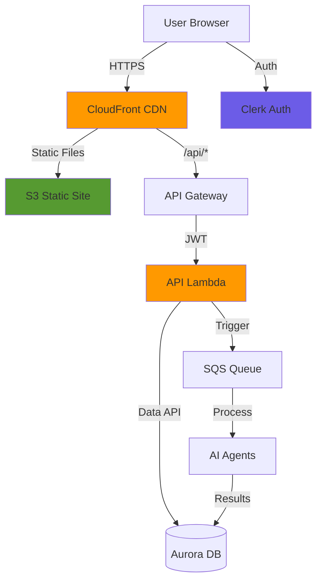

# Building Alex: Part 7 - Frontend & API

Welcome to the final development phase! In this guide, you'll deploy the user interface that brings Alex to life - a modern React application with real-time agent visualization, portfolio management, and comprehensive financial analysis displays.

## What You're Building

You'll deploy a complete SaaS frontend with:
- **Authentication**: Clerk-based sign-in/sign-up with automatic user creation
- **Portfolio Management**: Add accounts, track positions, edit holdings
- **AI Analysis**: Trigger and monitor multi-agent analysis with real-time progress
- **Interactive Reports**: Markdown reports, dynamic charts, retirement projections
- **Production Infrastructure**: CloudFront CDN, API Gateway, Lambda backend

Here's the complete architecture:



## Prerequisites

Before starting, ensure you have:
- Completed Guides 1-6 (all backend infrastructure deployed)
- AWS CLI configured
- Node.js 20+ and npm installed
- Python with `uv` package manager
- Terraform installed
- A Clerk account (free tier is fine)

## Step 1: Set Up Clerk Authentication

We'll use Clerk for authentication - the same service from earlier in the course. If you already have Clerk credentials from a previous project, you can reuse them.

### 1.1 Get Your Clerk Credentials

If you have Clerk credentials from a previous project:
1. Sign in to [Clerk Dashboard](https://dashboard.clerk.com)
2. Select your existing application
3. Navigate to **API Keys** in the left sidebar
4. You'll need:
   - Publishable Key (starts with `pk_`)
   - Secret Key (starts with `sk_`)
   - JWKS Endpoint URL (found under **Show JWT Public Key** → **JWKS Endpoint**)

If you need to create a new Clerk application:
1. Sign up at [clerk.com](https://clerk.com)
2. Create a new application
3. Choose **Email** and optionally **Google** for sign-in methods
4. Get your keys from the API Keys section

### 1.2 Configure Frontend Environment

Create `.env.local` in the frontend directory in Cursor and add your Clerk credentials:

```bash
# Clerk Authentication (use your existing keys if you have them)
NEXT_PUBLIC_CLERK_PUBLISHABLE_KEY=pk_test_your-key-here
CLERK_SECRET_KEY=sk_test_your-secret-here

# Sign-in/up redirects (these are already set correctly)
NEXT_PUBLIC_CLERK_AFTER_SIGN_IN_URL=/dashboard
NEXT_PUBLIC_CLERK_AFTER_SIGN_UP_URL=/dashboard

# API URL - use localhost for local development, AWS URL for production
NEXT_PUBLIC_API_URL=http://localhost:8000
```

### 1.3 Configure Backend Environment

Now add Clerk configuration to your root `.env` file:

```bash
# In your alex directory root .env file, add:

# Part 7 - Clerk Authentication
CLERK_JWKS_URL=https://your-app.clerk.accounts.dev/.well-known/jwks.json
```

To find your JWKS URL:
1. Go to Clerk Dashboard → **API Keys**
2. Click **Show JWT Public Key**
3. Copy the **JWKS Endpoint** URL

## Step 2: Test Frontend Locally

Let's verify the frontend works before deploying.

### 2.1 Install Dependencies

Navigate to the frontend directory and install packages:

```bash
# In alex/frontend directory
npm install
```

This installs React, NextJS, Tailwind CSS, and other dependencies.

### 2.2 Start Development Servers

We'll run both the backend API and frontend together:

```bash
# Navigate to scripts directory
# Go to alex/scripts in your terminal

# Start both frontend and backend
uv run run_local.py
```

You should see:
```
🚀 Starting FastAPI backend...
  ✅ Backend running at http://localhost:8000
     API docs: http://localhost:8000/docs

🚀 Starting NextJS frontend...
  ✅ Frontend running at http://localhost:3000
```

### 2.3 Explore the Application

Open your browser and visit [http://localhost:3000](http://localhost:3000)

1. **Landing Page**: You'll see the Alex AI Financial Advisor homepage
2. **Sign In**: Click "Sign In" and create an account or use existing Clerk credentials
3. **Dashboard**: After sign-in, you're redirected to the dashboard
4. **User Creation**: The system automatically creates your user profile in the database

### 2.4 Explore API Documentation

Open [http://localhost:8000/docs](http://localhost:8000/docs) to see the Swagger API documentation.

This interactive documentation shows:
- All available API endpoints
- Request/response schemas
- Authentication requirements
- Try-it-out functionality (requires JWT token)

Key endpoints:
- `GET /api/user` - Get or create user profile
- `GET /api/accounts` - List investment accounts
- `POST /api/positions` - Add positions to accounts
- `POST /api/analyze` - Trigger AI analysis
- `GET /api/jobs/{job_id}` - Check analysis status

## Step 3: Add Test Portfolio Data

Let's create a sample portfolio to work with.

### 3.1 Navigate to Accounts Page

1. Click **Accounts** in the navigation bar
2. You'll see "No accounts found"
3. Click **Populate Test Data** button

The system creates:
- 3 accounts (401k, Roth IRA, Taxable)
- Various ETF and stock positions
- Cash balances

### 3.2 Explore Account Management

Click on any account to:
- View positions with current values
- Edit position quantities
- Add new positions
- Delete positions
- Update cash balance

Try editing a position:
1. Click the edit icon next to any position
2. Change the quantity
3. Click save
4. See the value update automatically

**Note**: The AI analysis features require the AWS infrastructure to be deployed. You can explore portfolio management locally, but analysis will only work after deployment.

## Step 4: Deploy Infrastructure

Now let's deploy to AWS for production use.

### 4.1 Configure Terraform

Navigate to the terraform directory for Part 7:

```bash
# Go to alex/terraform/7_frontend directory

# Copy example variables
cp terraform.tfvars.example terraform.tfvars
```

Edit `terraform.tfvars` in Cursor:

```hcl
# AWS region for deployment
aws_region = "us-east-1"

# Clerk configuration for JWT validation
# Get these from your Clerk dashboard
# The JWKS URL is: https://[your-instance].clerk.accounts.dev/.well-known/jwks.json
# The issuer is: https://[your-instance].clerk.accounts.dev
clerk_jwks_url = "https://engaging-feline-80.clerk.accounts.dev/.well-known/jwks.json"
clerk_issuer   = "https://engaging-feline-80.clerk.accounts.dev"
```

To find your AWS account ID:
```bash
aws sts get-caller-identity --query Account --output text
```

### 4.2 Package the API Lambda

Navigate to the backend/api directory and package the Lambda:

```bash
# In alex/backend/api directory
uv run package_docker.py
```

This creates `api_lambda.zip` with all dependencies. Takes about 1 minute.

### 4.3 Deploy Infrastructure

Navigate back to the terraform directory and deploy:

```bash
# In alex/terraform/7_frontend directory

# Initialize Terraform
terraform init

# Review what will be created
terraform plan

# Deploy infrastructure
terraform apply
```

Type `yes` when prompted. This creates:
- S3 bucket for static frontend
- CloudFront CDN distribution
- API Gateway with Lambda integration
- Lambda function for API
- IAM roles and policies

Deployment takes 10-15 minutes (CloudFront takes time).

### 4.4 Save Important Outputs

After deployment, save the outputs:

```bash
terraform output
```

You'll see:
- `cloudfront_url` - Your frontend URL
- `api_gateway_url` - Your API endpoint
- `s3_bucket` - Frontend bucket name

Also update your root `.env` file with the SQS queue URL from Part 6:

```bash
# Check Part 6 outputs if you don't have this
# In alex/terraform/6_agents directory
terraform output sqs_queue_url

# Add to your .env file:
SQS_QUEUE_URL=https://sqs.us-east-1.amazonaws.com/123456789012/alex-analysis-jobs
```

## Step 5: Deploy Frontend Code

Now let's build and deploy the frontend application.

### 5.1 Build Frontend

Navigate to the frontend directory:

```bash
# In alex/frontend directory

# Build production version
npm run build
```

This creates an optimized production build in the `out` directory.

### 5.2 Deploy to S3

Navigate to the scripts directory and run the deployment:

```bash
# In alex/scripts directory

# Deploy frontend to S3 and invalidate CloudFront cache
uv run deploy.py
```

This script:
1. Uploads built files to S3
2. Sets correct content types
3. Invalidates CloudFront cache
4. Takes about 2 minutes

## Step 6: Test Production Deployment

### 6.1 Access Your Application

Open the CloudFront URL from the Terraform output in your browser:
```
https://d1234567890.cloudfront.net
```

1. **Sign In**: Use your Clerk credentials
2. **Dashboard**: Verify it loads correctly
3. **API Calls**: Check that data loads

### 6.2 Test Portfolio Management

1. Navigate to **Accounts**
2. Click **Populate Test Data** if needed
3. Edit a position to verify updates work
4. Add a new position

## Step 7: Run AI Analysis in Production

Now that everything is deployed, let's run the AI analysis!

### 7.1 Navigate to Advisor Team

Click **Advisor Team** in the navigation. You'll see four specialist agents:
- 🎯 **Financial Planner** - Orchestrates the analysis
- 📊 **Portfolio Analyst** - Analyzes holdings and performance
- 📈 **Chart Specialist** - Creates visualizations
- 🎯 **Retirement Planner** - Projects retirement scenarios

Note: The fifth agent (InstrumentTagger) runs invisibly when needed.

### 7.2 Start Analysis

1. Click the **Start New Analysis** button (purple, prominent)
2. Watch the progress visualization:
   - Financial Planner lights up first
   - Then three agents work in parallel
   - Each agent shows a glowing effect when active
3. Wait 60-90 seconds for completion
4. Automatically redirects to the Analysis page

### 7.3 Review Analysis Results

The Analysis page has four tabs:

**Overview Tab**:
- Executive summary
- Key observations
- Risk assessment
- Recommendations

**Charts Tab**:
- Asset allocation pie chart
- Geographic exposure
- Sector breakdown
- Top holdings

**Retirement Tab**:
- Monte Carlo simulation results
- Success probability
- Portfolio projections
- Retirement readiness score

**Recommendations Tab**:
- Specific action items
- Rebalancing suggestions
- Risk adjustments

## Step 8: Monitor in AWS Console

Let's explore what's happening behind the scenes.

### 8.1 CloudWatch Logs

1. Go to [CloudWatch Console](https://console.aws.amazon.com/cloudwatch)
2. Click **Log groups**
3. Find `/aws/lambda/alex-api`
4. Click on the latest log stream
5. You'll see API requests and responses

### 8.2 API Gateway Metrics

1. Go to [API Gateway Console](https://console.aws.amazon.com/apigateway)
2. Click on `alex-api`
3. Click **Dashboard** in the left sidebar
4. View request counts, latency, and errors

### 8.3 Lambda Performance

1. Go to [Lambda Console](https://console.aws.amazon.com/lambda)
2. Click on `alex-api`
3. Click **Monitor** tab
4. View invocations, duration, and errors
5. Check concurrent executions

### 8.4 SQS Queue Activity

When you trigger an analysis:

1. Go to [SQS Console](https://console.aws.amazon.com/sqs)
2. Click on `alex-analysis-jobs`
3. Watch **Messages Available** change
4. Check **Monitoring** tab for metrics

### 8.5 CloudFront Distribution

1. Go to [CloudFront Console](https://console.aws.amazon.com/cloudfront)
2. Click on your distribution
3. Check **Monitoring** tab for:
   - Requests per second
   - Cache hit ratio
   - Data transfer
   - Origin requests

## Step 9: Cost Monitoring

As a responsible AWS user, always monitor costs:

### 9.1 Check Current Costs

1. Sign in as your AWS root user
2. Go to [Billing Dashboard](https://console.aws.amazon.com/billing)
3. Check **Bills** for current month
4. Review service breakdown

### 9.2 Expected Costs

For this complete application:
- **Lambda**: < $1/month (pay per invocation)
- **API Gateway**: < $4/month (1M requests free tier)
- **Aurora**: $43-60/month (biggest cost)
- **S3 & CloudFront**: < $1/month for development
- **SQS**: < $1/month
- **CloudWatch**: < $5/month
- **Bedrock**: $0.01-0.10 per analysis

**Total**: ~$50-70/month during development

### 9.3 Cost Optimization

To reduce costs when not actively developing:

```bash
# Stop Aurora to save ~$43/month
# In alex/terraform/5_database directory
terraform destroy

# Or destroy everything
# Run in each terraform directory in reverse order (7, 6, 5, 4, 3, 2)
terraform destroy
```

## Troubleshooting

### Frontend Won't Build

If `npm run build` fails:
1. Check Node.js version (needs 20+)
2. Delete `node_modules` and `.next` directories
3. Run `npm install` again
4. Check for TypeScript errors

### API Returns 401 Unauthorized

If API calls fail with 401:
1. Verify Clerk keys in `.env.local`
2. Check JWKS URL in Lambda environment variables
3. Sign out and sign in again
4. Check token expiry (Clerk tokens expire after 1 hour)

### Analysis Doesn't Start

If analysis stays pending:
1. Check SQS queue for messages
2. Verify planner Lambda has SQS trigger
3. Check CloudWatch logs for errors
4. Ensure Aurora cluster is running

### CloudFront Returns 403

If you get access denied:
1. Check S3 bucket policy
2. Verify CloudFront OAI has access
3. Wait 15 minutes for propagation
4. Try incognito browser window

### Charts Don't Display

If charts are blank:
1. Check browser console for errors
2. Verify chart data in job results
3. Check Recharts library loaded
4. Review charter agent output

## Architecture Best Practices

### Security Highlights

The application implements several security best practices:

1. **Authentication**: Clerk handles all auth complexity
2. **JWT Validation**: Every API request validates tokens
3. **HTTPS Only**: CloudFront enforces SSL
4. **Input Validation**: Pydantic validates all data
5. **CORS Protection**: Restricts origins
6. **Secrets Management**: Uses AWS Secrets Manager

### Performance Optimizations

1. **CDN Caching**: Static assets cached globally
2. **Code Splitting**: NextJS automatically splits bundles
3. **API Response Caching**: CloudFront caches GET requests
4. **Database Connection Pooling**: Data API handles pooling
5. **Parallel Agent Execution**: Agents run simultaneously

### Scalability Design

The architecture scales automatically:
- **CloudFront**: Handles millions of requests
- **API Gateway**: Auto-scales to demand
- **Lambda**: Concurrent execution up to 1000
- **Aurora Serverless**: Scales ACUs as needed
- **SQS**: Manages queue automatically

## Next Steps

Congratulations! You've deployed a complete AI-powered financial planning application!

### Explore Advanced Features

Try these additional features:
1. Create multiple accounts with different strategies
2. Test with international ETFs
3. Adjust retirement parameters
4. Export reports (print to PDF)

### Customize the Application

Ideas for enhancement:
- Add more chart types
- Implement portfolio rebalancing
- Add email notifications
- Create mobile app
- Integrate with brokerages

### Continue Learning

Proceed to [Guide 8](8_observability.md) where you'll add:
- Comprehensive monitoring with CloudWatch
- Distributed tracing with X-Ray
- Security scanning
- Performance optimization

## Summary

In this guide, you successfully:
- ✅ Set up Clerk authentication
- ✅ Deployed a React/NextJS frontend
- ✅ Created a FastAPI backend on Lambda
- ✅ Configured CloudFront CDN
- ✅ Tested portfolio management
- ✅ Ran multi-agent AI analysis
- ✅ Monitored costs and performance

Your Alex Financial Advisor is now live and ready for users! 🎉

## Quick Reference

### Key URLs
- **Frontend**: Your CloudFront URL
- **API Docs**: Your API Gateway URL + `/docs`
- **Clerk Dashboard**: https://dashboard.clerk.com

### Common Commands
```bash
# Local development
uv run run_local.py

# Deploy frontend
npm run build
uv run deploy.py

# Check costs
aws ce get-cost-and-usage --time-period Start=2024-01-01,End=2024-01-31 --granularity MONTHLY --metrics "UnblendedCost" --group-by Type=DIMENSION,Key=SERVICE

# View logs
aws logs tail /aws/lambda/alex-api --follow
```

### Cost Management
- Set up billing alerts
- Review costs weekly
- Destroy resources when not needed
- Use AWS Free Tier where possible

Excellent work completing the Alex Financial Advisor! 🚀