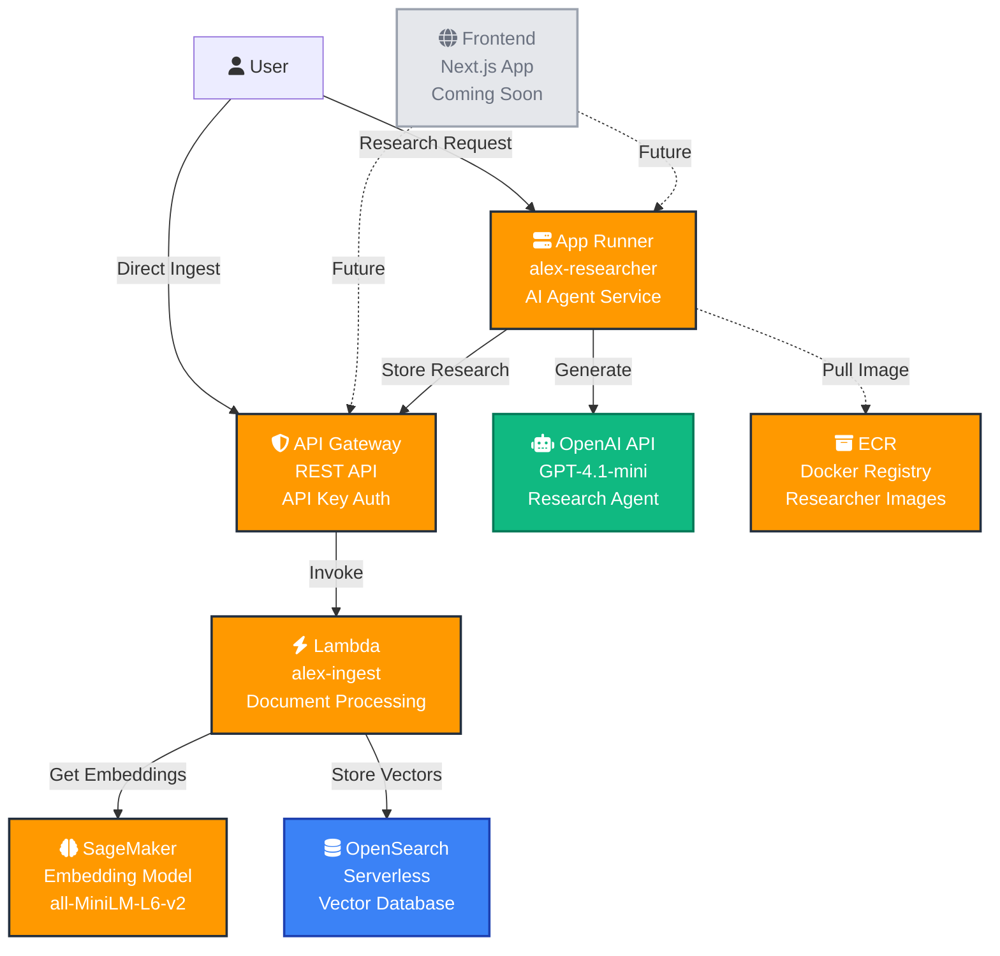

# Alex Architecture Overview

## System Architecture

The Alex platform uses a modern serverless architecture on AWS, combining AI services with scalable infrastructure:

## Data Flow

### Research Flow (Guide 4)
1. **User** requests investment research through App Runner
2. **App Runner** (Researcher service) uses OpenAI Agents SDK to generate analysis
3. **OpenAI Agent** researches the topic and creates comprehensive investment insights
4. **App Runner** calls the Ingest API to store the research
5. **Lambda** processes the document, generates embeddings via SageMaker
6. **OpenSearch** stores the document with vector embeddings for semantic search

### Direct Ingest Flow (Guide 3)
1. **User** sends documents directly to API Gateway
2. **API Gateway** authenticates with API key and invokes Lambda
3. **Lambda** processes the document and calls SageMaker for embeddings
4. **SageMaker** returns vector representation of the text
5. **Lambda** stores document + vectors in OpenSearch

### Search Flow
1. **User** queries the knowledge base
2. **Lambda** generates embedding for the query via SageMaker
3. **OpenSearch** performs vector similarity search
4. **Results** returned with semantically similar documents

## Component Details

### API Gateway (Guide 3)
- **Type**: REST API with API Key authentication
- **Endpoint**: `/ingest` - Document ingestion
- **Security**: API keys prevent unauthorized access
- **Integration**: Direct Lambda proxy integration

### Lambda Function (Guide 3)
- **Name**: `alex-ingest`
- **Runtime**: Python 3.12
- **Dependencies**: Packaged with `package.py` for cross-platform deployment
- **Functions**:
  - Document validation and processing
  - Embedding generation via SageMaker
  - OpenSearch indexing with retry logic
  - Metadata enrichment

### SageMaker Endpoint (Guide 2)
- **Model**: `sentence-transformers/all-MiniLM-L6-v2`
- **Type**: Serverless inference (auto-scaling)
- **Purpose**: Convert text to 384-dimensional vectors
- **Container**: HuggingFace inference container

### OpenSearch Serverless (Guide 3)
- **Type**: Vector search collection
- **Index**: `alex-knowledge`
- **Features**:
  - k-NN vector similarity search
  - Full-text search capabilities
  - Automatic scaling
  - Encryption at rest

### App Runner (Guide 4)
- **Service**: `alex-researcher`
- **Container**: Docker image from ECR
- **Framework**: FastAPI with OpenAI Agents SDK
- **Auto-scaling**: Managed by App Runner
- **Health checks**: `/health` endpoint monitoring

### ECR Repository (Guide 4)
- **Name**: `alex-researcher`
- **Purpose**: Store Docker images for App Runner
- **Build**: Multi-platform support (linux/amd64)

## Security

- **API Keys**: Protect public endpoints from abuse
- **IAM Roles**: Least-privilege access for each service
- **VPC**: OpenSearch runs in isolated network
- **Encryption**: Data encrypted in transit and at rest
- **Secrets**: Managed via environment variables

## Scaling

All components are serverless or auto-scaling:
- **Lambda**: Scales automatically with requests
- **SageMaker**: Serverless endpoint scales to zero
- **OpenSearch**: Serverless auto-scales storage and compute
- **App Runner**: Automatic scaling based on traffic
- **API Gateway**: Fully managed, no scaling concerns

## Cost Optimization

- **Pay-per-use**: Lambda and SageMaker Serverless only charge when used
- **Auto-scaling**: App Runner scales down to minimum during low traffic
- **Serverless**: No idle compute costs for OpenSearch
- **Free Tier**: Many services stay within AWS free tier for development