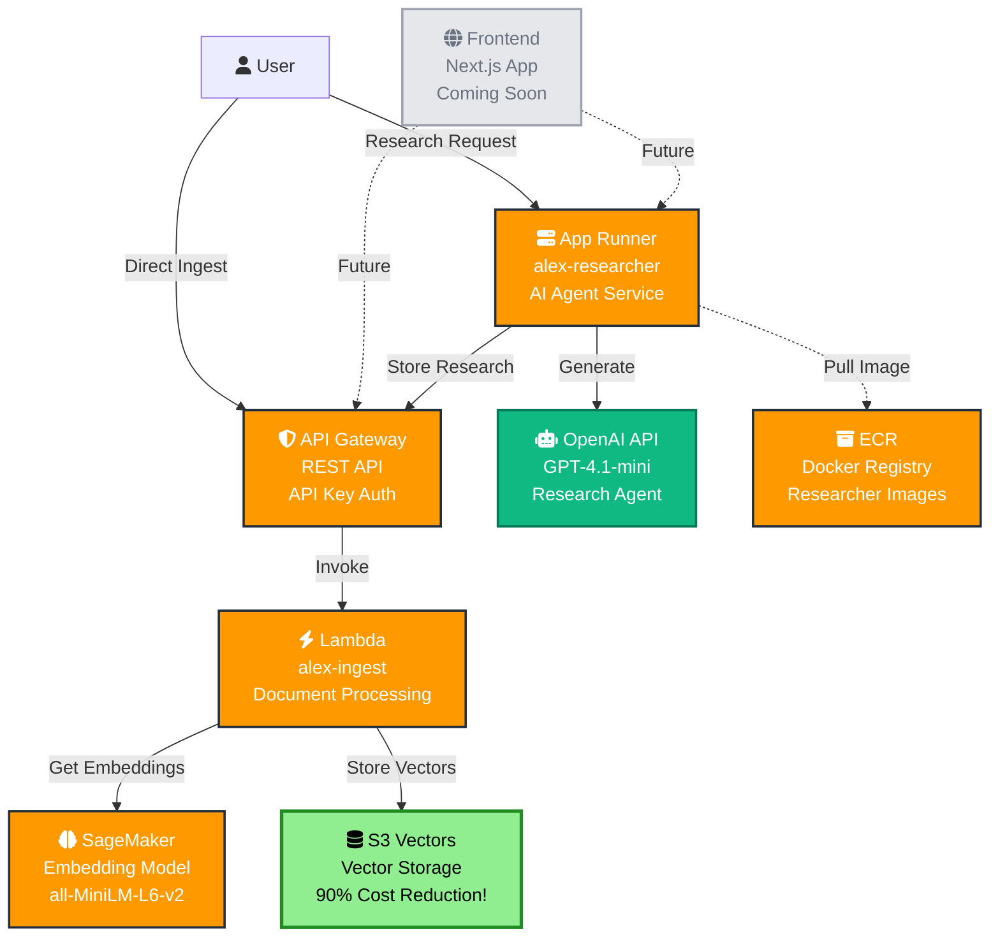
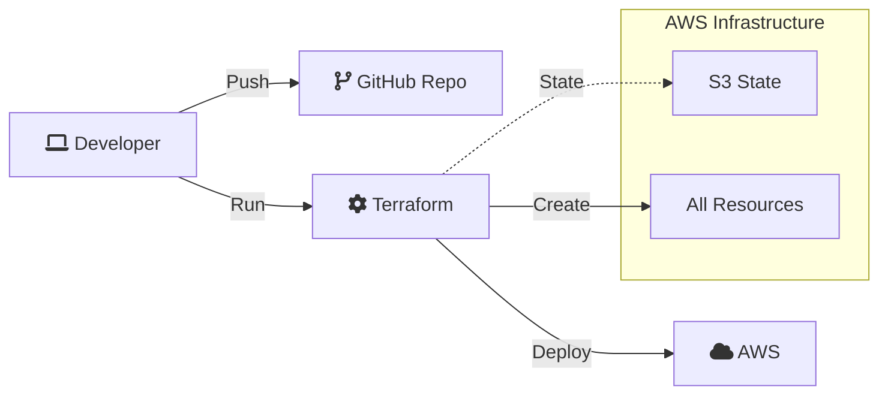

# Alex Architecture Overview (S3 Vectors Version)

## System Architecture

The Alex platform uses a modern serverless architecture on AWS, combining AI services with cost-effective infrastructure:



## Component Details

### 1. **S3 Vectors** (NEW! - 90% Cost Reduction)
- **Purpose**: Native vector storage in S3
- **Features**: 
  - Sub-second similarity search
  - Automatic optimization
  - No minimum charges
  - Strongly consistent writes
- **Cost**: ~$30/month (vs ~$300/month for OpenSearch)
- **Scale**: Millions of vectors per index

### 2. **API Gateway**
- **Type**: REST API
- **Auth**: API Key authentication
- **Endpoints**: `/ingest` (POST)
- **Purpose**: Secure access to Lambda functions

### 3. **Lambda Functions**
- **alex-ingest**: Processes documents and stores embeddings
- **Runtime**: Python 3.12
- **Memory**: 512MB
- **Timeout**: 30 seconds

### 4. **App Runner**
- **Service**: alex-researcher
- **Purpose**: Hosts the AI research agent
- **Resources**: 1 vCPU, 2GB RAM
- **Features**: Auto-scaling, HTTPS endpoint

### 5. **SageMaker Serverless**
- **Model**: sentence-transformers/all-MiniLM-L6-v2
- **Purpose**: Generate 384-dimensional embeddings
- **Memory**: 3GB
- **Concurrency**: 10 max

### 6. **External AI**
- **Provider**: OpenAI
- **Model**: GPT-4.1-mini
- **Purpose**: Research generation and analysis

## Data Flow

1. **Research Flow**:
   ```
   User → App Runner → OpenAI (generate) → API Gateway → Lambda → S3 Vectors
   ```

2. **Direct Ingest Flow**:
   ```
   User → API Gateway → Lambda → SageMaker (embed) → S3 Vectors
   ```

3. **Search Flow** (future):
   ```
   User → API Gateway → Lambda → S3 Vectors (similarity search)
   ```

## Cost Optimization

| Component | Monthly Cost | Notes |
|-----------|-------------|-------|
| S3 Vectors | ~$30 | 90% cheaper than OpenSearch! |
| SageMaker Serverless | ~$5-10 | Pay per request |
| Lambda | ~$1 | Minimal invocations |
| App Runner | ~$5 | 1 vCPU, 2GB RAM |
| API Gateway | ~$1 | REST API |
| **Total** | **~$42-47** | Previously ~$250+ |

## Security Features

- **API Gateway**: API key authentication
- **IAM Roles**: Least privilege access
- **S3 Vectors**: Always private (no public access)
- **App Runner**: HTTPS by default
- **Secrets**: Environment variables for API keys

## Deployment Architecture



## Technology Stack

- **Infrastructure**: Terraform
- **Compute**: Lambda, App Runner
- **AI/ML**: SageMaker, OpenAI
- **Storage**: S3 Vectors
- **API**: API Gateway
- **Languages**: Python 3.12
- **Container**: Docker

## Key Advantages of S3 Vectors

1. **Cost**: 90% reduction vs traditional vector databases
2. **Simplicity**: Just S3 - no complex infrastructure
3. **Scale**: Handles millions of vectors
4. **Performance**: Sub-second queries
5. **Integration**: Native AWS service

## Future Enhancements

- Frontend application (Next.js)
- User authentication
- Advanced search features
- Real-time updates
- Analytics dashboard