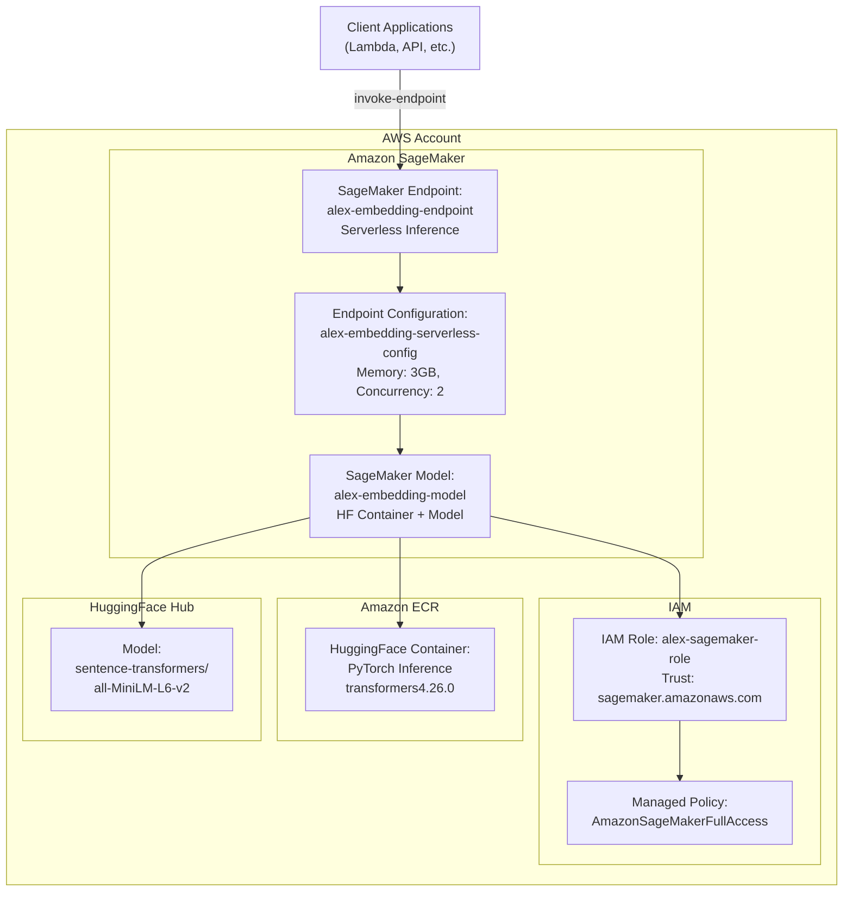
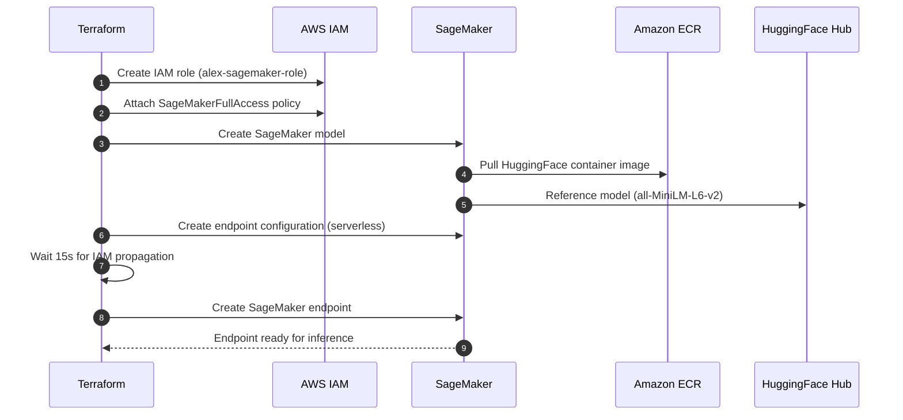
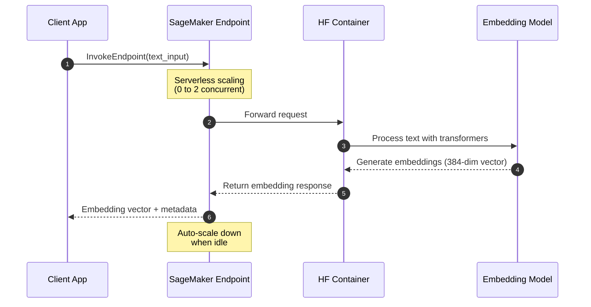

# Alex SageMaker Infrastructure (Terraform)

This document explains the SageMaker Serverless Inference stack for embedding generation defined in:
- `terraform/2_sagemaker/main.tf`
- `terraform/2_sagemaker/variables.tf`
- `terraform/2_sagemaker/outputs.tf`

## Overview

This module provisions an Amazon SageMaker Serverless Inference endpoint for generating text embeddings using HuggingFace models. The infrastructure is designed for cost-effective, on-demand inference with automatic scaling and pay-per-use pricing.

## Components

### **Terraform Configuration** (`main.tf`)
- **Terraform version**: `>= 1.5`
- **AWS Provider**: `~> 5.70`
- **Backend**: Local state storage (gitignored for security)
- **Region**: Configurable via `var.aws_region`

### **IAM Role and Permissions** (`main.tf`)
- **`aws_iam_role.sagemaker_role`**: Execution role for SageMaker services
  - Trust policy allows `sagemaker.amazonaws.com` to assume the role
  - Name: `alex-sagemaker-role`
- **`aws_iam_role_policy_attachment.sagemaker_full_access`**: 
  - Attaches `AmazonSageMakerFullAccess` managed policy
  - Provides comprehensive SageMaker permissions

### **SageMaker Model** (`main.tf`)
- **`aws_sagemaker_model.embedding_model`**: Defines the ML model
  - Name: `alex-embedding-model`
  - Uses HuggingFace PyTorch inference container
  - Environment variables:
    - `HF_MODEL_ID`: Configurable model (default: `sentence-transformers/all-MiniLM-L6-v2`)
    - `HF_TASK`: Set to `feature-extraction` for embeddings

### **Endpoint Configuration** (`main.tf`)
- **`aws_sagemaker_endpoint_configuration.serverless_config`**: Serverless inference settings
  - Name: `alex-embedding-serverless-config`
  - **Memory**: 3072 MB (3 GB)
  - **Max Concurrency**: 2 (reduced to avoid quota limits)
  - **Serverless**: Pay-per-use, automatic scaling

### **Timing and Dependencies** (`main.tf`)
- **`time_sleep.wait_for_iam_propagation`**: 15-second delay
  - Ensures IAM role is fully propagated before endpoint creation
  - Prevents race conditions during deployment

### **SageMaker Endpoint** (`main.tf`)
- **`aws_sagemaker_endpoint.embedding_endpoint`**: The inference endpoint
  - Name: `alex-embedding-endpoint`
  - Links to the serverless configuration
  - Depends on IAM propagation delay

## Variables

From `variables.tf`:

| Variable | Type | Default | Description |
|----------|------|---------|-------------|
| `aws_region` | string | - | AWS region for resources |
| `sagemaker_image_uri` | string | `763104351884.dkr.ecr.us-east-1.amazonaws.com/huggingface-pytorch-inference:1.13.1-transformers4.26.0-cpu-py39-ubuntu20.04` | SageMaker container image URI |
| `embedding_model_name` | string | `sentence-transformers/all-MiniLM-L6-v2` | HuggingFace model identifier |

## Outputs

From `outputs.tf`:

| Output | Description |
|--------|-------------|
| `sagemaker_endpoint_name` | Name of the deployed endpoint |
| `sagemaker_endpoint_arn` | ARN of the deployed endpoint |
| `setup_instructions` | Post-deployment guidance |

---

## Architecture Diagram



## Deployment Flow



## Inference Flow



## Cost Analysis

### **Serverless Inference Pricing**
- **Compute**: $0.20 per 1000 invocations (3GB memory configuration)
- **Data Processing**: $0.016 per GB processed
- **No idle charges**: Only pay for actual inference time
- **Cold start overhead**: ~10-30 seconds (no additional charge)

### **Cost Estimation Examples**

#### **Light Usage (1000 embeddings/day)**
- **Monthly invocations**: ~30,000
- **Compute cost**: ~$6/month
- **Data processing**: ~$2/month (assuming 1KB average input)
- **Total**: ~$8-10/month

#### **Medium Usage (10,000 embeddings/day)**
- **Monthly invocations**: ~300,000
- **Compute cost**: ~$60/month
- **Data processing**: ~$20/month
- **Total**: ~$80-100/month

#### **Heavy Usage (100,000 embeddings/day)**
- **Monthly invocations**: ~3,000,000
- **Compute cost**: ~$600/month
- **Data processing**: ~$200/month
- **Total**: ~$800-1000/month

### **Cost Optimization Strategies**
- **Batch Processing**: Group multiple texts in single invocation
- **Input Optimization**: Trim unnecessary whitespace and formatting
- **Caching**: Store frequently requested embeddings
- **Right-sizing**: Monitor memory usage and adjust if needed
- **Regional Deployment**: Use closest region to reduce data transfer costs

### **Scaling Characteristics**
- **Memory**: 3072 MB (sufficient for sentence-transformers models)
- **Max Concurrency**: 2 (conservative to avoid quota limits)
- **Model Size**: ~90MB (all-MiniLM-L6-v2)
- **Output**: 384-dimensional embedding vectors
- **Throughput**: ~50-100 requests/minute at max concurrency
- **Auto-scaling**: Automatic scaling from 0 to max concurrency

## Security

### **IAM Permissions**
- **Execution Role**: Dedicated role for SageMaker operations
- **Managed Policy**: Uses AWS-managed `AmazonSageMakerFullAccess`
- **Principle of Least Privilege**: Role only accessible by SageMaker service

### **Network Security**
- **VPC**: Uses default VPC (can be customized)
- **Encryption**: Data encrypted in transit and at rest
- **Access Control**: Endpoint access controlled via IAM policies

## Usage Instructions

### **Environment Setup**
After deployment, configure your application with:
```bash
export SAGEMAKER_ENDPOINT_NAME="alex-embedding-endpoint"
export SAGEMAKER_ENDPOINT_ARN="<from terraform output>"
export AWS_REGION="<your-region>"
```

### **Python Example**
```python
import boto3
import json

client = boto3.client('sagemaker-runtime', region_name='us-east-1')

response = client.invoke_endpoint(
    EndpointName='alex-embedding-endpoint',
    ContentType='application/json',
    Body=json.dumps({
        "inputs": "Hello, this is a sample text for embedding generation."
    })
)

result = json.loads(response['Body'].read().decode())
embeddings = result['embeddings']  # 384-dimensional vector
```

### **Initial Deployment**

#### **1. Deploy Infrastructure**
```bash
cd terraform/2_sagemaker
terraform init
terraform apply -var="aws_region=us-east-1" \
                -var="sagemaker_image_uri=763104351884.dkr.ecr.us-east-1.amazonaws.com/huggingface-pytorch-inference:1.13.1-transformers4.26.0-cpu-py39-ubuntu20.04" \
                -var="embedding_model_name=sentence-transformers/all-MiniLM-L6-v2"
```

#### **2. Wait for Endpoint Deployment**
```bash
# Monitor deployment status
while true; do
  STATUS=$(aws sagemaker describe-endpoint --endpoint-name alex-embedding-endpoint --query 'EndpointStatus' --output text)
  echo "Endpoint Status: $STATUS"
  if [ "$STATUS" = "InService" ]; then
    echo "Endpoint is ready!"
    break
  elif [ "$STATUS" = "Failed" ]; then
    echo "Endpoint deployment failed!"
    exit 1
  fi
  sleep 30
done
```

#### **3. Test Endpoint Functionality**
```bash
# Basic functionality test
aws sagemaker-runtime invoke-endpoint \
  --endpoint-name alex-embedding-endpoint \
  --content-type application/json \
  --body '{"inputs": "Hello, this is a test sentence for embedding generation."}' \
  response.json

# Check response
cat response.json | jq '.'
```

### **Testing the Endpoint**

## Security Best Practices

### **IAM Role Hardening**

#### **Least Privilege Policy**
```hcl
# More restrictive IAM policy for production
resource "aws_iam_role_policy" "sagemaker_restricted_policy" {
  name = "alex-sagemaker-restricted-policy"
  role = aws_iam_role.sagemaker_role.id
  
  policy = jsonencode({
    Version = "2012-10-17"
    Statement = [
      {
        Effect = "Allow"
        Action = [
          "ecr:GetDownloadUrlForLayer",
          "ecr:BatchGetImage",
          "ecr:BatchCheckLayerAvailability"
        ]
        Resource = "arn:aws:ecr:${var.aws_region}:763104351884:repository/huggingface-*"
      },
      {
        Effect = "Allow"
        Action = [
          "logs:CreateLogGroup",
          "logs:CreateLogStream",
          "logs:PutLogEvents"
        ]
        Resource = "arn:aws:logs:${var.aws_region}:${data.aws_caller_identity.current.account_id}:log-group:/aws/sagemaker/*"
      }
    ]
  })
}
```

### **Network Security**

#### **VPC Endpoint Configuration**
```hcl
# Deploy SageMaker in private VPC (optional)
resource "aws_vpc_endpoint" "sagemaker" {
  vpc_id              = data.aws_vpc.main.id
  service_name        = "com.amazonaws.${var.aws_region}.sagemaker.runtime"
  vpc_endpoint_type   = "Interface"
  subnet_ids          = data.aws_subnets.private.ids
  security_group_ids  = [aws_security_group.sagemaker_vpc_endpoint.id]
  
  policy = jsonencode({
    Version = "2012-10-17"
    Statement = [
      {
        Effect = "Allow"
        Principal = "*"
        Action = [
          "sagemaker:InvokeEndpoint"
        ]
        Resource = aws_sagemaker_endpoint.embedding_endpoint.arn
      }
    ]
  })
}
```

### **Data Encryption**

#### **Model Artifacts Encryption**
```hcl
resource "aws_kms_key" "sagemaker_key" {
  description             = "KMS key for SageMaker model encryption"
  deletion_window_in_days = 7
  
  tags = {
    Project = "alex"
    Part    = "2"
  }
}

resource "aws_sagemaker_model" "encrypted_embedding_model" {
  name               = "alex-embedding-model-encrypted"
  execution_role_arn = aws_iam_role.sagemaker_role.arn

  primary_container {
    image = var.sagemaker_image_uri
    environment = {
      HF_MODEL_ID = var.embedding_model_name
      HF_TASK     = "feature-extraction"
    }
  }
  
  # Enable model encryption
  enable_network_isolation = true
  
  vpc_config {
    security_group_ids = [aws_security_group.sagemaker.id]
    subnets           = data.aws_subnets.private.ids
  }
}
```

## Files and References

- **Main Configuration**: `terraform/2_sagemaker/main.tf`
- **Variables**: `terraform/2_sagemaker/variables.tf`
- **Outputs**: `terraform/2_sagemaker/outputs.tf`
- **Model Documentation**: [HuggingFace sentence-transformers](https://huggingface.co/sentence-transformers)
- **SageMaker Serverless**: [AWS Documentation](https://docs.aws.amazon.com/sagemaker/latest/dg/serverless-endpoints.html)

## Advanced Configuration

### **Model Customization**

#### **Using Different HuggingFace Models**
```hcl
# In terraform.tfvars
embedding_model_name = "sentence-transformers/all-mpnet-base-v2"  # Higher quality, larger model
# or
embedding_model_name = "sentence-transformers/paraphrase-MiniLM-L3-v2"  # Faster, smaller model
```

#### **Custom Container Images**
```hcl
# For different regions or custom models
sagemaker_image_uri = "763104351884.dkr.ecr.eu-west-1.amazonaws.com/huggingface-pytorch-inference:1.13.1-transformers4.26.0-cpu-py39-ubuntu20.04"
```

#### **Memory and Concurrency Tuning**
```hcl
# In main.tf - increase for larger models
serverless_config {
  memory_size_in_mb = 6144  # 6GB for larger models
  max_concurrency   = 5     # Higher throughput
}
```

### **Multi-Model Deployment**

#### **Deploy Multiple Embedding Models**
```hcl
# Additional model for different use cases
resource "aws_sagemaker_model" "large_embedding_model" {
  name               = "alex-large-embedding-model"
  execution_role_arn = aws_iam_role.sagemaker_role.arn

  primary_container {
    image = var.sagemaker_image_uri
    environment = {
      HF_MODEL_ID = "sentence-transformers/all-mpnet-base-v2"
      HF_TASK     = "feature-extraction"
    }
  }
}

# Separate endpoint for large model
resource "aws_sagemaker_endpoint_configuration" "large_serverless_config" {
  name = "alex-large-embedding-serverless-config"

  production_variants {
    model_name = aws_sagemaker_model.large_embedding_model.name
    
    serverless_config {
      memory_size_in_mb = 6144
      max_concurrency   = 2
    }
  }
}
```

### **Performance Optimization**

#### **Provisioned Concurrency (for consistent latency)**
```hcl
# Alternative to serverless for high-traffic scenarios
resource "aws_sagemaker_endpoint_configuration" "provisioned_config" {
  name = "alex-embedding-provisioned-config"

  production_variants {
    model_name                 = aws_sagemaker_model.embedding_model.name
    initial_instance_count     = 1
    instance_type             = "ml.t2.medium"
    initial_variant_weight    = 1
  }
}
```

#### **Auto Scaling Configuration**
```hcl
resource "aws_appautoscaling_target" "sagemaker_target" {
  max_capacity       = 3
  min_capacity       = 1
  resource_id        = "endpoint/${aws_sagemaker_endpoint.embedding_endpoint.name}/variant/AllTraffic"
  scalable_dimension = "sagemaker:variant:DesiredInstanceCount"
  service_namespace  = "sagemaker"
}

resource "aws_appautoscaling_policy" "sagemaker_policy" {
  name               = "alex-sagemaker-scaling-policy"
  policy_type        = "TargetTrackingScaling"
  resource_id        = aws_appautoscaling_target.sagemaker_target.resource_id
  scalable_dimension = aws_appautoscaling_target.sagemaker_target.scalable_dimension
  service_namespace  = aws_appautoscaling_target.sagemaker_target.service_namespace

  target_tracking_scaling_policy_configuration {
    target_value = 70.0
    predefined_metric_specification {
      predefined_metric_type = "SageMakerVariantInvocationsPerInstance"
    }
  }
}
```

## Monitoring & Observability

### **CloudWatch Metrics**

#### **Key Metrics to Monitor**
```bash
# Invocation count
aws cloudwatch get-metric-statistics \
  --namespace AWS/SageMaker \
  --metric-name Invocations \
  --dimensions Name=EndpointName,Value=alex-embedding-endpoint \
  --start-time $(date -u -d '1 hour ago' +%Y-%m-%dT%H:%M:%S) \
  --end-time $(date -u +%Y-%m-%dT%H:%M:%S) \
  --period 300 \
  --statistics Sum

# Model latency
aws cloudwatch get-metric-statistics \
  --namespace AWS/SageMaker \
  --metric-name ModelLatency \
  --dimensions Name=EndpointName,Value=alex-embedding-endpoint \
  --start-time $(date -u -d '1 hour ago' +%Y-%m-%dT%H:%M:%S) \
  --end-time $(date -u +%Y-%m-%dT%H:%M:%S) \
  --period 300 \
  --statistics Average

# Error rate
aws cloudwatch get-metric-statistics \
  --namespace AWS/SageMaker \
  --metric-name ModelSetupTime \
  --dimensions Name=EndpointName,Value=alex-embedding-endpoint \
  --start-time $(date -u -d '1 hour ago' +%Y-%m-%dT%H:%M:%S) \
  --end-time $(date -u +%Y-%m-%dT%H:%M:%S) \
  --period 300 \
  --statistics Average
```

#### **Custom CloudWatch Dashboard**
```bash
# Create dashboard for SageMaker metrics
aws cloudwatch put-dashboard \
  --dashboard-name "Alex-SageMaker-Dashboard" \
  --dashboard-body '{
    "widgets": [
      {
        "type": "metric",
        "properties": {
          "metrics": [
            ["AWS/SageMaker", "Invocations", "EndpointName", "alex-embedding-endpoint"],
            [".", "ModelLatency", ".", "."],
            [".", "OverheadLatency", ".", "."]
          ],
          "period": 300,
          "stat": "Average",
          "region": "us-east-1",
          "title": "SageMaker Endpoint Metrics"
        }
      }
    ]
  }'
```

### **Alerting Setup**

#### **High Error Rate Alert**
```bash
aws cloudwatch put-metric-alarm \
  --alarm-name "alex-sagemaker-high-error-rate" \
  --alarm-description "Alert when SageMaker endpoint error rate is high" \
  --metric-name "4XXError" \
  --namespace "AWS/SageMaker" \
  --statistic "Sum" \
  --period 300 \
  --threshold 5 \
  --comparison-operator "GreaterThanThreshold" \
  --dimensions Name=EndpointName,Value=alex-embedding-endpoint \
  --evaluation-periods 2
```

#### **High Latency Alert**
```bash
aws cloudwatch put-metric-alarm \
  --alarm-name "alex-sagemaker-high-latency" \
  --alarm-description "Alert when SageMaker endpoint latency is high" \
  --metric-name "ModelLatency" \
  --namespace "AWS/SageMaker" \
  --statistic "Average" \
  --period 300 \
  --threshold 5000 \
  --comparison-operator "GreaterThanThreshold" \
  --dimensions Name=EndpointName,Value=alex-embedding-endpoint \
  --evaluation-periods 2
```

## Troubleshooting

### **Diagnostic Commands**

#### **Check Endpoint Status**
```bash
# Detailed endpoint information
aws sagemaker describe-endpoint --endpoint-name alex-embedding-endpoint

# Check endpoint configuration
aws sagemaker describe-endpoint-config --endpoint-config-name alex-embedding-serverless-config

# Verify model details
aws sagemaker describe-model --model-name alex-embedding-model
```

#### **Monitor Deployment Progress**
```bash
# Real-time endpoint status monitoring
watch -n 10 'aws sagemaker describe-endpoint --endpoint-name alex-embedding-endpoint --query "EndpointStatus" --output text'

# Check recent logs
aws logs tail /aws/sagemaker/Endpoints/alex-embedding-endpoint --follow
```

### **Common Issues and Solutions**

#### **Endpoint Deployment Failures**
```bash
# Check for deployment errors
aws sagemaker describe-endpoint --endpoint-name alex-embedding-endpoint --query 'FailureReason'

# Review CloudWatch logs for errors
aws logs filter-log-events \
  --log-group-name "/aws/sagemaker/Endpoints/alex-embedding-endpoint" \
  --filter-pattern "ERROR"

# Verify IAM role permissions
aws iam simulate-principal-policy \
  --policy-source-arn $(aws sagemaker describe-model --model-name alex-embedding-model --query 'ExecutionRoleArn' --output text) \
  --action-names sagemaker:CreateEndpoint \
  --resource-arns "*"
```

#### **Cold Start Issues**
```bash
# Monitor cold start times
aws logs filter-log-events \
  --log-group-name "/aws/sagemaker/Endpoints/alex-embedding-endpoint" \
  --filter-pattern "INFERENCE_ACCELERATOR_LOAD_TIME"

# Warm up endpoint with test requests
for i in {1..5}; do
  aws sagemaker-runtime invoke-endpoint \
    --endpoint-name alex-embedding-endpoint \
    --content-type application/json \
    --body '{"inputs": "warmup request"}' \
    /tmp/warmup_response_$i.json
  sleep 2
done
```

#### **Memory and Performance Issues**
```bash
# Check memory utilization
aws cloudwatch get-metric-statistics \
  --namespace AWS/SageMaker \
  --metric-name MemoryUtilization \
  --dimensions Name=EndpointName,Value=alex-embedding-endpoint \
  --start-time $(date -u -d '1 hour ago' +%Y-%m-%dT%H:%M:%S) \
  --end-time $(date -u +%Y-%m-%dT%H:%M:%S) \
  --period 300 \
  --statistics Maximum

# Monitor CPU usage
aws cloudwatch get-metric-statistics \
  --namespace AWS/SageMaker \
  --metric-name CPUUtilization \
  --dimensions Name=EndpointName,Value=alex-embedding-endpoint \
  --start-time $(date -u -d '1 hour ago' +%Y-%m-%dT%H:%M:%S) \
  --end-time $(date -u +%Y-%m-%dT%H:%M:%S) \
  --period 300 \
  --statistics Average
```

#### **Quota and Limit Issues**
```bash
# Check service quotas
aws service-quotas get-service-quota \
  --service-code sagemaker \
  --quota-code L-1194F27D  # Serverless inference concurrent executions

# Request quota increase if needed
aws service-quotas request-service-quota-increase \
  --service-code sagemaker \
  --quota-code L-1194F27D \
  --desired-value 10
```

### **Performance Optimization**

#### **Batch Processing Implementation**
```python
# Optimized batch processing for multiple embeddings
import boto3
import json
from typing import List

class OptimizedEmbeddingClient:
    def __init__(self, endpoint_name: str, region: str = 'us-east-1'):
        self.client = boto3.client('sagemaker-runtime', region_name=region)
        self.endpoint_name = endpoint_name
    
    def get_embeddings_batch(self, texts: List[str], batch_size: int = 10):
        """Process texts in batches for better performance"""
        results = []
        
        for i in range(0, len(texts), batch_size):
            batch = texts[i:i + batch_size]
            
            response = self.client.invoke_endpoint(
                EndpointName=self.endpoint_name,
                ContentType='application/json',
                Body=json.dumps({"inputs": batch})
            )
            
            batch_results = json.loads(response['Body'].read().decode())
            results.extend(batch_results)
        
        return results
    
    def get_embedding_single(self, text: str):
        """Single text embedding with error handling"""
        try:
            response = self.client.invoke_endpoint(
                EndpointName=self.endpoint_name,
                ContentType='application/json',
                Body=json.dumps({"inputs": text})
            )
            
            result = json.loads(response['Body'].read().decode())
            return result
            
        except Exception as e:
            print(f"Error getting embedding: {e}")
            return None

# Usage example
client = OptimizedEmbeddingClient('alex-embedding-endpoint')
texts = ["Document 1 content", "Document 2 content", "Document 3 content"]
embeddings = client.get_embeddings_batch(texts, batch_size=5)
```

#### **Caching Strategy**
```python
# Redis-based caching for frequently requested embeddings
import redis
import hashlib
import json

class CachedEmbeddingClient(OptimizedEmbeddingClient):
    def __init__(self, endpoint_name: str, redis_host: str = 'localhost', region: str = 'us-east-1'):
        super().__init__(endpoint_name, region)
        self.redis_client = redis.Redis(host=redis_host, port=6379, db=0)
        self.cache_ttl = 3600  # 1 hour
    
    def _get_cache_key(self, text: str) -> str:
        """Generate cache key from text content"""
        return f"embedding:{hashlib.md5(text.encode()).hexdigest()}"
    
    def get_embedding_cached(self, text: str):
        """Get embedding with caching"""
        cache_key = self._get_cache_key(text)
        
        # Try cache first
        cached_result = self.redis_client.get(cache_key)
        if cached_result:
            return json.loads(cached_result)
        
        # Get from SageMaker if not cached
        result = self.get_embedding_single(text)
        if result:
            # Cache the result
            self.redis_client.setex(
                cache_key, 
                self.cache_ttl, 
                json.dumps(result)
            )
        
        return result
```

## Integration Notes

### **Dependencies**
- **HuggingFace Models**: Requires internet access to download models on first deployment
- **ECR Access**: Needs permissions to pull HuggingFace inference containers
- **Regional Availability**: Serverless inference available in limited regions

### **Integration with Other Components**
- **Part 3 (Ingestion)**: Provides embedding generation for document processing
- **Part 4 (Researcher)**: Can be used for research content embedding
- **Part 5 (Database)**: Embeddings stored in vector database for similarity search

### **Model Compatibility Matrix**

| Model | Memory Required | Output Dimensions | Use Case |
|-------|----------------|-------------------|----------|
| `all-MiniLM-L6-v2` | 3GB | 384 | General purpose, fast |
| `all-mpnet-base-v2` | 6GB | 768 | Higher quality, slower |
| `paraphrase-MiniLM-L3-v2` | 2GB | 384 | Paraphrase detection |
| `multi-qa-MiniLM-L6-cos-v1` | 3GB | 384 | Question-answering |

## Future Enhancements

### **Multi-Model Endpoints**
- Deploy multiple embedding models on single endpoint
- Route requests based on content type or quality requirements
- A/B testing between different models

### **Custom Model Training**
- Fine-tune models on domain-specific financial data
- Implement custom training pipelines
- Model versioning and rollback capabilities

### **Advanced Features**
- **Real-time Model Updates**: Hot-swapping models without downtime
- **Multi-Region Deployment**: Global endpoint distribution
- **Edge Deployment**: SageMaker Edge for local inference
- **Batch Transform**: Large-scale offline embedding generation

### **Production Deployment Checklist**

#### **Pre-Deployment**
- [ ] Verify HuggingFace model compatibility
- [ ] Test model locally with sample data
- [ ] Review IAM permissions and security groups
- [ ] Confirm regional availability of serverless inference
- [ ] Set up monitoring and alerting

#### **Post-Deployment**
- [ ] Validate endpoint functionality with test requests
- [ ] Monitor cold start times and performance
- [ ] Set up cost monitoring and budgets
- [ ] Configure auto-scaling if using provisioned endpoints
- [ ] Document API usage and integration patterns

#### **Ongoing Maintenance**
- [ ] Regular model performance evaluation
- [ ] Monitor and optimize costs
- [ ] Update models and container images
- [ ] Review and rotate IAM credentials
- [ ] Backup and disaster recovery planning

## Notes & Tips
