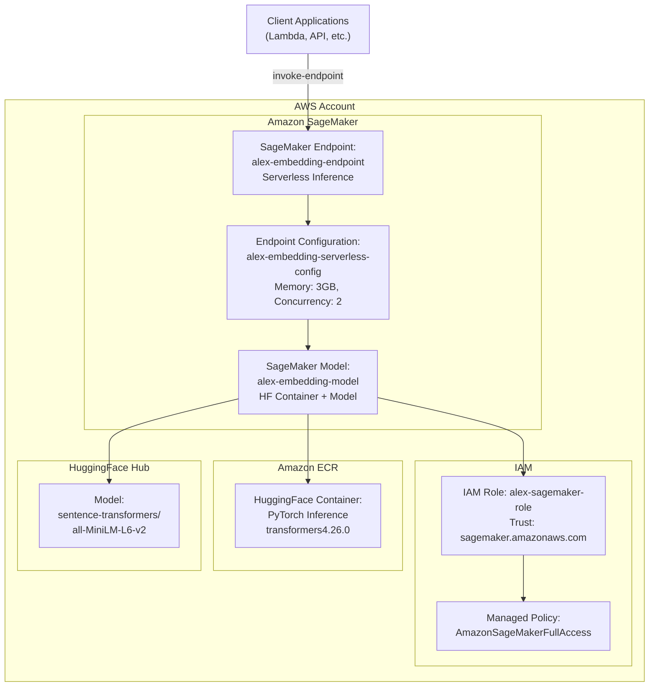
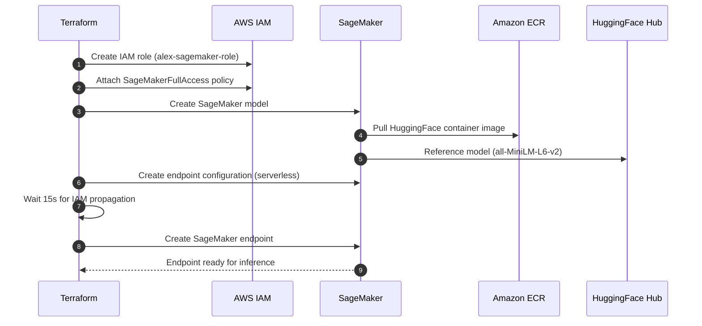
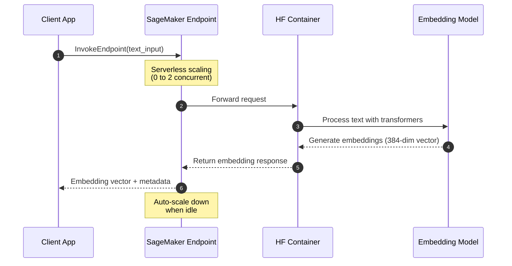

# Alex SageMaker Infrastructure (Terraform)

This document explains the SageMaker Serverless Inference stack for embedding generation defined in:
- `terraform/2_sagemaker/main.tf`
- `terraform/2_sagemaker/variables.tf`
- `terraform/2_sagemaker/outputs.tf`

## Overview

This module provisions an Amazon SageMaker Serverless Inference endpoint for generating text embeddings using HuggingFace models. The infrastructure is designed for cost-effective, on-demand inference with automatic scaling and pay-per-use pricing.

## Components

### **Terraform Configuration** (`main.tf`)
- **Terraform version**: `>= 1.5`
- **AWS Provider**: `~> 5.70`
- **Backend**: Local state storage (gitignored for security)
- **Region**: Configurable via `var.aws_region`

### **IAM Role and Permissions** (`main.tf`)
- **`aws_iam_role.sagemaker_role`**: Execution role for SageMaker services
  - Trust policy allows `sagemaker.amazonaws.com` to assume the role
  - Name: `alex-sagemaker-role`
- **`aws_iam_role_policy_attachment.sagemaker_full_access`**: 
  - Attaches `AmazonSageMakerFullAccess` managed policy
  - Provides comprehensive SageMaker permissions

### **SageMaker Model** (`main.tf`)
- **`aws_sagemaker_model.embedding_model`**: Defines the ML model
  - Name: `alex-embedding-model`
  - Uses HuggingFace PyTorch inference container
  - Environment variables:
    - `HF_MODEL_ID`: Configurable model (default: `sentence-transformers/all-MiniLM-L6-v2`)
    - `HF_TASK`: Set to `feature-extraction` for embeddings

### **Endpoint Configuration** (`main.tf`)
- **`aws_sagemaker_endpoint_configuration.serverless_config`**: Serverless inference settings
  - Name: `alex-embedding-serverless-config`
  - **Memory**: 3072 MB (3 GB)
  - **Max Concurrency**: 2 (reduced to avoid quota limits)
  - **Serverless**: Pay-per-use, automatic scaling

### **Timing and Dependencies** (`main.tf`)
- **`time_sleep.wait_for_iam_propagation`**: 15-second delay
  - Ensures IAM role is fully propagated before endpoint creation
  - Prevents race conditions during deployment

### **SageMaker Endpoint** (`main.tf`)
- **`aws_sagemaker_endpoint.embedding_endpoint`**: The inference endpoint
  - Name: `alex-embedding-endpoint`
  - Links to the serverless configuration
  - Depends on IAM propagation delay

## Variables

From `variables.tf`:

| Variable | Type | Default | Description |
|----------|------|---------|-------------|
| `aws_region` | string | - | AWS region for resources |
| `sagemaker_image_uri` | string | `763104351884.dkr.ecr.us-east-1.amazonaws.com/huggingface-pytorch-inference:1.13.1-transformers4.26.0-cpu-py39-ubuntu20.04` | SageMaker container image URI |
| `embedding_model_name` | string | `sentence-transformers/all-MiniLM-L6-v2` | HuggingFace model identifier |

## Outputs

From `outputs.tf`:

| Output | Description |
|--------|-------------|
| `sagemaker_endpoint_name` | Name of the deployed endpoint |
| `sagemaker_endpoint_arn` | ARN of the deployed endpoint |
| `setup_instructions` | Post-deployment guidance |

---

## Architecture Diagram



## Deployment Flow



## Inference Flow



## Cost & Scaling

### **Serverless Benefits**
- **Pay-per-use**: Only charged for actual inference time
- **Auto-scaling**: Scales from 0 to 2 concurrent requests
- **No idle costs**: No charges when not processing requests
- **Cold start**: ~10-30 seconds for first request after idle period

### **Configuration Details**
- **Memory**: 3072 MB (sufficient for sentence-transformers models)
- **Max Concurrency**: 2 (conservative to avoid quota limits)
- **Model Size**: ~90MB (all-MiniLM-L6-v2)
- **Output**: 384-dimensional embedding vectors

## Security

### **IAM Permissions**
- **Execution Role**: Dedicated role for SageMaker operations
- **Managed Policy**: Uses AWS-managed `AmazonSageMakerFullAccess`
- **Principle of Least Privilege**: Role only accessible by SageMaker service

### **Network Security**
- **VPC**: Uses default VPC (can be customized)
- **Encryption**: Data encrypted in transit and at rest
- **Access Control**: Endpoint access controlled via IAM policies

## Usage Instructions

### **Environment Setup**
After deployment, configure your application with:
```bash
export SAGEMAKER_ENDPOINT_NAME="alex-embedding-endpoint"
export SAGEMAKER_ENDPOINT_ARN="<from terraform output>"
export AWS_REGION="<your-region>"
```

### **Python Example**
```python
import boto3
import json

client = boto3.client('sagemaker-runtime', region_name='us-east-1')

response = client.invoke_endpoint(
    EndpointName='alex-embedding-endpoint',
    ContentType='application/json',
    Body=json.dumps({
        "inputs": "Hello, this is a sample text for embedding generation."
    })
)

result = json.loads(response['Body'].read().decode())
embeddings = result['embeddings']  # 384-dimensional vector
```

### **Testing the Endpoint**
```bash
# Test endpoint availability
aws sagemaker describe-endpoint --endpoint-name alex-embedding-endpoint

# Get endpoint status
aws sagemaker-runtime invoke-endpoint \
  --endpoint-name alex-embedding-endpoint \
  --content-type application/json \
  --body '{"inputs": "test text"}' \
  response.json
```

## Files and References

- **Main Configuration**: `terraform/2_sagemaker/main.tf`
- **Variables**: `terraform/2_sagemaker/variables.tf`
- **Outputs**: `terraform/2_sagemaker/outputs.tf`

## Notes & Tips

### **Model Customization**
- Change `embedding_model_name` variable to use different HuggingFace models
- Ensure the model is compatible with the `feature-extraction` task
- Adjust memory if using larger models

### **Performance Optimization**
- Increase `max_concurrency` for higher throughput (watch quotas)
- Consider provisioned endpoints for consistent low-latency requirements
- Monitor CloudWatch metrics for optimization opportunities

### **Troubleshooting**
- **Cold starts**: First request after idle period takes longer
- **Memory errors**: Increase `memory_size_in_mb` for larger models
- **Quota limits**: Request limit increases for higher concurrency
- **IAM propagation**: The 15-second delay prevents most timing issues
