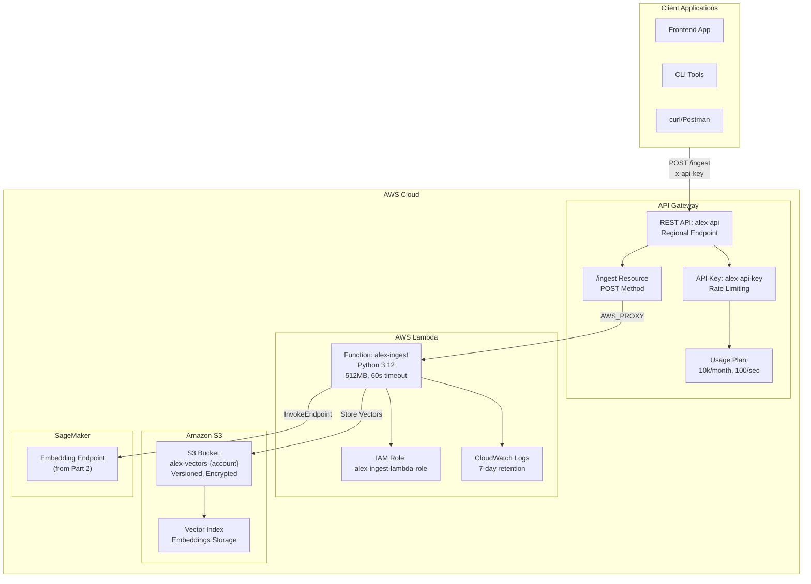
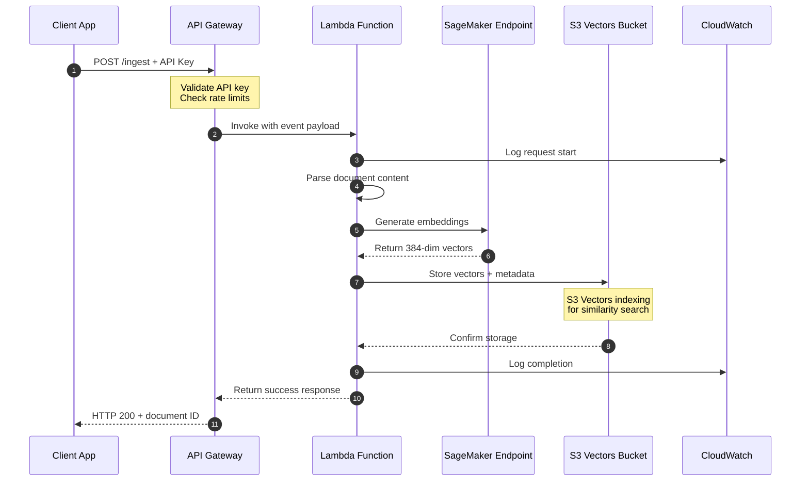
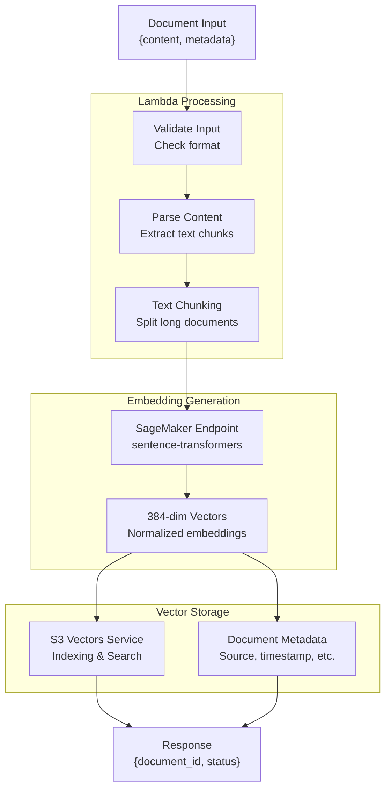

# Alex Ingestion Infrastructure (Terraform)

This document explains the document ingestion and vector storage pipeline defined in:
- `terraform/3_ingestion/main.tf`
- `terraform/3_ingestion/variables.tf`
- `terraform/3_ingestion/outputs.tf`

## Overview

This module provisions a complete document ingestion pipeline that processes text documents, generates embeddings using SageMaker, and stores them in S3 for vector search. The architecture includes API Gateway for HTTP endpoints, Lambda for processing, and S3 with vector indexing capabilities.

## Components

### **Terraform Configuration** (`main.tf`)
- **Terraform version**: `>= 1.5`
- **AWS Provider**: `~> 5.0`
- **Backend**: Local state storage (gitignored for security)
- **Region**: Configurable via `var.aws_region`

### **S3 Vector Storage** (`main.tf`)
- **`aws_s3_bucket.vectors`**: Primary storage for vector embeddings
  - Name: `alex-vectors-{account-id}` (globally unique)
  - Tags: Project "alex", Part "3"
- **`aws_s3_bucket_versioning.vectors`**: Version control enabled
- **`aws_s3_bucket_server_side_encryption_configuration.vectors`**: AES256 encryption
- **`aws_s3_bucket_public_access_block.vectors`**: Complete public access blocking

### **Lambda Function** (`main.tf`)
- **`aws_iam_role.lambda_role`**: Execution role for Lambda
  - Name: `alex-ingest-lambda-role`
  - Trust policy for `lambda.amazonaws.com`
- **`aws_iam_role_policy.lambda_policy`**: Comprehensive permissions for:
  - CloudWatch Logs (create groups, streams, put events)
  - S3 operations (get, put, delete objects, list bucket)
  - SageMaker endpoint invocation
  - S3 Vectors operations (put, query, get, delete vectors)
- **`aws_lambda_function.ingest`**: Main processing function
  - Name: `alex-ingest`
  - Runtime: Python 3.12
  - Handler: `ingest_s3vectors.lambda_handler`
  - Timeout: 60 seconds, Memory: 512 MB
  - Environment variables: `VECTOR_BUCKET`, `SAGEMAKER_ENDPOINT`
- **`aws_cloudwatch_log_group.lambda_logs`**: Log retention (7 days)

### **API Gateway** (`main.tf`)
- **`aws_api_gateway_rest_api.api`**: REST API endpoint
  - Name: `alex-api`
  - Type: Regional endpoint
- **`aws_api_gateway_resource.ingest`**: `/ingest` resource path
- **`aws_api_gateway_method.ingest_post`**: POST method with API key requirement
- **`aws_api_gateway_integration.lambda`**: AWS_PROXY integration with Lambda
- **`aws_lambda_permission.api_gateway`**: Permission for API Gateway to invoke Lambda
- **`aws_api_gateway_deployment.api`**: Deployment with automatic redeployment triggers
- **`aws_api_gateway_stage.api`**: Production stage
- **`aws_api_gateway_api_key.api_key`**: API key for authentication
- **`aws_api_gateway_usage_plan.plan`**: Rate limiting and quotas
  - Monthly quota: 10,000 requests
  - Rate limit: 100 requests/second
  - Burst limit: 200 requests
- **`aws_api_gateway_usage_plan_key.plan_key`**: Links API key to usage plan

## Variables

From `variables.tf`:

| Variable | Type | Description |
|----------|------|-------------|
| `aws_region` | string | AWS region for resources |
| `sagemaker_endpoint_name` | string | Name of the SageMaker endpoint from Part 2 |

## Outputs

From `outputs.tf`:

| Output | Description |
|--------|-------------|
| `vector_bucket_name` | Name of the S3 Vectors bucket |
| `api_endpoint` | Complete API Gateway endpoint URL |
| `api_key_id` | API Key ID for management |
| `api_key_value` | API Key value (sensitive) |
| `setup_instructions` | Complete setup and testing instructions |

---

## Architecture Diagram



## Ingestion Flow



## Data Processing Flow



## Security & Access Control

### **API Security**
- **API Key Authentication**: Required for all requests
- **Rate Limiting**: 100 requests/second, 200 burst
- **Monthly Quotas**: 10,000 requests per month
- **Regional Endpoint**: Reduced attack surface

### **IAM Permissions**
- **Least Privilege**: Lambda role has minimal required permissions
- **Resource-Specific**: S3 and SageMaker permissions scoped to specific resources
- **CloudWatch Logging**: Separate permissions for observability

### **S3 Security**
- **Public Access Blocked**: Complete prevention of public access
- **Server-Side Encryption**: AES256 encryption at rest
- **Versioning Enabled**: Protection against accidental deletion
- **Bucket Policy**: Implicit deny for unauthorized access

## Performance & Scaling

### **Lambda Configuration**
- **Memory**: 512 MB (balanced for embedding processing)
- **Timeout**: 60 seconds (sufficient for document processing)
- **Runtime**: Python 3.12 (latest stable version)
- **Concurrency**: AWS default (1000 concurrent executions)

### **API Gateway Limits**
- **Rate Limiting**: Protects backend from overload
- **Burst Capacity**: Handles traffic spikes
- **Regional Deployment**: Low latency for regional users

### **S3 Vectors Performance**
- **Automatic Indexing**: Built-in vector similarity search
- **Scalable Storage**: Handles millions of documents
- **Fast Retrieval**: Optimized for vector queries

## Cost Analysis

### **Pay-per-Use Components**
- **Lambda**: $0.20 per 1M requests + $0.0000166667 per GB-second
- **API Gateway**: $3.50 per million API calls + $0.09 per GB data transfer
- **SageMaker**: Serverless inference (from Part 2) - ~$0.20 per 1000 invocations
- **S3**: $0.023 per GB-month storage + $0.0004 per 1000 requests
- **S3 Vectors**: Additional indexing costs for vector operations

### **Cost Estimation Examples**

#### **Light Usage (100 documents/day)**
- **Lambda**: ~$2-5/month (depends on document size)
- **API Gateway**: ~$1/month
- **S3 Storage**: ~$1-3/month (1-5 GB vectors)
- **SageMaker**: ~$6/month (3000 embedding calls)
- **Total**: ~$10-15/month

#### **Heavy Usage (1000 documents/day)**
- **Lambda**: ~$20-50/month
- **API Gateway**: ~$10/month
- **S3 Storage**: ~$10-30/month (50-150 GB vectors)
- **SageMaker**: ~$60/month (30,000 embedding calls)
- **Total**: ~$100-150/month

### **Cost Optimization Strategies**
- **Batch Processing**: Group multiple documents in single API calls
- **Document Chunking**: Optimize chunk size to balance accuracy vs. cost
- **Caching**: Avoid re-processing identical content
- **Storage Lifecycle**: Archive old vectors to cheaper storage classes
- **Rate Limiting**: Prevent unexpected cost spikes from high traffic

## Usage Instructions

### **Initial Deployment**

#### **1. Deploy Infrastructure**
```bash
cd terraform/3_ingestion
terraform init
terraform apply -var="aws_region=us-east-1" \
                -var="sagemaker_endpoint_name=alex-embedding-endpoint"
```

#### **2. Get API Key and Configure Environment**
```bash
# Get API key value
API_KEY_ID=$(terraform output -raw api_key_id)
API_KEY_VALUE=$(aws apigateway get-api-key --api-key $API_KEY_ID --include-value --query 'value' --output text)

# Get other outputs
VECTOR_BUCKET=$(terraform output -raw vector_bucket_name)
API_ENDPOINT=$(terraform output -raw api_endpoint)

# Create .env file
cat > .env << EOF
VECTOR_BUCKET=$VECTOR_BUCKET
ALEX_API_ENDPOINT=$API_ENDPOINT
ALEX_API_KEY=$API_KEY_VALUE
EOF
```

#### **3. Deploy Lambda Function Code**
```bash
# Navigate to backend directory
cd ../../backend/ingest

# Install dependencies
pip install -r requirements.txt -t .

# Create deployment package
zip -r lambda_function.zip .

# Update Lambda function
aws lambda update-function-code \
  --function-name alex-ingest \
  --zip-file fileb://lambda_function.zip
```

### **Environment Setup**

### **API Usage Examples**

#### **Basic Document Ingestion**
```bash
curl -X POST $ALEX_API_ENDPOINT \
  -H "x-api-key: $ALEX_API_KEY" \
  -H "Content-Type: application/json" \
  -d '{
    "content": "This is a sample financial document about investment strategies.",
    "metadata": {
      "source": "financial_report.pdf",
      "category": "investment",
      "timestamp": "2024-01-15"
    }
  }'
```

#### **Batch Document Processing**
```bash
curl -X POST $ALEX_API_ENDPOINT \
  -H "x-api-key: $ALEX_API_KEY" \
  -H "Content-Type: application/json" \
  -d '{
    "documents": [
      {
        "content": "Document 1 content...",
        "metadata": {"source": "doc1.txt"}
      },
      {
        "content": "Document 2 content...",
        "metadata": {"source": "doc2.txt"}
      }
    ]
  }'
```

### **Python SDK Example**
```python
import requests
import json
import os

def ingest_document(content, metadata=None):
    url = os.getenv('ALEX_API_ENDPOINT')
    api_key = os.getenv('ALEX_API_KEY')
    
    headers = {
        'x-api-key': api_key,
        'Content-Type': 'application/json'
    }
    
    payload = {
        'content': content,
        'metadata': metadata or {}
    }
    
    response = requests.post(url, headers=headers, json=payload)
    return response.json()

# Usage
result = ingest_document(
    content="Financial planning document content...",
    metadata={
        "source": "financial_plan.pdf",
        "category": "planning",
        "client_id": "12345"
    }
)
print(f"Document ID: {result['document_id']}")
```

## Monitoring & Observability

### **CloudWatch Metrics**
- **Lambda Metrics**: Duration, errors, invocations
- **API Gateway Metrics**: Request count, latency, errors
- **S3 Metrics**: Storage usage, request patterns

### **Logging Strategy**
- **Lambda Logs**: Function execution details
- **API Gateway Logs**: Request/response logging (optional)
- **Retention**: 7-day retention for cost optimization

### **Alerting Recommendations**
```bash
# Monitor Lambda errors
aws logs filter-log-events \
  --log-group-name "/aws/lambda/alex-ingest" \
  --filter-pattern "ERROR"

# Check API Gateway throttling
aws logs filter-log-events \
  --log-group-name "API-Gateway-Execution-Logs" \
  --filter-pattern "throttled"
```

## Advanced Configuration

### **Custom Lambda Configuration**

#### **Increase Memory for Large Documents**
```hcl
# In main.tf
resource "aws_lambda_function" "ingest" {
  # ... other configuration
  memory_size = 1024  # Increase from 512 MB
  timeout     = 120   # Increase from 60 seconds
}
```

#### **Environment Variables**
```hcl
environment {
  variables = {
    VECTOR_BUCKET      = aws_s3_bucket.vectors.id
    SAGEMAKER_ENDPOINT = var.sagemaker_endpoint_name
    MAX_CHUNK_SIZE     = "1000"  # Characters per chunk
    CHUNK_OVERLAP      = "100"   # Overlap between chunks
    EMBEDDING_MODEL    = "sentence-transformers/all-MiniLM-L6-v2"
    LOG_LEVEL          = "INFO"
  }
}
```

### **API Gateway Customization**

#### **CORS Configuration**
```hcl
resource "aws_api_gateway_method_response" "cors" {
  rest_api_id = aws_api_gateway_rest_api.api.id
  resource_id = aws_api_gateway_resource.ingest.id
  http_method = aws_api_gateway_method.ingest_post.http_method
  status_code = "200"
  
  response_headers = {
    "Access-Control-Allow-Origin"  = true
    "Access-Control-Allow-Headers" = true
    "Access-Control-Allow-Methods" = true
  }
}
```

#### **Request Validation**
```hcl
resource "aws_api_gateway_request_validator" "validator" {
  name                        = "alex-request-validator"
  rest_api_id                = aws_api_gateway_rest_api.api.id
  validate_request_body      = true
  validate_request_parameters = true
}
```

### **S3 Bucket Optimization**

#### **Lifecycle Policies**
```hcl
resource "aws_s3_bucket_lifecycle_configuration" "vectors" {
  bucket = aws_s3_bucket.vectors.id
  
  rule {
    id     = "archive_old_vectors"
    status = "Enabled"
    
    transition {
      days          = 30
      storage_class = "STANDARD_IA"
    }
    
    transition {
      days          = 90
      storage_class = "GLACIER"
    }
  }
}
```

#### **Cross-Region Replication**
```hcl
resource "aws_s3_bucket_replication_configuration" "vectors" {
  role   = aws_iam_role.replication.arn
  bucket = aws_s3_bucket.vectors.id
  
  rule {
    id     = "replicate_vectors"
    status = "Enabled"
    
    destination {
      bucket        = aws_s3_bucket.vectors_backup.arn
      storage_class = "STANDARD_IA"
    }
  }
}
```

## Troubleshooting

### **Diagnostic Commands**

#### **Check Infrastructure Status**
```bash
# Verify all resources are deployed
terraform show | grep -E "(aws_lambda_function|aws_api_gateway|aws_s3_bucket)"

# Check Lambda function status
aws lambda get-function --function-name alex-ingest

# Verify API Gateway deployment
aws apigateway get-rest-apis --query 'items[?name==`alex-api`]'

# Check S3 bucket configuration
aws s3api get-bucket-location --bucket $(terraform output -raw vector_bucket_name)
```

#### **Test Components Individually**
```bash
# Test Lambda function directly
aws lambda invoke \
  --function-name alex-ingest \
  --payload '{"body": "{\"content\": \"test document\", \"metadata\": {}}"}' \
  response.json

# Test SageMaker endpoint
aws sagemaker-runtime invoke-endpoint \
  --endpoint-name alex-embedding-endpoint \
  --content-type application/json \
  --body '{"inputs": "test text"}' \
  embedding_response.json

# Test S3 access
aws s3 ls s3://$(terraform output -raw vector_bucket_name)/
```

### **Common Issues and Solutions**

#### **API Key Authentication Failures**
```bash
# Verify API key is active
API_KEY_ID=$(terraform output -raw api_key_id)
aws apigateway get-api-key --api-key $API_KEY_ID

# Check usage plan association
USAGE_PLAN_ID=$(aws apigateway get-usage-plans --query 'items[?name==`alex-usage-plan`].id' --output text)
aws apigateway get-usage-plan-keys --usage-plan-id $USAGE_PLAN_ID

# Test API key validity
curl -X POST $(terraform output -raw api_endpoint) \
  -H "x-api-key: $(aws apigateway get-api-key --api-key $API_KEY_ID --include-value --query 'value' --output text)" \
  -H "Content-Type: application/json" \
  -d '{"content": "test", "metadata": {}}'
```

#### **Lambda Timeout Issues**
```bash
# Monitor Lambda metrics
aws logs filter-log-events \
  --log-group-name "/aws/lambda/alex-ingest" \
  --filter-pattern "Task timed out"

# Check memory usage
aws logs filter-log-events \
  --log-group-name "/aws/lambda/alex-ingest" \
  --filter-pattern "Memory Size"

# Increase timeout and memory
aws lambda update-function-configuration \
  --function-name alex-ingest \
  --timeout 120 \
  --memory-size 1024
```

#### **S3 Vectors Permission Issues**
```bash
# Test IAM permissions
aws iam simulate-principal-policy \
  --policy-source-arn $(aws lambda get-function --function-name alex-ingest --query 'Configuration.Role' --output text) \
  --action-names s3vectors:PutVectors \
  --resource-arns "arn:aws:s3vectors:*:*:bucket/$(terraform output -raw vector_bucket_name)/index/*"

# Check S3 bucket policy
aws s3api get-bucket-policy --bucket $(terraform output -raw vector_bucket_name)
```

#### **SageMaker Endpoint Issues**
```bash
# Check endpoint status
aws sagemaker describe-endpoint --endpoint-name alex-embedding-endpoint

# Monitor endpoint metrics
aws cloudwatch get-metric-statistics \
  --namespace AWS/SageMaker \
  --metric-name Invocations \
  --dimensions Name=EndpointName,Value=alex-embedding-endpoint \
  --start-time $(date -u -d '1 hour ago' +%Y-%m-%dT%H:%M:%S) \
  --end-time $(date -u +%Y-%m-%dT%H:%M:%S) \
  --period 300 \
  --statistics Sum

# Check for cold start issues
aws logs filter-log-events \
  --log-group-name "/aws/sagemaker/Endpoints/alex-embedding-endpoint" \
  --filter-pattern "cold start"
```

### **Performance Optimization**

#### **Lambda Performance Tuning**
```python
# Example optimized Lambda code structure
import json
import boto3
from functools import lru_cache

# Cache clients to avoid recreation
@lru_cache(maxsize=1)
def get_sagemaker_client():
    return boto3.client('sagemaker-runtime')

@lru_cache(maxsize=1)
def get_s3_client():
    return boto3.client('s3')

def lambda_handler(event, context):
    # Reuse cached clients
    sagemaker = get_sagemaker_client()
    s3 = get_s3_client()
    
    # Process documents in batches
    batch_size = 10
    documents = json.loads(event['body']).get('documents', [])
    
    for i in range(0, len(documents), batch_size):
        batch = documents[i:i + batch_size]
        process_batch(batch, sagemaker, s3)
```

#### **API Gateway Caching**
```hcl
resource "aws_api_gateway_method_settings" "cache" {
  rest_api_id = aws_api_gateway_rest_api.api.id
  stage_name  = aws_api_gateway_stage.api.stage_name
  method_path = "*/*"
  
  settings {
    caching_enabled      = true
    cache_ttl_in_seconds = 300
    cache_key_parameters = ["method.request.header.x-api-key"]
  }
}
```

## Files and References

- **Main Configuration**: `terraform/3_ingestion/main.tf`
- **Variables**: `terraform/3_ingestion/variables.tf`
- **Outputs**: `terraform/3_ingestion/outputs.tf`
- **Lambda Code**: `backend/ingest/ingest_s3vectors.py` (created separately)

## Integration Notes

### **Dependencies**
- **Part 2**: Requires SageMaker endpoint from `terraform/2_sagemaker/`
- **Part 5**: Integrates with database from `terraform/5_database/`

### **Environment Variables**
The Lambda function expects these environment variables:
- `VECTOR_BUCKET`: S3 bucket name for vector storage
- `SAGEMAKER_ENDPOINT`: SageMaker endpoint name for embeddings

### **Future Enhancements**
- **Authentication**: Integrate with Cognito or custom auth
- **Batch Processing**: Add SQS for async document processing
- **Monitoring**: Enhanced CloudWatch dashboards
- **Caching**: Add ElastiCache for frequently accessed vectors
