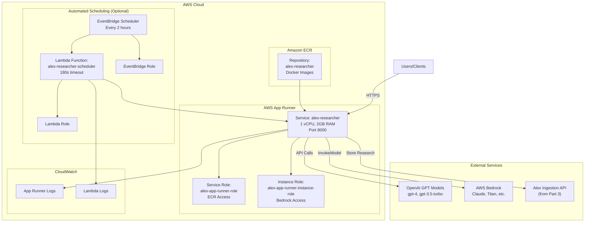
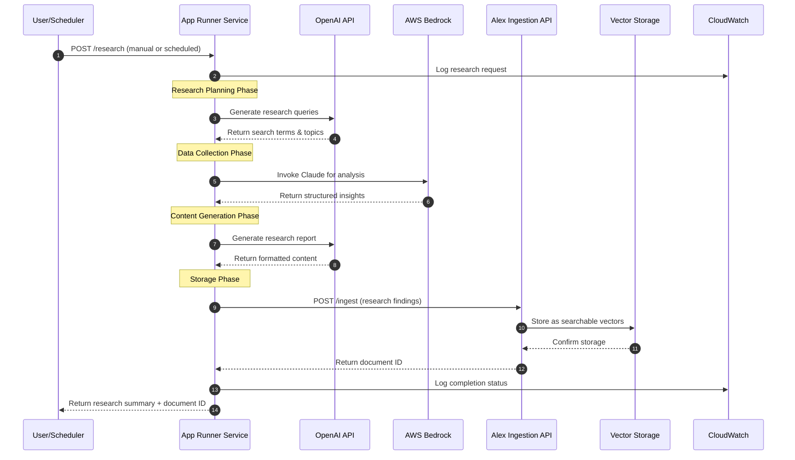
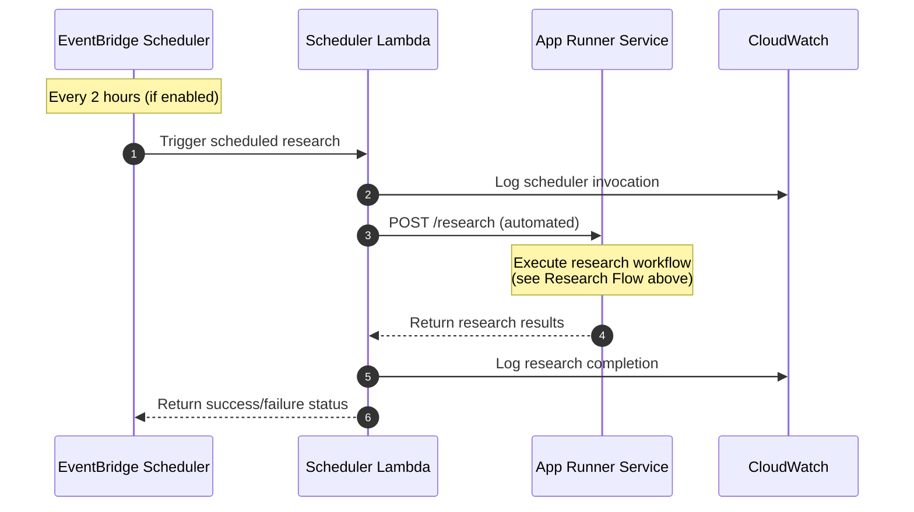
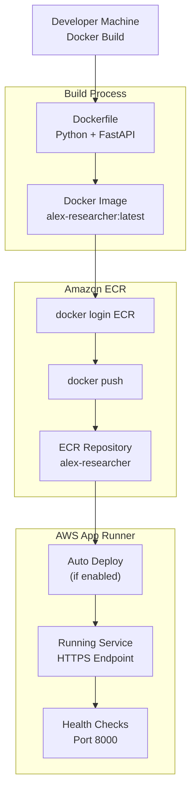

# Alex Researcher Infrastructure (Terraform)

This document explains the AI-powered research agent infrastructure defined in:
- `terraform/4_researcher/main.tf`
- `terraform/4_researcher/variables.tf`
- `terraform/4_researcher/outputs.tf`

## Overview

This module provisions a containerized AI research agent using AWS App Runner, with optional automated scheduling via EventBridge. The researcher agent can access multiple AI models (OpenAI GPT, AWS Bedrock) and integrates with the ingestion pipeline to store research findings as searchable vectors.

## Components

### **Terraform Configuration** (`main.tf`)
- **Terraform version**: `>= 1.5`
- **AWS Provider**: `~> 5.0`
- **Backend**: Local state storage (gitignored for security)
- **Region**: Configurable via `var.aws_region`

### **Container Registry** (`main.tf`)
- **`aws_ecr_repository.researcher`**: Private Docker registry
  - Name: `alex-researcher`
  - Image mutability: `MUTABLE` (allows updates)
  - Force delete: `true` (cleanup-friendly for development)
  - Vulnerability scanning: Disabled (can be enabled for production)

### **App Runner Service** (`main.tf`)
- **`aws_iam_role.app_runner_role`**: Service execution role
  - Trust policy for `build.apprunner.amazonaws.com` and `tasks.apprunner.amazonaws.com`
  - Name: `alex-app-runner-role`
- **`aws_iam_role_policy_attachment.app_runner_ecr_access`**: 
  - Attaches `AWSAppRunnerServicePolicyForECRAccess` for ECR access
- **`aws_iam_role.app_runner_instance_role`**: Runtime permissions role
  - Trust policy for `tasks.apprunner.amazonaws.com`
  - Name: `alex-app-runner-instance-role`
- **`aws_iam_role_policy.app_runner_instance_bedrock_access`**: Bedrock permissions
  - Actions: `InvokeModel`, `InvokeModelWithResponseStream`, `ListFoundationModels`
  - Resource: `*` (all Bedrock models)
- **`aws_apprunner_service.researcher`**: Main containerized service
  - Name: `alex-researcher`
  - CPU: 1 vCPU, Memory: 2 GB
  - Port: 8000
  - Auto-deployments: Disabled (manual control)
  - Environment variables: OpenAI API key, Alex API endpoint/key

### **Automated Scheduling (Optional)** (`main.tf`)
- **`aws_iam_role.eventbridge_role`**: EventBridge execution role
  - Conditional creation based on `var.scheduler_enabled`
  - Trust policy for `scheduler.amazonaws.com`
- **`aws_lambda_function.scheduler_lambda`**: Trigger function
  - Name: `alex-researcher-scheduler`
  - Runtime: Python 3.12
  - Timeout: 180 seconds (3 minutes)
  - Memory: 256 MB
  - Environment: App Runner service URL
- **`aws_iam_role.lambda_scheduler_role`**: Lambda execution role
- **`aws_iam_role_policy_attachment.lambda_scheduler_basic`**: Basic execution permissions
- **`aws_scheduler_schedule.research_schedule`**: EventBridge schedule
  - Frequency: Every 2 hours (`rate(2 hours)`)
  - Target: Lambda function
- **`aws_lambda_permission.allow_eventbridge`**: Permission for EventBridge to invoke Lambda
- **`aws_iam_role_policy.eventbridge_invoke_lambda`**: EventBridge Lambda invocation policy

## Variables

From `variables.tf`:

| Variable | Type | Default | Sensitive | Description |
|----------|------|---------|-----------|-------------|
| `aws_region` | string | - | No | AWS region for resources |
| `openai_api_key` | string | - | Yes | OpenAI API key for GPT models |
| `alex_api_endpoint` | string | - | No | Alex API endpoint from Part 3 |
| `alex_api_key` | string | - | Yes | Alex API key from Part 3 |
| `scheduler_enabled` | bool | `false` | No | Enable automated research scheduler |

## Outputs

From `outputs.tf`:

| Output | Description |
|--------|-------------|
| `ecr_repository_url` | ECR repository URL for Docker image pushes |
| `app_runner_service_url` | Public HTTPS URL of the researcher service |
| `app_runner_service_id` | App Runner service identifier |
| `scheduler_status` | Current status of automated scheduling |
| `setup_instructions` | Complete deployment and testing instructions |

---

## Architecture Diagram



## Research Flow



## Automated Scheduling Flow



## Container Deployment Flow



## Security & Access Control

### **IAM Roles and Permissions**

#### **App Runner Service Role**
- **Purpose**: Allows App Runner to pull images from ECR
- **Trust Policy**: `build.apprunner.amazonaws.com`, `tasks.apprunner.amazonaws.com`
- **Managed Policy**: `AWSAppRunnerServicePolicyForECRAccess`

#### **App Runner Instance Role**
- **Purpose**: Runtime permissions for the containerized application
- **Trust Policy**: `tasks.apprunner.amazonaws.com`
- **Custom Policy**: Bedrock model invocation permissions
- **Actions**: `bedrock:InvokeModel`, `bedrock:InvokeModelWithResponseStream`, `bedrock:ListFoundationModels`

#### **EventBridge Scheduler Role** (Optional)
- **Purpose**: Allows EventBridge to invoke Lambda functions
- **Trust Policy**: `scheduler.amazonaws.com`
- **Custom Policy**: `lambda:InvokeFunction` on specific Lambda ARN

#### **Lambda Scheduler Role** (Optional)
- **Purpose**: Basic Lambda execution permissions
- **Trust Policy**: `lambda.amazonaws.com`
- **Managed Policy**: `AWSLambdaBasicExecutionRole`

### **Network Security**
- **App Runner**: Fully managed, automatic HTTPS endpoints
- **ECR**: Private repository with IAM-based access control
- **Environment Variables**: Sensitive data (API keys) passed securely

### **API Key Management**
- **OpenAI API Key**: Stored as environment variable (sensitive)
- **Alex API Key**: Stored as environment variable (sensitive)
- **Best Practice**: Use AWS Secrets Manager for production deployments

## Performance & Scaling

### **App Runner Configuration**
- **CPU**: 1 vCPU (sufficient for AI API calls and light processing)
- **Memory**: 2 GB (handles multiple concurrent requests)
- **Auto Scaling**: App Runner automatically scales based on traffic
- **Cold Start**: ~10-30 seconds for first request after idle period

### **Scaling Characteristics**
- **Horizontal Scaling**: App Runner can scale to multiple instances
- **Vertical Scaling**: Can be increased to 2 vCPU / 4 GB if needed
- **Cost Optimization**: Pay only for actual usage (no idle charges)

### **Performance Considerations**
- **AI API Latency**: OpenAI/Bedrock calls add 2-10 seconds per request
- **Concurrent Requests**: App Runner handles multiple requests efficiently
- **Timeout Settings**: Lambda scheduler has 3-minute timeout for research completion

## Cost Analysis

### **App Runner Costs**
- **Base Cost**: ~$0.007 per vCPU-hour, ~$0.0008 per GB-hour
- **Monthly Estimate**: ~$5-15 for light usage (few hours per day)
- **Scaling Cost**: Linear with usage (no fixed costs)

### **AI Model Costs**
- **OpenAI**: $0.002-0.06 per 1K tokens (varies by model)
- **Bedrock**: $0.0008-0.024 per 1K tokens (varies by model)
- **Research Session**: Estimated $0.10-1.00 per comprehensive research task

### **Supporting Services**
- **ECR**: $0.10 per GB-month for image storage
- **EventBridge**: $1.00 per million invocations
- **Lambda**: $0.20 per 1M requests + compute time
- **CloudWatch**: Minimal logging costs

## Usage Instructions

### **Initial Setup**

#### **1. Deploy Infrastructure**
```bash
cd terraform/4_researcher
terraform init
terraform apply -var="aws_region=us-east-1" \
                -var="openai_api_key=sk-..." \
                -var="alex_api_endpoint=https://api-id.execute-api.region.amazonaws.com/prod/ingest" \
                -var="alex_api_key=your-alex-api-key"
```

#### **2. Build and Push Docker Image**
```bash
# Get ECR login command
aws ecr get-login-password --region us-east-1 | docker login --username AWS --password-stdin <account-id>.dkr.ecr.us-east-1.amazonaws.com

# Build Docker image
cd backend/researcher
docker build -t alex-researcher .

# Tag and push to ECR
docker tag alex-researcher:latest <ecr-repository-url>:latest
docker push <ecr-repository-url>:latest
```

#### **3. Update App Runner Service**
```bash
# Trigger deployment (if auto-deploy is disabled)
aws apprunner start-deployment --service-arn <service-arn>
```

### **API Usage Examples**

#### **Manual Research Request**
```bash
curl -X POST https://<app-runner-url>/research \
  -H "Content-Type: application/json" \
  -d '{
    "topic": "sustainable investing trends 2024",
    "depth": "comprehensive",
    "sources": ["financial_news", "research_reports"]
  }'
```

#### **Health Check**
```bash
curl https://<app-runner-url>/health
```

#### **Research Status**
```bash
curl https://<app-runner-url>/status/<research-id>
```

### **Python Client Example**
```python
import requests
import json

class AlexResearcher:
    def __init__(self, base_url):
        self.base_url = base_url.rstrip('/')
    
    def start_research(self, topic, depth="standard"):
        url = f"{self.base_url}/research"
        payload = {
            "topic": topic,
            "depth": depth,
            "store_results": True
        }
        response = requests.post(url, json=payload)
        return response.json()
    
    def get_status(self, research_id):
        url = f"{self.base_url}/status/{research_id}"
        response = requests.get(url)
        return response.json()

# Usage
researcher = AlexResearcher("https://your-app-runner-url")
result = researcher.start_research("ESG investment strategies", "comprehensive")
print(f"Research ID: {result['research_id']}")
```

## Monitoring & Observability

### **CloudWatch Integration**
- **App Runner Logs**: Automatic log collection and retention
- **Lambda Logs**: Scheduler function execution logs
- **Metrics**: Request count, response time, error rates

### **Key Metrics to Monitor**
```bash
# App Runner service health
aws apprunner describe-service --service-arn <service-arn>

# Recent logs
aws logs tail /aws/apprunner/<service-name>/<service-id>/application --follow

# Lambda scheduler logs (if enabled)
aws logs tail /aws/lambda/alex-researcher-scheduler --follow
```

### **Alerting Setup**
```bash
# Create CloudWatch alarm for App Runner errors
aws cloudwatch put-metric-alarm \
  --alarm-name "alex-researcher-errors" \
  --alarm-description "High error rate in researcher service" \
  --metric-name "4XXError" \
  --namespace "AWS/AppRunner" \
  --statistic "Sum" \
  --period 300 \
  --threshold 5 \
  --comparison-operator "GreaterThanThreshold"
```

## Advanced Configuration

### **Enable Automated Scheduling**
```hcl
# In terraform.tfvars
scheduler_enabled = true
```

### **Custom Scheduling Frequency**
Modify the schedule expression in `main.tf`:
```hcl
schedule_expression = "rate(6 hours)"  # Every 6 hours
# or
schedule_expression = "cron(0 9 * * ? *)"  # Daily at 9 AM UTC
```

### **Environment Variables**
Add additional environment variables to the App Runner service:
```hcl
runtime_environment_variables = {
  OPENAI_API_KEY    = var.openai_api_key
  ALEX_API_ENDPOINT = var.alex_api_endpoint
  ALEX_API_KEY      = var.alex_api_key
  RESEARCH_DEPTH    = "comprehensive"
  MAX_SOURCES       = "10"
  ENABLE_CACHING    = "true"
}
```

### **Scaling Configuration**
```hcl
instance_configuration {
  cpu               = "2 vCPU"    # Increase for better performance
  memory            = "4 GB"      # Increase for larger models
  instance_role_arn = aws_iam_role.app_runner_instance_role.arn
}
```

## Troubleshooting

### **Common Issues**

#### **App Runner Deployment Failures**
```bash
# Check service status
aws apprunner describe-service --service-arn <service-arn>

# View deployment logs
aws logs describe-log-groups --log-group-name-prefix "/aws/apprunner"
```

#### **ECR Authentication Issues**
```bash
# Refresh ECR login
aws ecr get-login-password --region <region> | docker login --username AWS --password-stdin <account-id>.dkr.ecr.<region>.amazonaws.com

# Verify repository permissions
aws ecr describe-repositories --repository-names alex-researcher
```

#### **API Key Configuration**
```bash
# Verify environment variables are set
aws apprunner describe-service --service-arn <service-arn> --query 'Service.SourceConfiguration.ImageRepository.ImageConfiguration.RuntimeEnvironmentVariables'
```

#### **Bedrock Access Issues**
```bash
# Check available models
aws bedrock list-foundation-models --region us-east-1

# Verify IAM permissions
aws iam simulate-principal-policy \
  --policy-source-arn <instance-role-arn> \
  --action-names bedrock:InvokeModel \
  --resource-arns "*"
```

### **Performance Optimization**

#### **Reduce Cold Start Time**
- Keep the service warm with periodic health checks
- Optimize Docker image size
- Use multi-stage builds to reduce image layers

#### **Improve Response Time**
- Implement caching for frequently requested research topics
- Use async processing for long-running research tasks
- Optimize AI model selection based on query complexity

## Files and References

- **Main Configuration**: `terraform/4_researcher/main.tf`
- **Variables**: `terraform/4_researcher/variables.tf`
- **Outputs**: `terraform/4_researcher/outputs.tf`
- **Application Code**: `backend/researcher/` (created separately)
- **Scheduler Code**: `backend/scheduler/` (created separately)

## Integration Notes

### **Dependencies**
- **Part 3**: Requires ingestion API endpoint and key from `terraform/3_ingestion/`
- **External**: Requires OpenAI API key for GPT model access
- **AWS Bedrock**: Requires model access in the deployment region

### **Data Flow Integration**
1. **Research Generation**: AI models generate comprehensive research content
2. **Vector Storage**: Research findings stored via Alex ingestion API
3. **Searchable Knowledge**: Research becomes part of the searchable knowledge base
4. **Continuous Learning**: Automated scheduling builds knowledge over time

### **Future Enhancements**
- **Multi-Model Support**: Add support for additional AI providers
- **Custom Research Templates**: Configurable research formats and structures
- **Real-time Streaming**: WebSocket support for live research updates
- **Knowledge Graph**: Build relationships between research topics
- **Quality Scoring**: Implement research quality assessment and ranking
