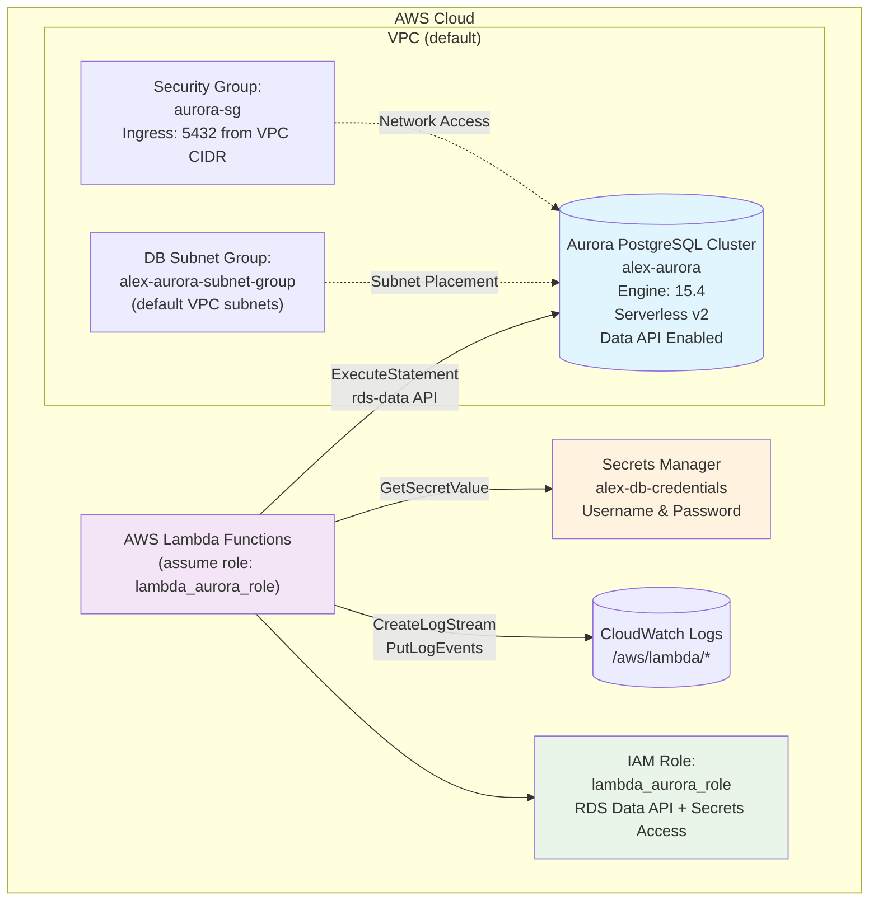

# Alex Database Infrastructure (Terraform)

This document explains the Aurora Serverless v2 PostgreSQL stack defined in:
- `terraform/5_database/main.tf`
- `terraform/5_database/variables.tf`
- `terraform/5_database/outputs.tf`

## Overview
This module provisions an Amazon Aurora PostgreSQL-Compatible Serverless v2 cluster with a single serverless instance. It enables the RDS Data API to allow stateless access (ideal for Lambda) and manages DB credentials via AWS Secrets Manager. Networking is kept simple by using the default VPC and a dedicated security group.

## Components
- **Terraform backend and providers** (`main.tf`)
  - Terraform `>= 1.5`, providers: `hashicorp/aws ~> 5.0`, `hashicorp/random ~> 3.5`.
  - `provider "aws"` region is configurable via `var.aws_region`.

- **Random/Secrets** (`main.tf`)
  - `random_password.db_password` creates a 32-char password with specials.
  - `random_id.suffix` adds uniqueness to secret name.
  - `aws_secretsmanager_secret.db_credentials` stores DB credentials.
  - `aws_secretsmanager_secret_version.db_credentials` sets `username` and `password`.

- **Networking** (`main.tf`)
  - `data.aws_vpc.default` and `data.aws_subnets.default` select the default VPC and its subnets.
  - `aws_db_subnet_group.aurora` groups subnets for RDS.
  - `aws_security_group.aurora` allows PostgreSQL (5432) inbound from the VPC CIDR and all outbound.

- **Aurora cluster and instance** (`main.tf`)
  - `aws_rds_cluster.aurora` with:
    - `engine = aurora-postgresql`, `engine_version = 15.4`, `engine_mode = provisioned`.
    - Database name `alex`, master user `alexadmin`, password from Random.
    - Serverless v2 scaling via `serverlessv2_scaling_configuration { min_capacity = var.min_capacity, max_capacity = var.max_capacity }`.
    - `enable_http_endpoint = true` to enable Data API.
    - `db_subnet_group_name` and `vpc_security_group_ids` wired to resources above.
    - Backups and maintenance windows configured. Dev-friendly `skip_final_snapshot = true`, `apply_immediately = true`.
  - `aws_rds_cluster_instance.aurora` with `instance_class = db.serverless` and same engine/version.

- **IAM for Lambda + Data API** (`main.tf`)
  - `aws_iam_role.lambda_aurora_role` trust policy for `lambda.amazonaws.com`.
  - `aws_iam_role_policy.lambda_aurora_policy` permits:
    - `rds-data:*` (execute, batch, transaction ops) on the Aurora cluster ARN.
    - `secretsmanager:GetSecretValue` on the DB secret.
    - CloudWatch Logs creation and put events in the selected region/account.
  - `aws_iam_role_policy_attachment.lambda_basic` attaches `AWSLambdaBasicExecutionRole`.

## Variables
From `variables.tf`:
- `aws_region` (string): AWS region for resources.
- `min_capacity` (number, default `0.5` ACUs): Serverless v2 min capacity.
- `max_capacity` (number, default `1` ACU): Serverless v2 max capacity.

Notes:
- Aurora Serverless v2 ACU is a measure of capacity; billing scales between `min_capacity` and `max_capacity`.

## Outputs
From `outputs.tf`:
- `aurora_cluster_arn`: Cluster ARN.
- `aurora_cluster_endpoint`: Writer endpoint.
- `aurora_secret_arn`: Secrets Manager secret ARN.
- `database_name`: Database name (`alex`).
- `lambda_role_arn`: IAM role ARN for Lambda to access Aurora.
- `data_api_enabled`: Whether Data API is enabled (here: Enabled).
- `setup_instructions`: Post-deploy guidance, including `.env` entries and Data API test command.

## Security
- **Network**: SG allows 5432 from the VPC CIDR only; egress open to internet.
- **Credentials**: Stored in Secrets Manager. No plaintext passwords in Terraform outputs.
- **Least Privilege**: Inline policy limits `rds-data` to the specific cluster ARN and secrets access to the specific secret.
## Cost Analysis

### **Aurora Serverless v2 Pricing**
- **ACU (Aurora Capacity Unit)**: $0.12 per ACU-hour
- **Storage**: $0.10 per GB-month
- **I/O**: $0.20 per 1 million requests
- **Backup Storage**: $0.021 per GB-month (beyond free tier)

### **Cost Estimation Examples**

#### **Development Usage (0.5-1 ACU, 10GB storage)**
- **Compute**: 0.75 ACU average × 24h × 30 days × $0.12 = ~$65/month
- **Storage**: 10 GB × $0.10 = $1/month
- **I/O**: ~100K requests × $0.20/million = minimal
- **Total**: ~$66-70/month

#### **Production Usage (2-8 ACU, 100GB storage)**
- **Compute**: 5 ACU average × 24h × 30 days × $0.12 = ~$432/month
- **Storage**: 100 GB × $0.10 = $10/month
- **I/O**: ~10M requests × $0.20/million = $2/month
- **Total**: ~$444-450/month

#### **High-Scale Usage (8-16 ACU, 500GB storage)**
- **Compute**: 12 ACU average × 24h × 30 days × $0.12 = ~$1,037/month
- **Storage**: 500 GB × $0.10 = $50/month
- **I/O**: ~100M requests × $0.20/million = $20/month
- **Total**: ~$1,107/month

### **Cost Optimization Strategies**
- **Auto-Pause**: Set `min_capacity = 0` to pause during inactivity (saves ~50-70%)
- **Right-Sizing**: Monitor ACU usage and adjust min/max capacity
- **Connection Pooling**: Use RDS Proxy to reduce connection overhead
- **Query Optimization**: Efficient queries reduce I/O costs
- **Backup Management**: Configure retention periods appropriately

### **Scaling Characteristics**
- **Default Configuration**: 0.5-1 ACU (sufficient for development)
- **Auto-Scaling**: Seamless scaling based on CPU, connections, memory
- **Scaling Speed**: ~15-30 seconds for capacity adjustments
- **Maximum Capacity**: Up to 128 ACUs per cluster
- **Pause Capability**: Automatic pause after 5 minutes of inactivity (if min_capacity = 0)

## Usage Instructions

### **Initial Deployment**

#### **1. Deploy Infrastructure**
```bash
cd terraform/5_database
terraform init
terraform apply -var="aws_region=us-east-1" \
                -var="min_capacity=0.5" \
                -var="max_capacity=1"
```

#### **2. Wait for Cluster Deployment**
```bash
# Monitor cluster status
while true; do
  STATUS=$(aws rds describe-db-clusters --db-cluster-identifier alex-aurora --query 'DBClusters[0].Status' --output text)
  echo "Cluster Status: $STATUS"
  if [ "$STATUS" = "available" ]; then
    echo "Cluster is ready!"
    break
  elif [ "$STATUS" = "failed" ]; then
    echo "Cluster deployment failed!"
    exit 1
  fi
  sleep 30
done
```

#### **3. Configure Environment Variables**
```bash
# Get cluster details from Terraform outputs
AURORA_CLUSTER_ARN=$(terraform output -raw aurora_cluster_arn)
AURORA_SECRET_ARN=$(terraform output -raw aurora_secret_arn)
AURORA_ENDPOINT=$(terraform output -raw aurora_cluster_endpoint)
LAMBDA_ROLE_ARN=$(terraform output -raw lambda_role_arn)

# Create .env file
cat > .env << EOF
AURORA_CLUSTER_ARN=$AURORA_CLUSTER_ARN
AURORA_SECRET_ARN=$AURORA_SECRET_ARN
AURORA_ENDPOINT=$AURORA_ENDPOINT
LAMBDA_ROLE_ARN=$LAMBDA_ROLE_ARN
DATABASE_NAME=alex
EOF
```

#### **4. Test Data API Connection**
```bash
# Basic connectivity test
aws rds-data execute-statement \
  --resource-arn "$AURORA_CLUSTER_ARN" \
  --secret-arn "$AURORA_SECRET_ARN" \
  --database alex \
  --sql "SELECT version(), current_database(), current_user"

# Test with formatted output
aws rds-data execute-statement \
  --resource-arn "$AURORA_CLUSTER_ARN" \
  --secret-arn "$AURORA_SECRET_ARN" \
  --database alex \
  --sql "SELECT 'Hello from Aurora!' as message, now() as timestamp" \
  --format-records-as PARQUET
```

#### **5. Initialize Database Schema**
```bash
# Navigate to backend directory
cd ../../backend/database

# Install dependencies
pip install -r requirements.txt

# Run database migrations
python migrate.py

# Load test data (optional)
python reset_db.py --with-test-data
```

### **Environment Setup**

After deployment, configure your application with:
```bash
export AURORA_CLUSTER_ARN="$(terraform output -raw aurora_cluster_arn)"
export AURORA_SECRET_ARN="$(terraform output -raw aurora_secret_arn)"
export AURORA_ENDPOINT="$(terraform output -raw aurora_cluster_endpoint)"
export DATABASE_NAME="alex"
```

---

## Architecture Diagram



## Data API Flow (Sequence)
  ```mermaid
  sequenceDiagram
    autonumber
    participant U as Caller (Lambda/App)
    participant SM as Secrets Manager
    participant RDS as Aurora Data API
    participant DB as Aurora Cluster

    U->>SM: GetSecretValue(AURORA_SECRET_ARN)
    SM-->>U: {username, password}
    U->>RDS: ExecuteStatement(resourceArn, secretArn, database, sql)
    RDS->>DB: Authenticate via secret, run SQL
    DB-->>RDS: Result set
    RDS-->>U: Rows/metadata
  ```

## Advanced Configuration

### **Performance Tuning**

#### **ACU Scaling Configuration**
```hcl
# In main.tf - optimize for different workloads
serverlessv2_scaling_configuration {
  min_capacity = 0      # Allow pausing (cost optimization)
  max_capacity = 16     # Higher performance ceiling
}

# Alternative: Consistent performance
serverlessv2_scaling_configuration {
  min_capacity = 2      # Always-on for low latency
  max_capacity = 8      # Controlled scaling
}
```

#### **Enhanced Backup Configuration**
```hcl
# Production backup settings
resource "aws_rds_cluster" "aurora" {
  # ... other configuration
  
  backup_retention_period = 14        # 2 weeks retention
  preferred_backup_window = "03:00-04:00"  # Low-traffic window
  copy_tags_to_snapshot  = true
  
  # Point-in-time recovery
  backup_window          = "03:00-04:00"
  maintenance_window     = "sun:04:00-sun:05:00"
  
  # Enhanced monitoring
  enabled_cloudwatch_logs_exports = ["postgresql"]
  monitoring_interval            = 60
  monitoring_role_arn           = aws_iam_role.rds_monitoring.arn
}
```

#### **Multi-AZ Deployment**
```hcl
# High availability configuration
resource "aws_rds_cluster_instance" "aurora_instances" {
  count              = 2  # Multi-AZ deployment
  identifier         = "alex-aurora-${count.index}"
  cluster_identifier = aws_rds_cluster.aurora.id
  instance_class     = "db.serverless"
  engine             = aws_rds_cluster.aurora.engine
  engine_version     = aws_rds_cluster.aurora.engine_version
  
  availability_zone = data.aws_availability_zones.available.names[count.index]
  
  performance_insights_enabled = true
  monitoring_interval         = 60
  monitoring_role_arn        = aws_iam_role.rds_monitoring.arn
}
```

### **Security Hardening**

#### **Enhanced Security Group**
```hcl
# More restrictive security group
resource "aws_security_group" "aurora_enhanced" {
  name_prefix = "alex-aurora-enhanced-"
  vpc_id      = data.aws_vpc.default.id
  
  # Allow PostgreSQL from specific CIDR blocks
  ingress {
    from_port   = 5432
    to_port     = 5432
    protocol    = "tcp"
    cidr_blocks = ["10.0.0.0/8"]  # Private networks only
  }
  
  # Allow from Lambda security groups
  ingress {
    from_port       = 5432
    to_port         = 5432
    protocol        = "tcp"
    security_groups = [aws_security_group.lambda_sg.id]
  }
  
  egress {
    from_port   = 0
    to_port     = 0
    protocol    = "-1"
    cidr_blocks = ["0.0.0.0/0"]
  }
}
```

#### **Encryption at Rest**
```hcl
# KMS encryption for enhanced security
resource "aws_kms_key" "aurora_key" {
  description             = "KMS key for Aurora cluster encryption"
  deletion_window_in_days = 7
  
  tags = {
    Project = "alex"
    Part    = "5"
  }
}

resource "aws_rds_cluster" "aurora_encrypted" {
  # ... other configuration
  
  storage_encrypted = true
  kms_key_id       = aws_kms_key.aurora_key.arn
  
  # Enhanced security
  deletion_protection = true  # Prevent accidental deletion
  
  # Network isolation
  db_subnet_group_name   = aws_db_subnet_group.aurora_private.name
  vpc_security_group_ids = [aws_security_group.aurora_enhanced.id]
}
```

### **Monitoring and Alerting**

#### **CloudWatch Alarms**
```hcl
# High CPU utilization alarm
resource "aws_cloudwatch_metric_alarm" "aurora_cpu_high" {
  alarm_name          = "alex-aurora-cpu-high"
  comparison_operator = "GreaterThanThreshold"
  evaluation_periods  = "2"
  metric_name         = "CPUUtilization"
  namespace           = "AWS/RDS"
  period              = "300"
  statistic           = "Average"
  threshold           = "80"
  alarm_description   = "This metric monitors Aurora CPU utilization"
  
  dimensions = {
    DBClusterIdentifier = aws_rds_cluster.aurora.cluster_identifier
  }
}

# Database connections alarm
resource "aws_cloudwatch_metric_alarm" "aurora_connections_high" {
  alarm_name          = "alex-aurora-connections-high"
  comparison_operator = "GreaterThanThreshold"
  evaluation_periods  = "2"
  metric_name         = "DatabaseConnections"
  namespace           = "AWS/RDS"
  period              = "300"
  statistic           = "Average"
  threshold           = "80"
  
  dimensions = {
    DBClusterIdentifier = aws_rds_cluster.aurora.cluster_identifier
  }
}
```

#### **Performance Insights**
```hcl
# Enable Performance Insights for query analysis
resource "aws_rds_cluster_instance" "aurora_with_insights" {
  # ... other configuration
  
  performance_insights_enabled          = true
  performance_insights_retention_period = 7  # days
  performance_insights_kms_key_id      = aws_kms_key.aurora_key.arn
}
```

## Monitoring & Observability

### **Key Metrics to Monitor**

#### **Cluster-Level Metrics**
```bash
# CPU Utilization
aws cloudwatch get-metric-statistics \
  --namespace AWS/RDS \
  --metric-name CPUUtilization \
  --dimensions Name=DBClusterIdentifier,Value=alex-aurora \
  --start-time $(date -u -d '1 hour ago' +%Y-%m-%dT%H:%M:%S) \
  --end-time $(date -u +%Y-%m-%dT%H:%M:%S) \
  --period 300 \
  --statistics Average

# ACU Utilization
aws cloudwatch get-metric-statistics \
  --namespace AWS/RDS \
  --metric-name ACUUtilization \
  --dimensions Name=DBClusterIdentifier,Value=alex-aurora \
  --start-time $(date -u -d '1 hour ago' +%Y-%m-%dT%H:%M:%S) \
  --end-time $(date -u +%Y-%m-%dT%H:%M:%S) \
  --period 300 \
  --statistics Average,Maximum

# Database Connections
aws cloudwatch get-metric-statistics \
  --namespace AWS/RDS \
  --metric-name DatabaseConnections \
  --dimensions Name=DBClusterIdentifier,Value=alex-aurora \
  --start-time $(date -u -d '1 hour ago' +%Y-%m-%dT%H:%M:%S) \
  --end-time $(date -u +%Y-%m-%dT%H:%M:%S) \
  --period 300 \
  --statistics Average,Maximum
```

#### **Data API Metrics**
```bash
# Data API Request Count
aws cloudwatch get-metric-statistics \
  --namespace AWS/RDS-Data \
  --metric-name RequestCount \
  --dimensions Name=ResourceArn,Value=$(terraform output -raw aurora_cluster_arn) \
  --start-time $(date -u -d '1 hour ago' +%Y-%m-%dT%H:%M:%S) \
  --end-time $(date -u +%Y-%m-%dT%H:%M:%S) \
  --period 300 \
  --statistics Sum

# Data API Latency
aws cloudwatch get-metric-statistics \
  --namespace AWS/RDS-Data \
  --metric-name RequestLatency \
  --dimensions Name=ResourceArn,Value=$(terraform output -raw aurora_cluster_arn) \
  --start-time $(date -u -d '1 hour ago' +%Y-%m-%dT%H:%M:%S) \
  --end-time $(date -u +%Y-%m-%dT%H:%M:%S) \
  --period 300 \
  --statistics Average,Maximum
```

### **Custom Dashboard**
```bash
# Create comprehensive Aurora dashboard
aws cloudwatch put-dashboard \
  --dashboard-name "Alex-Aurora-Dashboard" \
  --dashboard-body '{
    "widgets": [
      {
        "type": "metric",
        "properties": {
          "metrics": [
            ["AWS/RDS", "CPUUtilization", "DBClusterIdentifier", "alex-aurora"],
            [".", "ACUUtilization", ".", "."],
            [".", "DatabaseConnections", ".", "."]
          ],
          "period": 300,
          "stat": "Average",
          "region": "us-east-1",
          "title": "Aurora Cluster Performance"
        }
      },
      {
        "type": "metric",
        "properties": {
          "metrics": [
            ["AWS/RDS-Data", "RequestCount", "ResourceArn", "'$(terraform output -raw aurora_cluster_arn)'"],
            [".", "RequestLatency", ".", "."]
          ],
          "period": 300,
          "stat": "Sum",
          "region": "us-east-1",
          "title": "Data API Metrics"
        }
      }
    ]
  }'
```

## Troubleshooting

### **Diagnostic Commands**

#### **Check Cluster Status**
```bash
# Detailed cluster information
aws rds describe-db-clusters --db-cluster-identifier alex-aurora

# Check cluster instances
aws rds describe-db-cluster-members --db-cluster-identifier alex-aurora

# Verify Data API status
aws rds describe-db-clusters \
  --db-cluster-identifier alex-aurora \
  --query 'DBClusters[0].HttpEndpointEnabled'
```

#### **Test Connectivity**
```bash
# Test Data API connectivity
aws rds-data execute-statement \
  --resource-arn "$(terraform output -raw aurora_cluster_arn)" \
  --secret-arn "$(terraform output -raw aurora_secret_arn)" \
  --database alex \
  --sql "SELECT 1 as test_connection, version() as db_version"

# Check secret manager access
aws secretsmanager get-secret-value \
  --secret-id "$(terraform output -raw aurora_secret_arn)" \
  --query 'SecretString' --output text | jq .
```

### **Common Issues and Solutions**

#### **Cluster Scaling Issues**
```bash
# Monitor scaling events
aws logs filter-log-events \
  --log-group-name "/aws/rds/cluster/alex-aurora/postgresql" \
  --filter-pattern "scaling"

# Check ACU utilization trends
aws cloudwatch get-metric-statistics \
  --namespace AWS/RDS \
  --metric-name ServerlessDatabaseCapacity \
  --dimensions Name=DBClusterIdentifier,Value=alex-aurora \
  --start-time $(date -u -d '24 hours ago' +%Y-%m-%dT%H:%M:%S) \
  --end-time $(date -u +%Y-%m-%dT%H:%M:%S) \
  --period 3600 \
  --statistics Average,Maximum
```

#### **Data API Connection Issues**
```bash
# Verify IAM permissions
aws iam simulate-principal-policy \
  --policy-source-arn "$(terraform output -raw lambda_role_arn)" \
  --action-names rds-data:ExecuteStatement \
  --resource-arns "$(terraform output -raw aurora_cluster_arn)"

# Check secret access permissions
aws iam simulate-principal-policy \
  --policy-source-arn "$(terraform output -raw lambda_role_arn)" \
  --action-names secretsmanager:GetSecretValue \
  --resource-arns "$(terraform output -raw aurora_secret_arn)"
```

#### **Performance Issues**
```bash
# Check for long-running queries
aws rds-data execute-statement \
  --resource-arn "$(terraform output -raw aurora_cluster_arn)" \
  --secret-arn "$(terraform output -raw aurora_secret_arn)" \
  --database alex \
  --sql "SELECT pid, now() - pg_stat_activity.query_start AS duration, query FROM pg_stat_activity WHERE (now() - pg_stat_activity.query_start) > interval '5 minutes';"

# Monitor connection pool
aws rds-data execute-statement \
  --resource-arn "$(terraform output -raw aurora_cluster_arn)" \
  --secret-arn "$(terraform output -raw aurora_secret_arn)" \
  --database alex \
  --sql "SELECT count(*) as active_connections FROM pg_stat_activity WHERE state = 'active';"
```

### **Performance Optimization**

#### **Query Optimization**
```python
# Optimized Data API usage patterns
import boto3
import json
from typing import List, Dict, Any

class OptimizedAuroraClient:
    def __init__(self, cluster_arn: str, secret_arn: str, database: str = 'alex'):
        self.client = boto3.client('rds-data')
        self.cluster_arn = cluster_arn
        self.secret_arn = secret_arn
        self.database = database
    
    def execute_batch(self, sql: str, parameter_sets: List[List[Dict]]):
        """Execute batch operations for better performance"""
        return self.client.batch_execute_statement(
            resourceArn=self.cluster_arn,
            secretArn=self.secret_arn,
            database=self.database,
            sql=sql,
            parameterSets=parameter_sets
        )
    
    def execute_transaction(self, statements: List[Dict]):
        """Execute multiple statements in a transaction"""
        # Begin transaction
        transaction = self.client.begin_transaction(
            resourceArn=self.cluster_arn,
            secretArn=self.secret_arn,
            database=self.database
        )
        
        try:
            results = []
            for stmt in statements:
                result = self.client.execute_statement(
                    resourceArn=self.cluster_arn,
                    secretArn=self.secret_arn,
                    database=self.database,
                    transactionId=transaction['transactionId'],
                    **stmt
                )
                results.append(result)
            
            # Commit transaction
            self.client.commit_transaction(
                resourceArn=self.cluster_arn,
                secretArn=self.secret_arn,
                transactionId=transaction['transactionId']
            )
            
            return results
            
        except Exception as e:
            # Rollback on error
            self.client.rollback_transaction(
                resourceArn=self.cluster_arn,
                secretArn=self.secret_arn,
                transactionId=transaction['transactionId']
            )
            raise e
```

#### **Connection Pooling with RDS Proxy**
```hcl
# Optional RDS Proxy for connection pooling
resource "aws_db_proxy" "aurora_proxy" {
  name                   = "alex-aurora-proxy"
  engine_family         = "POSTGRESQL"
  auth {
    auth_scheme = "SECRETS"
    secret_arn  = aws_secretsmanager_secret.db_credentials.arn
  }
  
  role_arn               = aws_iam_role.proxy_role.arn
  vpc_subnet_ids         = data.aws_subnets.default.ids
  
  target {
    db_cluster_identifier = aws_rds_cluster.aurora.cluster_identifier
  }
  
  # Connection pooling settings
  idle_client_timeout    = 1800
  max_connections_percent = 100
  max_idle_connections_percent = 50
}
```

## Files and References

- **Main Configuration**: `terraform/5_database/main.tf`
- **Variables**: `terraform/5_database/variables.tf`
- **Outputs**: `terraform/5_database/outputs.tf`
- **Aurora Serverless v2**: [AWS Documentation](https://docs.aws.amazon.com/AmazonRDS/latest/AuroraUserGuide/aurora-serverless-v2.html)
- **RDS Data API**: [AWS Documentation](https://docs.aws.amazon.com/AmazonRDS/latest/AuroraUserGuide/data-api.html)
- **PostgreSQL Documentation**: [Official Docs](https://www.postgresql.org/docs/)

## Integration Notes

### **Dependencies**
- **VPC**: Uses default VPC and subnets (can be customized)
- **Secrets Manager**: Automatic credential management
- **IAM**: Lambda execution role for Data API access

### **Integration with Other Components**
- **Part 3 (Ingestion)**: Stores document metadata and vector references
- **Part 4 (Researcher)**: Stores research findings and analysis results
- **Part 6 (Agents)**: Conversation history and agent state management
- **Part 7 (Frontend)**: User data, preferences, and session management
- **Part 8 (Enterprise)**: Multi-tenant data isolation and analytics

### **Database Schema Design**

#### **Core Tables**
```sql
-- Users and authentication
CREATE TABLE users (
    id UUID PRIMARY KEY DEFAULT gen_random_uuid(),
    email VARCHAR(255) UNIQUE NOT NULL,
    created_at TIMESTAMP WITH TIME ZONE DEFAULT NOW(),
    updated_at TIMESTAMP WITH TIME ZONE DEFAULT NOW()
);

-- Documents and content
CREATE TABLE documents (
    id UUID PRIMARY KEY DEFAULT gen_random_uuid(),
    user_id UUID REFERENCES users(id),
    title TEXT,
    content TEXT,
    metadata JSONB,
    vector_id VARCHAR(255),  -- Reference to S3 Vectors
    created_at TIMESTAMP WITH TIME ZONE DEFAULT NOW()
);

-- Conversations and chat history
CREATE TABLE conversations (
    id UUID PRIMARY KEY DEFAULT gen_random_uuid(),
    user_id UUID REFERENCES users(id),
    title TEXT,
    metadata JSONB,
    created_at TIMESTAMP WITH TIME ZONE DEFAULT NOW(),
    updated_at TIMESTAMP WITH TIME ZONE DEFAULT NOW()
);

CREATE TABLE messages (
    id UUID PRIMARY KEY DEFAULT gen_random_uuid(),
    conversation_id UUID REFERENCES conversations(id),
    role VARCHAR(50) NOT NULL,  -- 'user', 'assistant', 'system'
    content TEXT NOT NULL,
    metadata JSONB,
    created_at TIMESTAMP WITH TIME ZONE DEFAULT NOW()
);
```

## Future Enhancements

### **High Availability**
- **Multi-Region Deployment**: Cross-region read replicas
- **Global Database**: Aurora Global Database for disaster recovery
- **Automated Failover**: Multi-AZ deployment with automatic failover

### **Advanced Features**
- **Read Replicas**: Separate read workloads from write operations
- **Blue/Green Deployments**: Zero-downtime schema changes
- **Database Cloning**: Fast database copies for testing
- **Parallel Query**: Accelerate analytical workloads

### **Security Enhancements**
- **Database Activity Streams**: Real-time monitoring of database activity
- **IAM Database Authentication**: Eliminate password-based authentication
- **VPC Endpoints**: Private connectivity without internet gateway
- **Audit Logging**: Comprehensive audit trail for compliance

### **Production Deployment Checklist**

#### **Pre-Deployment**
- [ ] Review and configure ACU scaling limits
- [ ] Set up proper backup and retention policies
- [ ] Configure monitoring and alerting
- [ ] Review security group and network access
- [ ] Plan database schema and indexing strategy

#### **Post-Deployment**
- [ ] Validate Data API functionality
- [ ] Test scaling behavior under load
- [ ] Verify backup and restore procedures
- [ ] Set up Performance Insights monitoring
- [ ] Document connection patterns and best practices

#### **Ongoing Maintenance**
- [ ] Monitor ACU utilization and costs
- [ ] Regular performance analysis and optimization
- [ ] Update PostgreSQL engine versions
- [ ] Review and rotate database credentials
- [ ] Backup and disaster recovery testing

## Notes & Tips

### **Development Best Practices**
- Set `min_capacity = 0` for cost optimization in development
- Use `skip_final_snapshot = true` for faster teardown in dev environments
- Enable `apply_immediately = true` for rapid iteration
- Monitor costs closely during development to avoid surprises

### **Production Considerations**
- Set `min_capacity >= 0.5` for consistent performance
- Enable `deletion_protection = true` to prevent accidental deletion
- Configure appropriate backup retention (7-35 days)
- Use dedicated security groups with minimal access
- Implement proper error handling and retry logic in applications

### **Performance Tips**
- Use connection pooling (RDS Proxy) for high-concurrency applications
- Implement proper indexing strategy for query patterns
- Use batch operations for bulk data operations
- Monitor and optimize slow queries using Performance Insights
- Consider read replicas for read-heavy workloads
