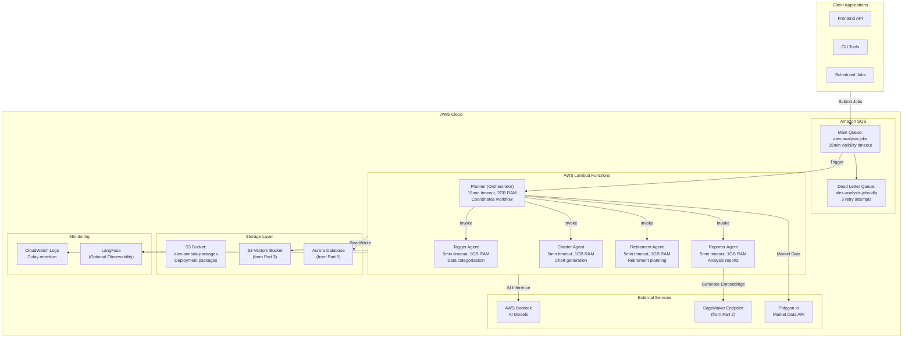
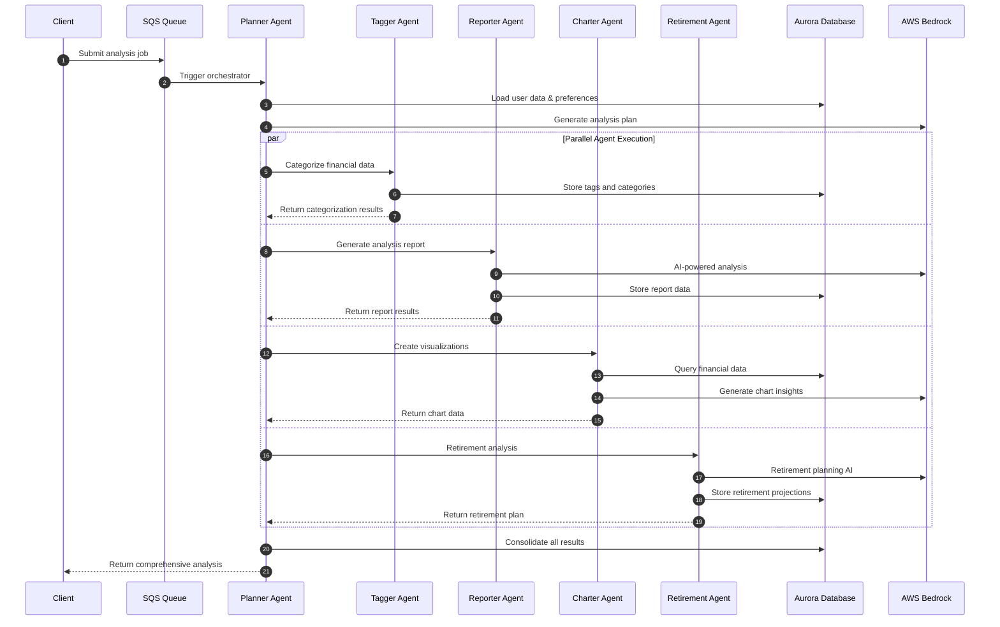

# Alex Agents Infrastructure (Terraform)

This document explains the multi-agent financial analysis system defined in:
- `terraform/6_agents/main.tf`
- `terraform/6_agents/variables.tf`
- `terraform/6_agents/outputs.tf`

## Overview

This module provisions a sophisticated multi-agent system for financial analysis using AWS Lambda functions orchestrated through SQS. The system includes specialized agents for different financial analysis tasks: planning, tagging, reporting, charting, and retirement planning.

## Components

### **Terraform Configuration** (`main.tf`)
- **Terraform version**: `>= 1.5`
- **AWS Provider**: `~> 5.0`
- **Backend**: Local state storage (gitignored for security)
- **Region**: Configurable via `var.aws_region`

### **Message Queue System** (`main.tf`)
- **`aws_sqs_queue.analysis_jobs`**: Main job queue
  - Name: `alex-analysis-jobs`
  - Message retention: 1 day (86400 seconds)
  - Visibility timeout: 15 minutes + buffer (910 seconds)
  - Long polling enabled (10 seconds)
  - Dead letter queue integration
- **`aws_sqs_queue.analysis_jobs_dlq`**: Dead letter queue
  - Name: `alex-analysis-jobs-dlq`
  - Handles failed messages after 3 retry attempts

### **IAM Permissions** (`main.tf`)
- **`aws_iam_role.lambda_agents_role`**: Unified execution role
  - Name: `alex-lambda-agents-role`
  - Trust policy for `lambda.amazonaws.com`
- **`aws_iam_role_policy.lambda_agents_policy`**: Comprehensive permissions
  - CloudWatch Logs access
  - SQS queue operations
  - Lambda function invocation
  - Aurora Data API access
  - Secrets Manager access
  - S3 Vectors operations
  - SageMaker endpoint invocation
  - Bedrock model access

### **Lambda Package Storage** (`main.tf`)
- **`aws_s3_bucket.lambda_packages`**: Package storage
  - Name: `alex-lambda-packages-{account-id}`
  - Stores deployment packages >50MB
- **`aws_s3_object.lambda_packages`**: Individual agent packages
  - Automated upload for each agent
  - Version tracking via ETags

### **Lambda Functions** (`main.tf`)

#### **Planner (Orchestrator)**
- **Function**: `alex-planner`
- **Role**: Orchestrates the entire analysis workflow
- **Timeout**: 15 minutes (900 seconds)
- **Memory**: 2048 MB
- **Trigger**: SQS queue messages
- **Environment**: Full access to all services

#### **Specialized Agents**
- **Tagger**: `alex-tagger` - Categorizes and tags financial data
- **Reporter**: `alex-reporter` - Generates analysis reports
- **Charter**: `alex-charter` - Creates financial charts and visualizations
- **Retirement**: `alex-retirement` - Retirement planning analysis
- **Configuration**: 5 minutes timeout, 1024 MB memory each

## Variables

From `variables.tf`:

| Variable | Type | Default | Sensitive | Description |
|----------|------|---------|-----------|-------------|
| `aws_region` | string | - | No | AWS region for resources |
| `aurora_cluster_arn` | string | - | No | Aurora cluster ARN from Part 5 |
| `aurora_secret_arn` | string | - | No | Secrets Manager ARN from Part 5 |
| `vector_bucket` | string | - | No | S3 Vectors bucket from Part 3 |
| `bedrock_model_id` | string | - | No | Bedrock model ID for agents |
| `bedrock_region` | string | - | No | AWS region for Bedrock |
| `sagemaker_endpoint` | string | `alex-embedding-endpoint` | No | SageMaker endpoint from Part 2 |
| `polygon_api_key` | string | - | No | Polygon.io API key for market data |
| `polygon_plan` | string | `free` | No | Polygon.io plan type |
| `langfuse_public_key` | string | `""` | No | LangFuse observability (optional) |
| `langfuse_secret_key` | string | `""` | Yes | LangFuse secret key (optional) |
| `langfuse_host` | string | `https://us.cloud.langfuse.com` | No | LangFuse host URL |
| `openai_api_key` | string | `""` | Yes | OpenAI API key for tracing |

## Outputs

From `outputs.tf`:

| Output | Description |
|--------|-------------|
| `sqs_queue_url` | SQS queue URL for job submission |
| `sqs_queue_arn` | SQS queue ARN |
| `lambda_functions` | Map of all Lambda function names |
| `setup_instructions` | Complete deployment and testing guide |

---

## Architecture Diagram



## Agent Workflow



## Cost Analysis

### **Lambda Pricing**
- **Requests**: $0.20 per 1M requests
- **Duration**: $0.0000166667 per GB-second
- **Provisioned Concurrency**: $0.0000097222 per GB-second (if used)

### **Cost Estimation Examples**

#### **Light Usage (100 analyses/month)**
- **Planner**: 100 × 5min × 2GB = ~$0.83/month
- **Agents**: 400 × 2min × 1GB = ~$0.89/month  
- **SQS**: 500 messages × $0.40/million = minimal
- **S3 Storage**: ~$1/month for packages
- **Total**: ~$2.72/month

#### **Medium Usage (1000 analyses/month)**
- **Planner**: 1000 × 5min × 2GB = ~$8.33/month
- **Agents**: 4000 × 2min × 1GB = ~$8.89/month
- **SQS**: 5000 messages = minimal
- **S3 Storage**: ~$1/month
- **Total**: ~$18.22/month

#### **Heavy Usage (10,000 analyses/month)**
- **Planner**: 10,000 × 5min × 2GB = ~$83.33/month
- **Agents**: 40,000 × 2min × 1GB = ~$88.89/month
- **SQS**: 50,000 messages = minimal
- **S3 Storage**: ~$2/month
- **Total**: ~$174.24/month

### **Cost Optimization Strategies**
- **Right-sizing**: Monitor memory usage and adjust
- **Timeout Optimization**: Reduce timeouts based on actual performance
- **Provisioned Concurrency**: Only for high-frequency workloads
- **Batch Processing**: Group multiple analyses together
- **Dead Letter Queue**: Prevent infinite retry costs

## Usage Instructions

### **Initial Deployment**

#### **1. Deploy Infrastructure**
```bash
cd terraform/6_agents
terraform init
terraform apply -var="aws_region=us-east-1" \
                -var="aurora_cluster_arn=arn:aws:rds:us-east-1:123456789012:cluster:alex-aurora" \
                -var="aurora_secret_arn=arn:aws:secretsmanager:us-east-1:123456789012:secret:alex-db-secret" \
                -var="vector_bucket=alex-vectors-123456789012" \
                -var="bedrock_model_id=anthropic.claude-3-sonnet-20240229-v1:0" \
                -var="bedrock_region=us-east-1" \
                -var="polygon_api_key=your-polygon-key"
```

#### **2. Package and Deploy Agent Code**
```bash
# Package each agent
cd backend/planner && uv run package_docker.py --deploy
cd ../tagger && uv run package_docker.py --deploy  
cd ../reporter && uv run package_docker.py --deploy
cd ../charter && uv run package_docker.py --deploy
cd ../retirement && uv run package_docker.py --deploy
```

#### **3. Test the System**
```bash
# Run integration test
cd backend/planner
uv run run_full_test.py

# Monitor logs
aws logs tail /aws/lambda/alex-planner --follow
```

### **Submitting Analysis Jobs**

#### **Via AWS CLI**
```bash
# Submit analysis job to SQS
aws sqs send-message \
  --queue-url $(terraform output -raw sqs_queue_url) \
  --message-body '{
    "user_id": "user123",
    "analysis_type": "comprehensive",
    "data_sources": ["portfolio", "market_data"],
    "preferences": {
      "risk_tolerance": "moderate",
      "time_horizon": "long_term"
    }
  }'
```

#### **Python SDK Example**
```python
import boto3
import json

def submit_analysis_job(user_id, analysis_type="comprehensive"):
    sqs = boto3.client('sqs')
    queue_url = "https://sqs.us-east-1.amazonaws.com/123456789012/alex-analysis-jobs"
    
    message = {
        "user_id": user_id,
        "analysis_type": analysis_type,
        "timestamp": datetime.utcnow().isoformat(),
        "data_sources": ["portfolio", "market_data", "research"],
        "preferences": {
            "risk_tolerance": "moderate",
            "time_horizon": "long_term",
            "focus_areas": ["retirement", "tax_optimization"]
        }
    }
    
    response = sqs.send_message(
        QueueUrl=queue_url,
        MessageBody=json.dumps(message)
    )
    
    return response['MessageId']

# Usage
job_id = submit_analysis_job("user123", "retirement_planning")
print(f"Submitted job: {job_id}")
```

## Advanced Configuration

### **Custom Agent Configuration**

#### **Increase Memory for Complex Analysis**
```hcl
# In main.tf - for data-intensive agents
resource "aws_lambda_function" "reporter" {
  # ... other configuration
  memory_size = 2048  # Increase from 1024 MB
  timeout     = 600   # Increase from 300 seconds
}
```

#### **Environment Variable Customization**
```hcl
environment {
  variables = {
    # Core configuration
    AURORA_CLUSTER_ARN = var.aurora_cluster_arn
    AURORA_SECRET_ARN  = var.aurora_secret_arn
    DATABASE_NAME      = "alex"
    
    # AI/ML configuration
    BEDROCK_MODEL_ID   = var.bedrock_model_id
    BEDROCK_REGION     = var.bedrock_region
    SAGEMAKER_ENDPOINT = var.sagemaker_endpoint
    
    # External APIs
    POLYGON_API_KEY    = var.polygon_api_key
    POLYGON_PLAN       = var.polygon_plan
    
    # Performance tuning
    MAX_CONCURRENT_REQUESTS = "10"
    BATCH_SIZE             = "50"
    CACHE_TTL              = "3600"
    
    # Feature flags
    ENABLE_ADVANCED_CHARTS = "true"
    ENABLE_TAX_ANALYSIS   = "true"
    ENABLE_ESG_SCORING    = "false"
  }
}
```

### **SQS Queue Optimization**

#### **High-Throughput Configuration**
```hcl
resource "aws_sqs_queue" "analysis_jobs" {
  name = "alex-analysis-jobs"
  
  # Optimize for high throughput
  visibility_timeout_seconds = 300    # Reduce for faster processing
  receive_wait_time_seconds = 20      # Maximum long polling
  max_receive_count         = 5       # More retries
  
  # FIFO queue for ordered processing (optional)
  fifo_queue                  = true
  content_based_deduplication = true
}
```

## Monitoring & Observability

### **CloudWatch Metrics**

#### **Lambda Function Metrics**
```bash
# Monitor function duration
aws cloudwatch get-metric-statistics \
  --namespace AWS/Lambda \
  --metric-name Duration \
  --dimensions Name=FunctionName,Value=alex-planner \
  --start-time $(date -u -d '1 hour ago' +%Y-%m-%dT%H:%M:%S) \
  --end-time $(date -u +%Y-%m-%dT%H:%M:%S) \
  --period 300 \
  --statistics Average,Maximum

# Monitor error rates
aws cloudwatch get-metric-statistics \
  --namespace AWS/Lambda \
  --metric-name Errors \
  --dimensions Name=FunctionName,Value=alex-planner \
  --start-time $(date -u -d '1 hour ago' +%Y-%m-%dT%H:%M:%S) \
  --end-time $(date -u +%Y-%m-%dT%H:%M:%S) \
  --period 300 \
  --statistics Sum
```

#### **SQS Queue Metrics**
```bash
# Monitor queue depth
aws cloudwatch get-metric-statistics \
  --namespace AWS/SQS \
  --metric-name ApproximateNumberOfVisibleMessages \
  --dimensions Name=QueueName,Value=alex-analysis-jobs \
  --start-time $(date -u -d '1 hour ago' +%Y-%m-%dT%H:%M:%S) \
  --end-time $(date -u +%Y-%m-%dT%H:%M:%S) \
  --period 300 \
  --statistics Average,Maximum
```

### **LangFuse Integration**

#### **Enable Observability**
```bash
# Set LangFuse environment variables
export LANGFUSE_PUBLIC_KEY="pk_..."
export LANGFUSE_SECRET_KEY="sk_..."
export LANGFUSE_HOST="https://us.cloud.langfuse.com"

# Deploy with observability
terraform apply -var="langfuse_public_key=$LANGFUSE_PUBLIC_KEY" \
                -var="langfuse_secret_key=$LANGFUSE_SECRET_KEY"
```

## Troubleshooting

### **Common Issues**

#### **Lambda Function Failures**
```bash
# Check function logs
aws logs filter-log-events \
  --log-group-name "/aws/lambda/alex-planner" \
  --filter-pattern "ERROR"

# Check dead letter queue
aws sqs receive-message \
  --queue-url $(aws sqs get-queue-url --queue-name alex-analysis-jobs-dlq --query 'QueueUrl' --output text)
```

#### **SQS Processing Issues**
```bash
# Monitor queue attributes
aws sqs get-queue-attributes \
  --queue-url $(terraform output -raw sqs_queue_url) \
  --attribute-names All

# Purge queue if needed (development only)
aws sqs purge-queue \
  --queue-url $(terraform output -raw sqs_queue_url)
```

#### **IAM Permission Issues**
```bash
# Test IAM permissions
aws iam simulate-principal-policy \
  --policy-source-arn $(aws lambda get-function --function-name alex-planner --query 'Configuration.Role' --output text) \
  --action-names bedrock:InvokeModel \
  --resource-arns "*"
```

## Files and References

- **Main Configuration**: `terraform/6_agents/main.tf`
- **Variables**: `terraform/6_agents/variables.tf`  
- **Outputs**: `terraform/6_agents/outputs.tf`
- **Agent Code**: `backend/{agent}/` directories
- **AWS Lambda**: [Documentation](https://docs.aws.amazon.com/lambda/)
- **Amazon SQS**: [Documentation](https://docs.aws.amazon.com/sqs/)
- **AWS Bedrock**: [Documentation](https://docs.aws.amazon.com/bedrock/)

## Integration Notes

### **Dependencies**
- **Part 2**: SageMaker endpoint for embeddings
- **Part 3**: S3 Vectors bucket for knowledge retrieval
- **Part 5**: Aurora database for data persistence
- **External**: Polygon.io API for market data
- **Optional**: LangFuse for observability

### **Data Flow Integration**
1. **Job Submission**: Client submits analysis request to SQS
2. **Orchestration**: Planner coordinates agent execution
3. **Parallel Processing**: Specialized agents process different aspects
4. **Data Persistence**: Results stored in Aurora database
5. **Knowledge Integration**: Vector search for contextual analysis

## Future Enhancements

### **Scalability Improvements**
- **Step Functions**: Replace Lambda orchestration with Step Functions
- **ECS Tasks**: Long-running analysis tasks on ECS
- **Auto Scaling**: Dynamic scaling based on queue depth
- **Multi-Region**: Deploy agents across multiple regions

### **Advanced Features**
- **Real-time Streaming**: WebSocket connections for live updates
- **Custom Models**: Fine-tuned models for specific financial domains
- **Advanced Caching**: Redis/ElastiCache for performance optimization
- **Workflow Templates**: Predefined analysis workflows

### **Production Checklist**

#### **Pre-Deployment**
- [ ] Configure all required API keys and secrets
- [ ] Test agent code packages locally
- [ ] Review IAM permissions and security
- [ ] Set up monitoring and alerting
- [ ] Configure dead letter queue handling

#### **Post-Deployment**
- [ ] Validate all Lambda functions deploy successfully
- [ ] Test SQS message processing end-to-end
- [ ] Verify external API connectivity
- [ ] Set up CloudWatch dashboards
- [ ] Test error handling and retry logic

#### **Ongoing Maintenance**
- [ ] Monitor costs and optimize resource allocation
- [ ] Update agent code and dependencies regularly
- [ ] Review and tune timeout and memory settings
- [ ] Analyze performance metrics and optimize
- [ ] Maintain observability and logging systems
