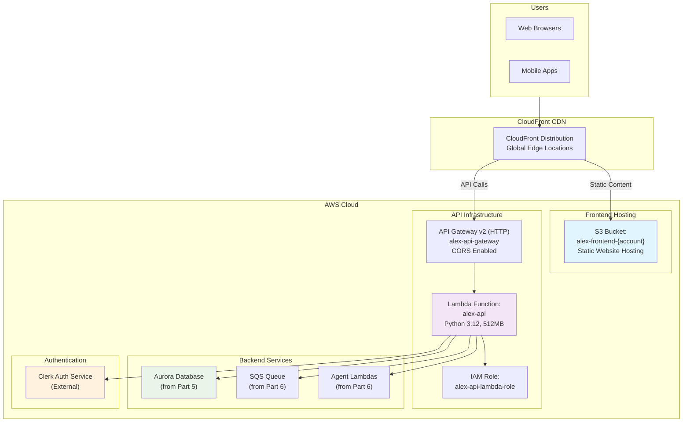
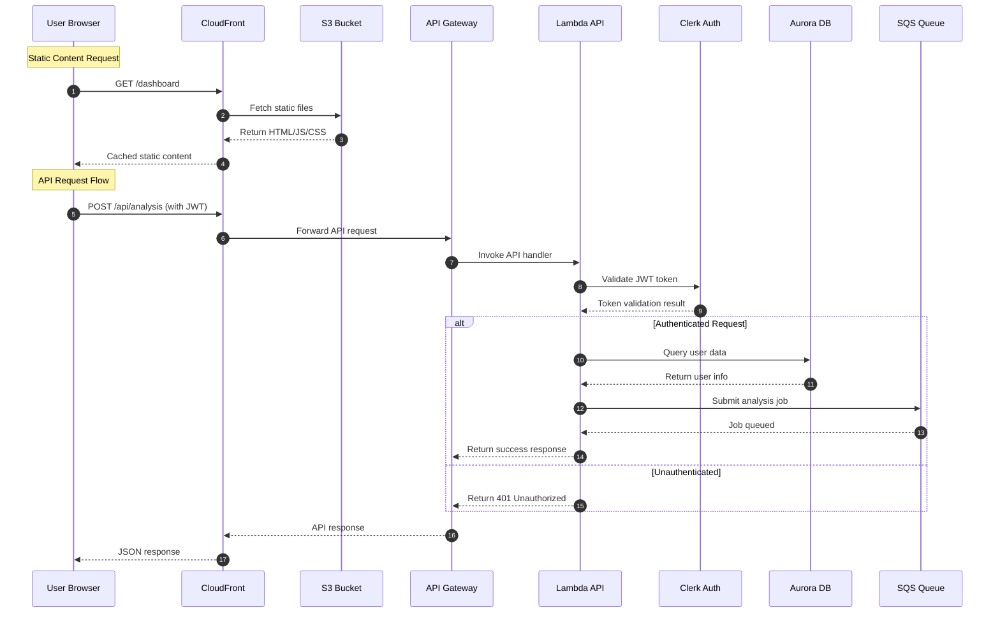

# Alex Frontend Infrastructure (Terraform)

This document explains the frontend and API infrastructure defined in:
- `terraform/7_frontend/main.tf`
- `terraform/7_frontend/variables.tf`
- `terraform/7_frontend/outputs.tf`

## Overview

This module provisions a complete frontend infrastructure including a React/Next.js application hosted on S3 with CloudFront CDN, API Gateway for backend services, and Lambda functions for API handling. The architecture supports modern web application patterns with authentication, CORS, and SPA routing.

## Components

### **Terraform Configuration** (`main.tf`)
- **Terraform version**: `>= 1.0`
- **AWS Provider**: `~> 5.0`
- **Backend**: Local state storage with remote state references
- **Dependencies**: References Parts 5 (Database) and 6 (Agents)

### **Static Website Hosting** (`main.tf`)
- **`aws_s3_bucket.frontend`**: Static website hosting
  - Name: `alex-frontend-{account-id}`
  - Public read access for website content
- **`aws_s3_bucket_website_configuration.frontend`**: Website configuration
  - Index document: `index.html`
  - Error document: `404.html`
- **`aws_s3_bucket_policy.frontend`**: Public read policy
  - Allows public access to website objects

### **API Infrastructure** (`main.tf`)
- **`aws_lambda_function.api`**: Backend API handler
  - Name: `alex-api`
  - Runtime: Python 3.12
  - Timeout: 30 seconds, Memory: 512 MB
  - Handler: `lambda_handler.handler`
- **`aws_apigatewayv2_api.main`**: HTTP API Gateway
  - Name: `alex-api-gateway`
  - Protocol: HTTP (not REST)
  - CORS enabled for all origins
- **`aws_apigatewayv2_stage.default`**: Default stage
  - Auto-deploy enabled
  - Rate limiting: 100 requests/second

### **IAM Permissions** (`main.tf`)
- **`aws_iam_role.api_lambda_role`**: Lambda execution role
  - Basic Lambda execution permissions
  - Aurora Data API access
  - SQS message sending
  - Agent Lambda invocation

### **Content Delivery** (`main.tf`)
- **`aws_cloudfront_distribution.main`**: Global CDN
  - Two origins: S3 (static content) and API Gateway (API calls)
  - Custom error pages for SPA routing
  - HTTPS redirect enforcement
  - Caching optimization for static and dynamic content

## Variables

From `variables.tf`:

| Variable | Type | Default | Description |
|----------|------|---------|-------------|
| `aws_region` | string | `us-east-1` | AWS region for deployment |
| `clerk_jwks_url` | string | - | Clerk JWKS URL for JWT validation |
| `clerk_issuer` | string | `""` | Clerk issuer URL (legacy) |

## Outputs

From `outputs.tf`:

| Output | Description |
|--------|-------------|
| `cloudfront_url` | CloudFront distribution HTTPS URL |
| `api_gateway_url` | API Gateway endpoint URL |
| `s3_bucket_name` | S3 bucket name for frontend files |
| `lambda_function_name` | API Lambda function name |
| `setup_instructions` | Complete deployment guide |

---

## Architecture Diagram



## Request Flow



## Cost Analysis

### **Infrastructure Costs**

#### **CloudFront CDN**
- **Requests**: $0.0075 per 10,000 HTTP requests
- **Data Transfer**: $0.085 per GB (first 10TB)
- **Monthly Estimate**: $5-20 for typical usage

#### **API Gateway HTTP**
- **Requests**: $1.00 per million requests
- **Data Transfer**: $0.09 per GB
- **Monthly Estimate**: $1-10 for typical usage

#### **Lambda Functions**
- **Requests**: $0.20 per 1M requests
- **Duration**: $0.0000166667 per GB-second
- **Monthly Estimate**: $2-15 for typical usage

#### **S3 Static Hosting**
- **Storage**: $0.023 per GB-month
- **Requests**: $0.0004 per 1,000 GET requests
- **Monthly Estimate**: $1-5 for typical frontend

### **Total Cost Examples**

#### **Development Usage (1,000 users/month)**
- **CloudFront**: ~$5/month
- **API Gateway**: ~$2/month
- **Lambda**: ~$3/month
- **S3**: ~$2/month
- **Total**: ~$12/month

#### **Production Usage (10,000 users/month)**
- **CloudFront**: ~$15/month
- **API Gateway**: ~$8/month
- **Lambda**: ~$12/month
- **S3**: ~$3/month
- **Total**: ~$38/month

#### **High-Scale Usage (100,000 users/month)**
- **CloudFront**: ~$50/month
- **API Gateway**: ~$30/month
- **Lambda**: ~$45/month
- **S3**: ~$5/month
- **Total**: ~$130/month

## Usage Instructions

### **Initial Deployment**

#### **1. Deploy Infrastructure**
```bash
cd terraform/7_frontend
terraform init
terraform apply -var="aws_region=us-east-1" \
                -var="clerk_jwks_url=https://your-clerk-domain.clerk.accounts.dev/.well-known/jwks.json"
```

#### **2. Build and Deploy Frontend**
```bash
# Navigate to frontend directory
cd ../../frontend

# Install dependencies
npm install

# Build for production
npm run build

# Deploy to S3
aws s3 sync out/ s3://$(terraform -chdir=../terraform/7_frontend output -raw s3_bucket_name)/ --delete

# Invalidate CloudFront cache
aws cloudfront create-invalidation \
  --distribution-id $(terraform -chdir=../terraform/7_frontend output -raw cloudfront_distribution_id) \
  --paths "/*"
```

#### **3. Deploy API Lambda**
```bash
# Navigate to API directory
cd ../backend/api

# Package Lambda function
zip -r api_lambda.zip lambda_handler.py requirements.txt

# Update Lambda function
aws lambda update-function-code \
  --function-name $(terraform -chdir=../../terraform/7_frontend output -raw lambda_function_name) \
  --zip-file fileb://api_lambda.zip
```

### **Development Workflow**

#### **Local Development**
```bash
# Start local development server
cd frontend
npm run dev

# API calls will go to deployed Lambda via CloudFront
# Configure CORS_ORIGINS to include localhost:3000
```

#### **Testing API Endpoints**
```bash
# Get API endpoint
API_URL=$(terraform -chdir=terraform/7_frontend output -raw api_gateway_url)

# Test health endpoint
curl "$API_URL/api/health"

# Test authenticated endpoint (requires JWT)
curl -H "Authorization: Bearer $JWT_TOKEN" "$API_URL/api/user/profile"
```

## Advanced Configuration

### **Custom Domain Setup**

#### **Add Custom Domain**
```hcl
# Add to main.tf
resource "aws_cloudfront_distribution" "main" {
  # ... existing configuration
  
  aliases = ["app.yourdomain.com"]
  
  viewer_certificate {
    acm_certificate_arn = aws_acm_certificate.main.arn
    ssl_support_method  = "sni-only"
  }
}

resource "aws_acm_certificate" "main" {
  domain_name       = "app.yourdomain.com"
  validation_method = "DNS"
  
  lifecycle {
    create_before_destroy = true
  }
}
```

### **Enhanced Security**

#### **WAF Integration**
```hcl
resource "aws_wafv2_web_acl" "main" {
  name  = "alex-frontend-waf"
  scope = "CLOUDFRONT"
  
  default_action {
    allow {}
  }
  
  rule {
    name     = "RateLimitRule"
    priority = 1
    
    action {
      block {}
    }
    
    statement {
      rate_based_statement {
        limit              = 2000
        aggregate_key_type = "IP"
      }
    }
    
    visibility_config {
      cloudwatch_metrics_enabled = true
      metric_name                = "RateLimitRule"
      sampled_requests_enabled   = true
    }
  }
}

# Attach WAF to CloudFront
resource "aws_cloudfront_distribution" "main" {
  # ... existing configuration
  web_acl_id = aws_wafv2_web_acl.main.arn
}
```

### **Performance Optimization**

#### **Enhanced Caching**
```hcl
# Optimize cache behaviors
resource "aws_cloudfront_distribution" "main" {
  # ... existing configuration
  
  # Static assets with long cache
  ordered_cache_behavior {
    path_pattern     = "/_next/static/*"
    allowed_methods  = ["GET", "HEAD"]
    cached_methods   = ["GET", "HEAD"]
    target_origin_id = "S3-${aws_s3_bucket.frontend.id}"
    
    forwarded_values {
      query_string = false
      cookies {
        forward = "none"
      }
    }
    
    viewer_protocol_policy = "redirect-to-https"
    min_ttl                = 31536000  # 1 year
    default_ttl            = 31536000
    max_ttl                = 31536000
  }
}
```

## Monitoring & Observability

### **CloudWatch Metrics**

#### **Lambda Function Metrics**
```bash
# Monitor API Lambda performance
aws cloudwatch get-metric-statistics \
  --namespace AWS/Lambda \
  --metric-name Duration \
  --dimensions Name=FunctionName,Value=alex-api \
  --start-time $(date -u -d '1 hour ago' +%Y-%m-%dT%H:%M:%S) \
  --end-time $(date -u +%Y-%m-%dT%H:%M:%S) \
  --period 300 \
  --statistics Average,Maximum

# Monitor error rates
aws cloudwatch get-metric-statistics \
  --namespace AWS/Lambda \
  --metric-name Errors \
  --dimensions Name=FunctionName,Value=alex-api \
  --start-time $(date -u -d '1 hour ago' +%Y-%m-%dT%H:%M:%S) \
  --end-time $(date -u +%Y-%m-%dT%H:%M:%S) \
  --period 300 \
  --statistics Sum
```

#### **CloudFront Metrics**
```bash
# Monitor CloudFront requests
aws cloudwatch get-metric-statistics \
  --namespace AWS/CloudFront \
  --metric-name Requests \
  --dimensions Name=DistributionId,Value=$(terraform output -raw cloudfront_distribution_id) \
  --start-time $(date -u -d '1 hour ago' +%Y-%m-%dT%H:%M:%S) \
  --end-time $(date -u +%Y-%m-%dT%H:%M:%S) \
  --period 300 \
  --statistics Sum

# Monitor cache hit ratio
aws cloudwatch get-metric-statistics \
  --namespace AWS/CloudFront \
  --metric-name CacheHitRate \
  --dimensions Name=DistributionId,Value=$(terraform output -raw cloudfront_distribution_id) \
  --start-time $(date -u -d '1 hour ago' +%Y-%m-%dT%H:%M:%S) \
  --end-time $(date -u +%Y-%m-%dT%H:%M:%S) \
  --period 300 \
  --statistics Average
```

### **Custom Dashboard**
```bash
# Create comprehensive dashboard
aws cloudwatch put-dashboard \
  --dashboard-name "Alex-Frontend-Dashboard" \
  --dashboard-body '{
    "widgets": [
      {
        "type": "metric",
        "properties": {
          "metrics": [
            ["AWS/Lambda", "Duration", "FunctionName", "alex-api"],
            [".", "Errors", ".", "."],
            ["AWS/CloudFront", "Requests", "DistributionId", "'$(terraform output -raw cloudfront_distribution_id)'"],
            [".", "CacheHitRate", ".", "."]
          ],
          "period": 300,
          "stat": "Average",
          "region": "us-east-1",
          "title": "Frontend Performance"
        }
      }
    ]
  }'
```

## Troubleshooting

### **Common Issues**

#### **CORS Errors**
```bash
# Check CORS configuration
aws apigatewayv2 get-api --api-id $(terraform output -raw api_gateway_id)

# Test CORS preflight
curl -X OPTIONS \
  -H "Origin: https://localhost:3000" \
  -H "Access-Control-Request-Method: POST" \
  -H "Access-Control-Request-Headers: authorization,content-type" \
  $(terraform output -raw api_gateway_url)/api/test
```

#### **Lambda Function Errors**
```bash
# Check function logs
aws logs filter-log-events \
  --log-group-name "/aws/lambda/alex-api" \
  --filter-pattern "ERROR"

# Test function directly
aws lambda invoke \
  --function-name alex-api \
  --payload '{"httpMethod": "GET", "path": "/api/health"}' \
  response.json
```

#### **CloudFront Cache Issues**
```bash
# Create cache invalidation
aws cloudfront create-invalidation \
  --distribution-id $(terraform output -raw cloudfront_distribution_id) \
  --paths "/*"

# Check invalidation status
aws cloudfront list-invalidations \
  --distribution-id $(terraform output -raw cloudfront_distribution_id)
```

### **Performance Issues**

#### **Slow API Responses**
```python
# Optimize Lambda cold starts
import json
import os
from functools import lru_cache

# Cache database connections
@lru_cache(maxsize=1)
def get_db_client():
    import boto3
    return boto3.client('rds-data')

# Optimize JWT validation
@lru_cache(maxsize=100)
def get_jwks():
    import requests
    return requests.get(os.environ['CLERK_JWKS_URL']).json()

def lambda_handler(event, context):
    # Reuse cached connections and data
    db_client = get_db_client()
    jwks = get_jwks()
    
    # Process request
    return {
        'statusCode': 200,
        'body': json.dumps({'message': 'success'})
    }
```

## Files and References

- **Main Configuration**: `terraform/7_frontend/main.tf`
- **Variables**: `terraform/7_frontend/variables.tf`
- **Outputs**: `terraform/7_frontend/outputs.tf`
- **Frontend Code**: `frontend/` directory
- **API Code**: `backend/api/` directory
- **CloudFront**: [AWS Documentation](https://docs.aws.amazon.com/cloudfront/)
- **API Gateway v2**: [AWS Documentation](https://docs.aws.amazon.com/apigateway/latest/developerguide/http-api.html)

## Integration Notes

### **Dependencies**
- **Part 5**: Aurora database for user data and application state
- **Part 6**: SQS queue and agent Lambdas for analysis jobs
- **Clerk**: External authentication service
- **Frontend**: React/Next.js application

### **Authentication Flow**
1. User authenticates with Clerk in frontend
2. Clerk provides JWT token to frontend
3. Frontend includes JWT in API requests
4. Lambda validates JWT against Clerk JWKS
5. Authenticated requests access backend services

### **Data Flow**
- **Static Content**: S3 → CloudFront → User
- **API Requests**: User → CloudFront → API Gateway → Lambda → Backend Services
- **Real-time Updates**: WebSocket connections (future enhancement)

## Future Enhancements

### **Advanced Features**
- **Server-Side Rendering**: Next.js SSR with Lambda@Edge
- **Progressive Web App**: Service workers and offline support
- **Real-time Updates**: WebSocket API Gateway for live data
- **Multi-language Support**: i18n with CloudFront edge functions

### **Performance Optimizations**
- **Edge Computing**: Lambda@Edge for personalization
- **Image Optimization**: CloudFront image optimization
- **Bundle Splitting**: Advanced code splitting strategies
- **Caching Strategies**: Redis/ElastiCache integration

### **Security Enhancements**
- **Content Security Policy**: CSP headers via Lambda@Edge
- **Bot Protection**: Advanced WAF rules and bot detection
- **DDoS Protection**: AWS Shield Advanced integration
- **Security Headers**: Comprehensive security header implementation
