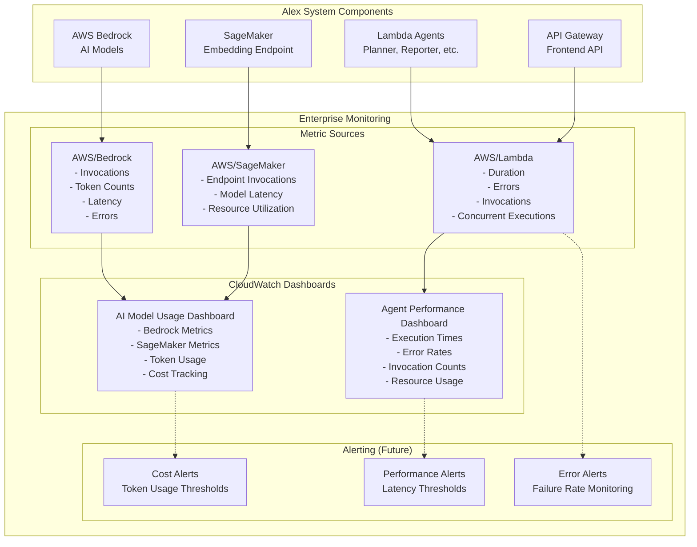

# Alex Enterprise Infrastructure (Terraform)

This document explains the enterprise monitoring and observability infrastructure defined in:
- `terraform/8_enterprise/main.tf`
- `terraform/8_enterprise/variables.tf`
- `terraform/8_enterprise/outputs.tf`

## Overview

This module provisions comprehensive CloudWatch dashboards for monitoring the entire Alex financial advisor system. It provides enterprise-grade observability for AI model usage, agent performance, cost tracking, and system health across all components.

## Components

### **Terraform Configuration** (`main.tf`)
- **Terraform version**: `>= 1.0`
- **AWS Provider**: `~> 5.0`
- **Backend**: Local state storage
- **Region**: Configurable via `var.aws_region`

### **AI Model Usage Dashboard** (`main.tf`)
- **`aws_cloudwatch_dashboard.ai_model_usage`**: Comprehensive AI monitoring
  - Name: `alex-ai-model-usage`
  - **Bedrock Metrics**: Invocations, errors, token usage, latency
  - **SageMaker Metrics**: Endpoint invocations, model latency, errors
  - **Cost Tracking**: Token consumption and usage patterns
  - **Performance Analysis**: Response times and throughput

### **Agent Performance Dashboard** (`main.tf`)
- **`aws_cloudwatch_dashboard.agent_performance`**: Multi-agent system monitoring
  - Name: `alex-agent-performance`
  - **Execution Metrics**: Duration, invocations, concurrent executions
  - **Error Tracking**: Error rates and throttling across all agents
  - **Resource Utilization**: Memory usage and performance optimization
  - **Comparative Analysis**: Cross-agent performance comparison

## Variables

From `variables.tf`:

| Variable | Type | Default | Description |
|----------|------|---------|-------------|
| `aws_region` | string | `us-east-1` | AWS region for deployment |
| `bedrock_region` | string | `us-west-2` | AWS region for Bedrock (may differ) |
| `bedrock_model_id` | string | `amazon.nova-pro-v1:0` | Bedrock model ID to monitor |

## Outputs

From `outputs.tf`:

| Output | Description |
|--------|-------------|
| `dashboard_urls` | Direct URLs to CloudWatch dashboards |
| `dashboard_names` | Names of created dashboards |
| `setup_instructions` | Complete usage and navigation guide |

---

## Architecture Diagram



## Dashboard Details

### **AI Model Usage Dashboard**

#### **Bedrock Model Monitoring**
- **Invocations**: Total model calls over time
- **Client Errors**: 4XX errors from invalid requests
- **Server Errors**: 5XX errors from service issues
- **Token Usage**: Input and output token consumption
- **Latency Metrics**: Average, minimum, and maximum response times

#### **SageMaker Endpoint Monitoring**
- **Endpoint Invocations**: Embedding generation requests
- **Error Rates**: 4XX and 5XX error tracking
- **Model Latency**: Processing time for embedding generation
- **Resource Utilization**: CPU and memory usage patterns

### **Agent Performance Dashboard**

#### **Multi-Agent Execution Tracking**
- **Planner Agent**: Orchestration performance and duration
- **Reporter Agent**: Analysis report generation metrics
- **Charter Agent**: Chart creation performance
- **Retirement Agent**: Retirement planning execution
- **Tagger Agent**: Data categorization performance

#### **Performance Metrics**
- **Execution Times**: Average duration per agent
- **Error Rates**: Failure tracking across all agents
- **Invocation Counts**: Usage patterns and load distribution
- **Concurrent Executions**: Parallelism and scaling metrics
- **Throttles**: Resource limit detection

## Cost Analysis

### **Dashboard Costs**
- **CloudWatch Dashboards**: $3.00 per dashboard per month
- **Custom Metrics**: $0.30 per metric per month (if using custom metrics)
- **API Calls**: $0.01 per 1,000 API calls for dashboard data
- **Total Monthly Cost**: ~$6-10 for both dashboards

### **Monitoring Value**
- **Cost Optimization**: Identify expensive AI model usage patterns
- **Performance Optimization**: Detect bottlenecks and optimization opportunities
- **Error Prevention**: Early detection of system issues
- **Capacity Planning**: Data-driven scaling decisions

## Usage Instructions

### **Initial Deployment**

#### **1. Deploy Enterprise Infrastructure**
```bash
cd terraform/8_enterprise
terraform init
terraform apply -var="aws_region=us-east-1" \
                -var="bedrock_region=us-west-2" \
                -var="bedrock_model_id=anthropic.claude-3-sonnet-20240229-v1:0"
```

#### **2. Access Dashboards**
```bash
# Get dashboard URLs
terraform output dashboard_urls

# Open in browser
open "$(terraform output -json dashboard_urls | jq -r '.ai_model_usage')"
open "$(terraform output -json dashboard_urls | jq -r '.agent_performance')"
```

### **Dashboard Navigation**

#### **AI Model Usage Dashboard**
1. **Bedrock Section**: Monitor AI model performance
   - Track token consumption for cost management
   - Monitor latency for user experience optimization
   - Identify error patterns and model issues

2. **SageMaker Section**: Monitor embedding generation
   - Track endpoint utilization and performance
   - Monitor cold start impacts
   - Optimize resource allocation

#### **Agent Performance Dashboard**
1. **Execution Metrics**: Compare agent performance
   - Identify slow-performing agents
   - Monitor execution time trends
   - Optimize resource allocation

2. **Error Analysis**: Track system reliability
   - Monitor error rates across agents
   - Identify failure patterns
   - Set up alerting thresholds

### **Monitoring Best Practices**

#### **Daily Monitoring**
```bash
# Check key metrics via CLI
aws cloudwatch get-metric-statistics \
  --namespace AWS/Bedrock \
  --metric-name Invocations \
  --dimensions Name=ModelId,Value=anthropic.claude-3-sonnet-20240229-v1:0 \
  --start-time $(date -u -d '24 hours ago' +%Y-%m-%dT%H:%M:%S) \
  --end-time $(date -u +%Y-%m-%dT%H:%M:%S) \
  --period 3600 \
  --statistics Sum

# Check agent error rates
aws cloudwatch get-metric-statistics \
  --namespace AWS/Lambda \
  --metric-name Errors \
  --dimensions Name=FunctionName,Value=alex-planner \
  --start-time $(date -u -d '24 hours ago' +%Y-%m-%dT%H:%M:%S) \
  --end-time $(date -u +%Y-%m-%dT%H:%M:%S) \
  --period 3600 \
  --statistics Sum
```

## Advanced Configuration

### **Custom Metrics Integration**

#### **Add Business Metrics**
```hcl
# Add custom metrics to dashboards
resource "aws_cloudwatch_dashboard" "business_metrics" {
  dashboard_name = "${local.name_prefix}-business-metrics"
  
  dashboard_body = jsonencode({
    widgets = [
      {
        type = "metric"
        properties = {
          metrics = [
            ["AWS/Lambda", "Duration", "FunctionName", "alex-api", { stat = "Average" }],
            ["CWAgent", "UserSessions", "Environment", "production", { stat = "Sum" }],
            ["Custom", "AnalysisRequests", "Type", "retirement_planning", { stat = "Sum" }]
          ]
          title = "Business KPIs"
          period = 300
        }
      }
    ]
  })
}
```

### **Alerting Integration**

#### **Cost Threshold Alerts**
```hcl
resource "aws_cloudwatch_metric_alarm" "high_token_usage" {
  alarm_name          = "alex-high-token-usage"
  comparison_operator = "GreaterThanThreshold"
  evaluation_periods  = "2"
  metric_name         = "InputTokenCount"
  namespace           = "AWS/Bedrock"
  period              = "300"
  statistic           = "Sum"
  threshold           = "1000000"  # 1M tokens
  alarm_description   = "High token usage detected"
  
  dimensions = {
    ModelId = var.bedrock_model_id
  }
  
  alarm_actions = [aws_sns_topic.alerts.arn]
}

resource "aws_cloudwatch_metric_alarm" "agent_error_rate" {
  alarm_name          = "alex-agent-high-error-rate"
  comparison_operator = "GreaterThanThreshold"
  evaluation_periods  = "2"
  metric_name         = "Errors"
  namespace           = "AWS/Lambda"
  period              = "300"
  statistic           = "Sum"
  threshold           = "10"
  alarm_description   = "High error rate in agents"
  
  dimensions = {
    FunctionName = "alex-planner"
  }
  
  alarm_actions = [aws_sns_topic.alerts.arn]
}
```

### **Multi-Region Monitoring**

#### **Cross-Region Dashboard**
```hcl
resource "aws_cloudwatch_dashboard" "multi_region" {
  dashboard_name = "${local.name_prefix}-multi-region"
  
  dashboard_body = jsonencode({
    widgets = [
      {
        type = "metric"
        properties = {
          metrics = [
            ["AWS/Bedrock", "Invocations", "ModelId", var.bedrock_model_id, { region = "us-west-2" }],
            ["AWS/Lambda", "Duration", "FunctionName", "alex-planner", { region = "us-east-1" }]
          ]
          title = "Cross-Region Performance"
          view = "timeSeries"
        }
      }
    ]
  })
}
```

## Monitoring & Alerting

### **Key Performance Indicators (KPIs)**

#### **AI Model Efficiency**
- **Token Usage Rate**: Tokens per successful request
- **Model Latency**: P50, P90, P99 response times
- **Error Rate**: Percentage of failed requests
- **Cost per Request**: Total cost divided by successful requests

#### **Agent Performance**
- **Execution Success Rate**: Percentage of successful completions
- **Average Processing Time**: Time per analysis type
- **Resource Utilization**: Memory and CPU usage patterns
- **Throughput**: Requests processed per hour

### **Automated Reporting**

#### **Daily Performance Report**
```python
import boto3
import json
from datetime import datetime, timedelta

def generate_daily_report():
    cloudwatch = boto3.client('cloudwatch')
    
    # Get yesterday's metrics
    end_time = datetime.utcnow()
    start_time = end_time - timedelta(days=1)
    
    # Bedrock metrics
    bedrock_invocations = cloudwatch.get_metric_statistics(
        Namespace='AWS/Bedrock',
        MetricName='Invocations',
        Dimensions=[{'Name': 'ModelId', 'Value': 'anthropic.claude-3-sonnet-20240229-v1:0'}],
        StartTime=start_time,
        EndTime=end_time,
        Period=86400,
        Statistics=['Sum']
    )
    
    # Agent metrics
    agent_metrics = {}
    for agent in ['planner', 'reporter', 'charter', 'retirement', 'tagger']:
        metrics = cloudwatch.get_metric_statistics(
            Namespace='AWS/Lambda',
            MetricName='Duration',
            Dimensions=[{'Name': 'FunctionName', 'Value': f'alex-{agent}'}],
            StartTime=start_time,
            EndTime=end_time,
            Period=86400,
            Statistics=['Average', 'Maximum']
        )
        agent_metrics[agent] = metrics
    
    # Generate report
    report = {
        'date': start_time.strftime('%Y-%m-%d'),
        'bedrock_invocations': bedrock_invocations['Datapoints'],
        'agent_performance': agent_metrics
    }
    
    return report

# Usage
daily_report = generate_daily_report()
print(json.dumps(daily_report, indent=2, default=str))
```

### **Cost Optimization Insights**

#### **Token Usage Analysis**
```bash
# Analyze token usage patterns
aws cloudwatch get-metric-statistics \
  --namespace AWS/Bedrock \
  --metric-name InputTokenCount \
  --dimensions Name=ModelId,Value=anthropic.claude-3-sonnet-20240229-v1:0 \
  --start-time $(date -u -d '7 days ago' +%Y-%m-%dT%H:%M:%S) \
  --end-time $(date -u +%Y-%m-%dT%H:%M:%S) \
  --period 86400 \
  --statistics Sum,Average

# Calculate cost per request
aws cloudwatch get-metric-statistics \
  --namespace AWS/Bedrock \
  --metric-name Invocations \
  --dimensions Name=ModelId,Value=anthropic.claude-3-sonnet-20240229-v1:0 \
  --start-time $(date -u -d '7 days ago' +%Y-%m-%dT%H:%M:%S) \
  --end-time $(date -u +%Y-%m-%dT%H:%M:%S) \
  --period 86400 \
  --statistics Sum
```

## Troubleshooting

### **Common Issues**

#### **Missing Metrics Data**
```bash
# Verify metric availability
aws cloudwatch list-metrics --namespace AWS/Bedrock
aws cloudwatch list-metrics --namespace AWS/Lambda

# Check if functions have been invoked
aws lambda get-function --function-name alex-planner
aws lambda invoke --function-name alex-planner --payload '{}' response.json
```

#### **Dashboard Access Issues**
```bash
# Verify dashboard exists
aws cloudwatch list-dashboards

# Get dashboard definition
aws cloudwatch get-dashboard --dashboard-name alex-ai-model-usage

# Update dashboard if needed
terraform apply -refresh-only
```

#### **Metric Collection Delays**
- CloudWatch metrics have up to 5-minute delays
- Custom metrics may take longer to appear
- Bedrock metrics in different regions may have additional delays

### **Performance Optimization**

#### **Dashboard Load Time**
- Use appropriate time ranges (avoid very long periods)
- Limit number of metrics per widget
- Use metric math expressions for complex calculations
- Consider creating focused dashboards for specific use cases

## Files and References

- **Main Configuration**: `terraform/8_enterprise/main.tf`
- **Variables**: `terraform/8_enterprise/variables.tf`
- **Outputs**: `terraform/8_enterprise/outputs.tf`
- **CloudWatch Dashboards**: [AWS Documentation](https://docs.aws.amazon.com/AmazonCloudWatch/latest/monitoring/CloudWatch_Dashboards.html)
- **CloudWatch Metrics**: [AWS Documentation](https://docs.aws.amazon.com/AmazonCloudWatch/latest/monitoring/working_with_metrics.html)

## Integration Notes

### **Dependencies**
- **All Parts**: Monitors metrics from all Alex system components
- **Bedrock**: Requires Bedrock model usage in specified region
- **Lambda Agents**: Requires deployed agent functions from Part 6
- **SageMaker**: Monitors embedding endpoint from Part 2

### **Cross-Component Monitoring**
- **End-to-End Tracing**: Track requests across all components
- **Cost Attribution**: Understand costs per feature/user
- **Performance Correlation**: Identify bottlenecks across services
- **Error Propagation**: Track how errors cascade through the system

## Future Enhancements

### **Advanced Analytics**
- **Machine Learning Insights**: Anomaly detection for metrics
- **Predictive Scaling**: Forecast resource needs
- **Cost Forecasting**: Predict monthly costs based on usage trends
- **Performance Benchmarking**: Compare against historical baselines

### **Enterprise Features**
- **Multi-Tenant Monitoring**: Separate dashboards per customer
- **Role-Based Access**: Different dashboard views for different roles
- **Custom Metrics**: Business-specific KPIs and metrics
- **Integration APIs**: Export metrics to external systems

### **Operational Excellence**
- **Automated Remediation**: Auto-scaling based on metrics
- **Incident Response**: Automated alert escalation
- **Capacity Planning**: Data-driven infrastructure decisions
- **Compliance Reporting**: Automated compliance metric collection

### **Production Checklist**

#### **Pre-Deployment**
- [ ] Verify all monitored services are deployed
- [ ] Configure appropriate Bedrock model ID
- [ ] Set correct AWS regions for all services
- [ ] Review metric retention policies

#### **Post-Deployment**
- [ ] Validate dashboard data appears within 5-10 minutes
- [ ] Test dashboard access and navigation
- [ ] Set up alerting thresholds based on baseline data
- [ ] Train team on dashboard usage and interpretation

#### **Ongoing Maintenance**
- [ ] Review and update metric thresholds monthly
- [ ] Analyze cost trends and optimize usage
- [ ] Update dashboards as new features are added
- [ ] Archive or modify dashboards for deprecated services
